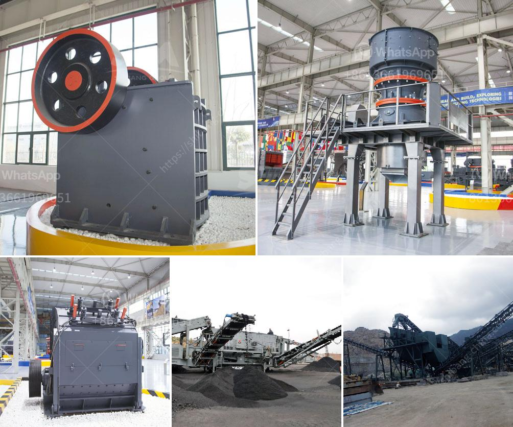

<h3>مصنع كرة الاسمنت المواد والطاقة</h3>
تعتبر صناعة الأسمنت من الصناعات الحيوية والحيوية التي تلعب دورًا هامًا في تطور الاقتصاد والبنية التحتية للدول. واحد من العناصر الأساسية في صناعة البناء ، حيث يتم استخدام الأسمنت بشكل واسع في بناء المباني والمنشآت المختلفة.

يعتبر مصنع كرة الأسمنت مكوناً أساسياً في إنتاج الأسمنت. يتم استخدام المواد الخام الأساسية لصناعة الأسمنت مثل الحجر الجيري والطين والصلصال. يتم إزالة المواد الخام في مرحلة محجر أو منجم وتنقل إلى المصنع. يتم سحق المواد الخام في كسارات وطواحين للحصول على الحجم المطلوب.

بعد ذلك ، يتم تسخين المواد الخام في فرن الأسمنت عند درجة حرارة تتراوح بين 1400 و 1600 درجة مئوية. تحت رداءة اختناق للغاز ، يؤدي التسخين إلى تفاعلات كيميائية تحول المواد الخام إلى ما يعرف بالكلنكر ، وهو ركام صلب يحتوي على الكلس والسيليكات والألومينا.

بعد ذلك ، يتم طحن الكلنكر في طواحين الأسمنت الخاصة حتى يتم الحصول على مسحوق الأسمنت النهائي. يتم خلط الأسمنت مع كميات محددة من مواد الإضافة مثل الجبس لتنظيم زمن التصلب وتحسين الخواص الميكانيكية للأسمنت النهائي.

تستهلك عملية صناعة الأسمنت كميات كبيرة من الطاقة. يتم استخدام الطاقة في التسخين والتبريد وسحق المواد الخام وطحن الأسمنت. تعتمد العديد من المصانع على الفحم كمصدر للطاقة ، ولكن أيضًا يتم استخدام الغاز الطبيعي أو مصادر الطاقة البديلة مثل الطاقة الشمسية أو الرياح.

علاوة على ذلك ، تتولى مصانع الأسمنت مسؤولية حماية البيئة وتقليل الآثار الضارة لعملية الإنتاج. تستخدم بعض المصانع أفران الأسمنت الحديثة التي تستهلك كميات أقل من الطاقة وتقلل الانبعاثات الضارة. يتم أيضًا التركيز على إدارة المخلفات وإعادة تدوير المنتجات الجانبية للأقلية المستدامة.

باختصار ، يعتبر مصنع كرة الأسمنت محركًا رئيسيًا في صناعة البناء ويسهم في تطور الاقتصاد المحلي. ومع ذلك ، يجب أن تتحلى المصانع بالاهتمام البيئي وتحسين كفاءة استخدام الطاقة من أجل المستدامة والحفاظ على البيئة.
<h3>Contact us</h3><ul><li><strong>Whatsapp:&nbsp;<a href="https://wa.me/8613661969651">+8613661969651</a></strong></li><li><a href="https://swt.shibang-china.com/?git&amp;zhl&amp;مصنع كرة الاسمنت المواد والطاقة"><strong>Online Service(chat now)</strong></a></li></ul><h3>Related</h3><ul><li><a href='شاشة هزازة صينية.md'>شاشة هزازة صينية</a></li><li><a href='مطحنة الكرة للصبغة.md'>مطحنة الكرة للصبغة</a></li><li><a href='تخطيط منشأة تعدين الماس.md'>تخطيط منشأة تعدين الماس</a></li><li><a href='مصنع غسيل الذهب المستخدمة.md'>مصنع غسيل الذهب المستخدمة</a></li><li><a href='مطاحن الكرة للتعدين في الصين.md'>مطاحن الكرة للتعدين في الصين</a></li></ul>