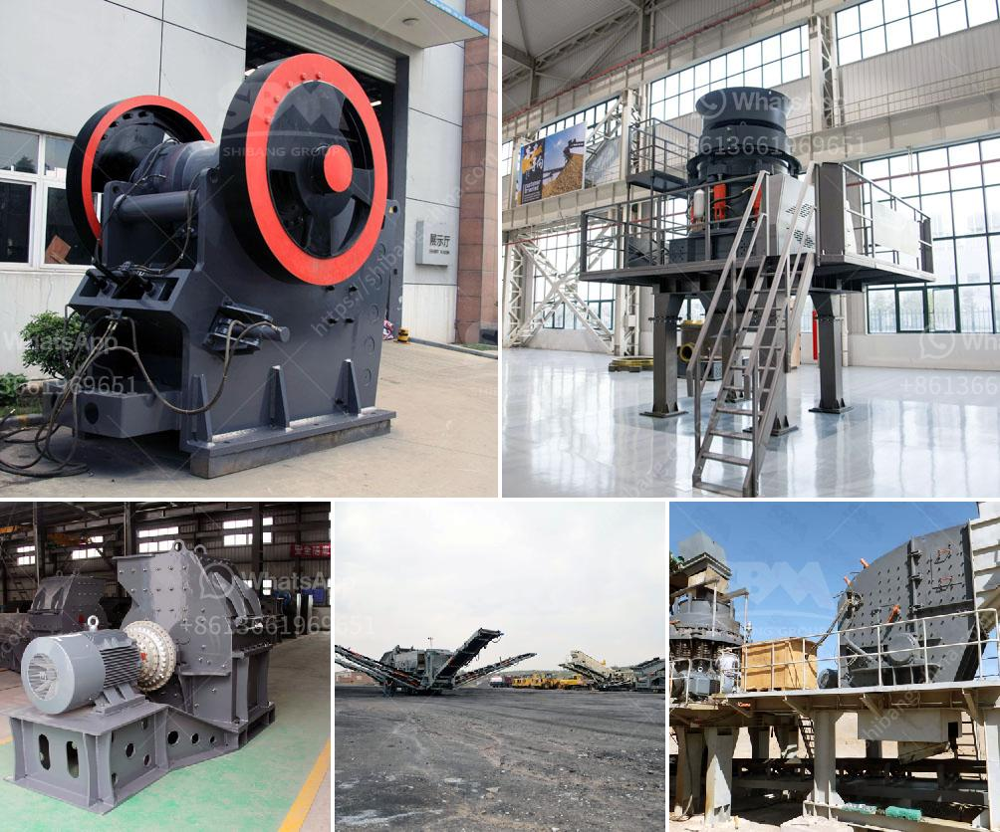

<h3>مصنع كرة متنقل من ألمانيا</h3>
في قلب ألمانيا، يوجد مصنع كرة متنقل يعتبر واحدًا من أكبر المصانع لصناعة الكرات في العالم. هذا المصنع الذي يقع في مدينة هامبورغ يتمتع بسمعة عالمية بفضل جودة منتجاته وتكنولوجياه المتطورة. يعود تاريخ المصنع إلى أكثر من قرن من الزمان حيث تأسس في عام 1909 وما زال يعمل حتى اليوم بقدرات إنتاجية هائلة.

يشتهر هذا المصنع بتصميم وانتاج مجموعة واسعة من الكرات التي تستخدم في مختلف المجالات. فهو ينتج الكرات الرياضية المستخدمة في الألعاب المختلفة مثل كرة القدم وكرة السلة والتنس. كما يُعْدُ هذا المصنع مورداً رئيسياً للكرات المستخدمة في الصناعات الأخرى مثل السيارات والمعدات الثقيلة وصناعة الأجهزة الإلكترونية.

من أبرز الأسباب وراء الشهرة التي حققها هذا المصنع هو التركيز الدائم على الجودة والابتكار التكنولوجي. يعتبر المصنع رائدًا في استخدام أحدث التقنيات في عملية الإنتاج وتحسين الأداء. يستخدم المصنع آلات حديثة مزودة بنظام الروبوتات لتصنيع الكرات بدقة عالية وسرعة فائقة. يوفر هذا النهج الصارم للجودة فرصة متساوية لإنتاج كرات متينة وعالية المرونة تلبي احتياجات العملاء وتتحمل متطلبات الاستخدام المختلفة.

بالإضافة إلى التقنيات المتقدمة، يولي المصنع اهتمامًا كبيرًا للتنمية المستدامة ومراعاة البيئة. يتبنى المصنع أفضل الممارسات الصديقة للبيئة في عملية الإنتاج بحيث يقوم بإعادة تدوير النفايات واستخدام الموارد بكفاءة عالية. يستخدم المصنع المواد البيئية والمتجددة في صناعة الكرات مما يقلل من الآثار السلبية على البيئة ويحافظ على الموارد الطبيعية.

لا يقدم هذا المصنع فقط منتجات ذات جودة عالية، بل يتميز أيضا بخدمة العملاء الممتازة والتسليم في الوقت المحدد. يتعاون المصنع ويتواصل مع العملاء بشكل وثيق لضمان تلبية الاحتياجات الفريدة لكل عميل وتوفير الدعم الفني المطلوب. كما يحرص المصنع على تلبية المواصفات والمعايير الدولية المحددة للكرات في جميع المجالات التي يتم استخدامها.

في الختام، يعد مصنع الكرة المتنقل من ألمانيا مثالًا رائعًا للابتكار والتكنولوجيا والجودة. يلتزم المصنع بتقديم منتجات عالية الجودة وخدمة العملاء الفائقة والمسؤولية البيئية. يمثل هذا المصنع الرائد تلميحًا للتطور الصناعي العالمي ويوضح القدرة الفريدة لألمانيا في تقديم منتجات رائعة تحظى بالاعتراف العالمي.
<h3>Contact us</h3><ul><li><strong>Whatsapp:&nbsp;<a href="https://wa.me/8613661969651">+8613661969651</a></strong></li><li><a href="https://swt.shibang-china.com/?git&amp;zhl&amp;مصنع كرة متنقل من ألمانيا"><strong>Online Service(chat now)</strong></a></li></ul><h3>Related</h3><ul><li><a href='مطحنة صخرة الرخام.md'>مطحنة صخرة الرخام</a></li><li><a href='مطحنة الأسطوانة العمودية في تايوان.md'>مطحنة الأسطوانة العمودية في تايوان</a></li><li><a href='آلات مصنع تكسير وفرز الحجر المحمولة.md'>آلات مصنع تكسير وفرز الحجر المحمولة</a></li><li><a href='معدات تعدين الذهب.md'>معدات تعدين الذهب</a></li><li><a href='شراء آلة محجر من أوروبا.md'>شراء آلة محجر من أوروبا</a></li></ul>