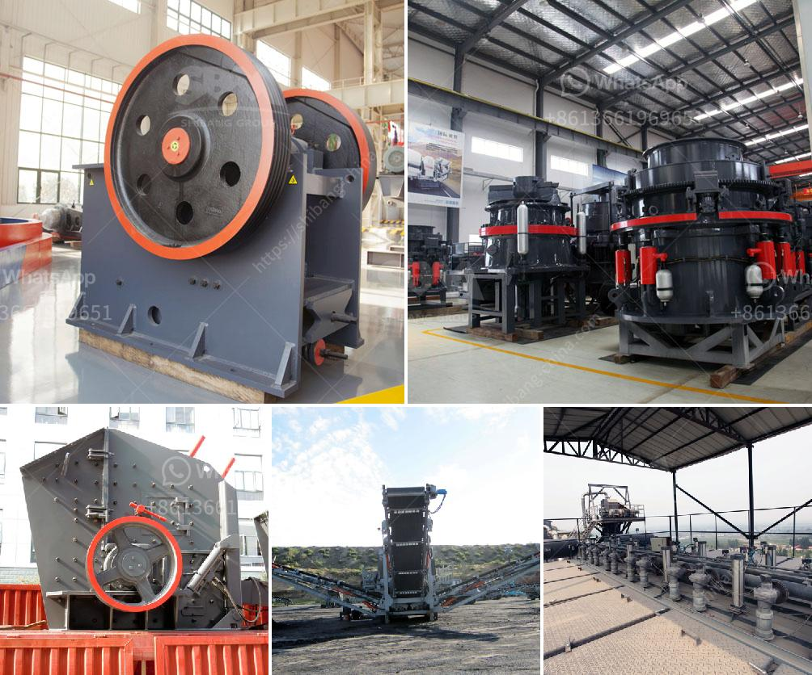

<h3>مصنع كسارة 150 طن في الساعة</h3>
تعتبر كسارات الحجارة أدوات أساسية في صناعة البناء والإنشاءات، حيث تستخدم لكسر الصخور والأحجار الكبيرة إلى قطع صغيرة الحجم. ومن بين الكسارات المستخدمة في هذا المجال، تمثل كسارة 150 طن في الساعة واحدة من أهم الأدوات التي تعتبر قوية وفعالة في أداء مهامها.

تتميز كسارة الحجر بسعة 150 طن في الساعة بقدرتها الكبيرة على معالجة الكميات الضخمة من الحجارة بسرعة، حيث يمكنها سحق وطحن الحجارة الكبيرة بسرعة تصل إلى 150 طن في الساعة. وبالتالي، فإن الكسارة قادرة على تغذية خط الإنتاج بكميات كبيرة من الحجارة والصخور المكسورة التي تستخدم في صنع الخرسانة والطرق والمباني.

تضمن هذه الكسارة أداءً عاليًا وكفاءة في استخدام الطاقة، بالإضافة إلى قوتها الهيكلية وتحملها للتشغيل المستمر. يتم تشغيل هذا المصنع بواسطة محركات كهربائية قوية، مما يسهم في خفض استهلاك الوقود والحد من الانبعاثات الضارة. وتتسم هذه الكسارة أيضًا بنوعية البناء الجيدة والمواد المستخدمة في تصنيعها، مما يجعلها متينة وقادرة على تحمل ظروف العمل الشاقة طوال فترات التشغيل المطولة.

وجدير بالذكر أن الكسارة 150 طن في الساعة مصممة لتحقيق أقصى كفاءة وإنتاجية في عمليات السحق، من خلال تصميمها المتقن ونظام التحكم الآلي الذي يساعد في تنظيم عملية السحق والحفاظ على جودة المنتج النهائي. كما تتميز الكسارة بهامش قابلية التكيف لمختلف أنواع الحجارة والصخور، وهذا يعزز قدرتها على التعامل مع مواد متنوعة والاستفادة القصوى من قدرتها التشغيلية.

في الختام، تعتبر كسارة 150 طن في الساعة أداة لا غنى عنها في صناعة البناء والإنشاءات، حيث تسهم في تحقيق إنتاجية عالية، ودقة في المنتج النهائي، وتوفير الوقت والجهد. إن استخدام هذا المصنع قد يساهم في تسهيل وتسريع عملية الإنشاء وتوفير الموارد والمواد اللازمة لها، وبالتالي تحقيق الكفاءة والجودة في العمل الإنشائي.
<h3>Contact us</h3><ul><li><strong>Whatsapp:&nbsp;<a href="https://wa.me/8613661969651">+8613661969651</a></strong></li><li><a href="https://swt.shibang-china.com/?git&amp;zhl&amp;مصنع كسارة 150 طن في الساعة"><strong>Online Service(chat now)</strong></a></li></ul><h3>Related</h3><ul><li><a href='كسارة تأثير الكلي.md'>كسارة تأثير الكلي</a></li><li><a href='آلات كسارة المحجر.md'>آلات كسارة المحجر</a></li><li><a href='كسارة الفك PE 150x250.md'>كسارة الفك PE 150x250</a></li><li><a href='أسعار معدات المحجر.md'>أسعار معدات المحجر</a></li><li><a href='أسعار وحدات طحن الكلنكر.md'>أسعار وحدات طحن الكلنكر</a></li></ul>