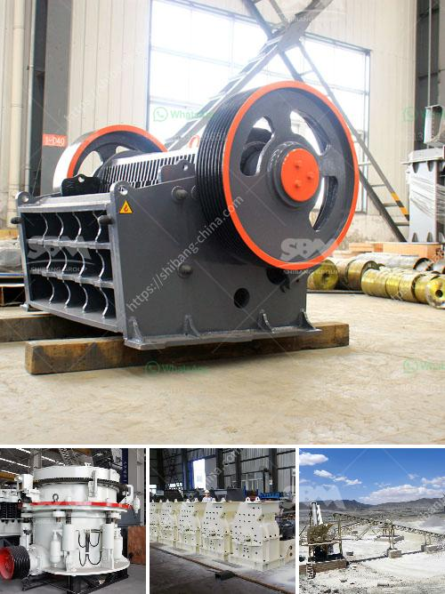

<h3>مصنع كسارة البنتونيت</h3>
تعتبر كسارة البنتونيت من المعدات الهامة والضرورية في صناعة التعدين والإنشاءات. فهي تستخدم لسحق وطحن البنتونيت، وهو معدن طبيعي يتكون بشكل رئيسي من الألومنيوم والسيليكا. يتم استخراج البنتونيت بواسطة الحفر والتنقيب عنه في المناطق التي تحتوي على ترسبات كبيرة من هذا المعدن.

يتم تحويل البنتونيت إلى مسحوق ناعم باستخدام كسارة البنتونيت. تُستخدم هذه الآلة لتجهيز البنتونيت وتحويله إلى مسحوق يمكن استخدامه في العديد من التطبيقات المختلفة، بما في ذلك الصناعات الزراعية والميكانيكية والكيميائية والبحرية وغيرها.

تتميز مصانع تصنيع كسارة البنتونيت بتصاميمها القوية والفعالة والمتطورة. فعند استخدام هذه المصانع، يتم تكسير حبيبات البنتونيت بفعالية وسرعة عالية للحصول على الحجم المطلوب. كما أن الكسارات مجهزة بتقنيات حديثة تضمن الحد الأدنى من تكون الغبار والانبعاثات الضارة. بالإضافة إلى ذلك، توفر مصانع تصنيع كسارة البنتونيت تشغيلًا سهلاً ومريحًا وصيانة بسيطة.

تستخدم كسارة البنتونيت عادة في صناعة الطوب والأخشاب والبورسلين والمواد العازلة وغيرها من المواد. وبفضل قدرتها على تحويل البنتونيت إلى مسحوق دقيق وسهولة استخدامها وفعاليتها، فإنها تسهم في زيادة الإنتاجية وتقليل التكاليف في هذه الصناعات.

بشكل عام، يمكن القول إن كسارة البنتونيت هي أداة مهمة في عمليات تكسير وطحن البنتونيت، وتستخدم في العديد من الصناعات المختلفة. تضمن هذه الآلة الفعالة والفعالية والكفاءة في عمليات التصنيع وتحسين جودة المنتج النهائي. بالإضافة إلى ذلك، فإن استخدام كسارة البنتونيت يؤدي إلى تقليل التكاليف وزيادة الإنتاج في العديد من الصناعات، مما يساهم في تحقيق النجاح والاستدامة في هذا المجال.
<h3>Contact us</h3><ul><li><strong>Whatsapp:&nbsp;<a href="https://wa.me/8613661969651">+8613661969651</a></strong></li><li><a href="https://swt.shibang-china.com/?git&amp;zhl&amp;مصنع كسارة البنتونيت"><strong>Online Service(chat now)</strong></a></li></ul><h3>Related</h3><ul><li><a href='كسارات مزدوجة التبديل.md'>كسارات مزدوجة التبديل</a></li><li><a href='تكلفة معدات التكسير والطحن في إثيوبيا.md'>تكلفة معدات التكسير والطحن في إثيوبيا</a></li><li><a href='كسارة متنقلة القطرة.md'>كسارة متنقلة القطرة</a></li><li><a href='سعر كسارة الحجر الصلب.md'>سعر كسارة الحجر الصلب</a></li><li><a href='مزايا وعيوب مطحنة الطحن.md'>مزايا وعيوب مطحنة الطحن</a></li></ul>