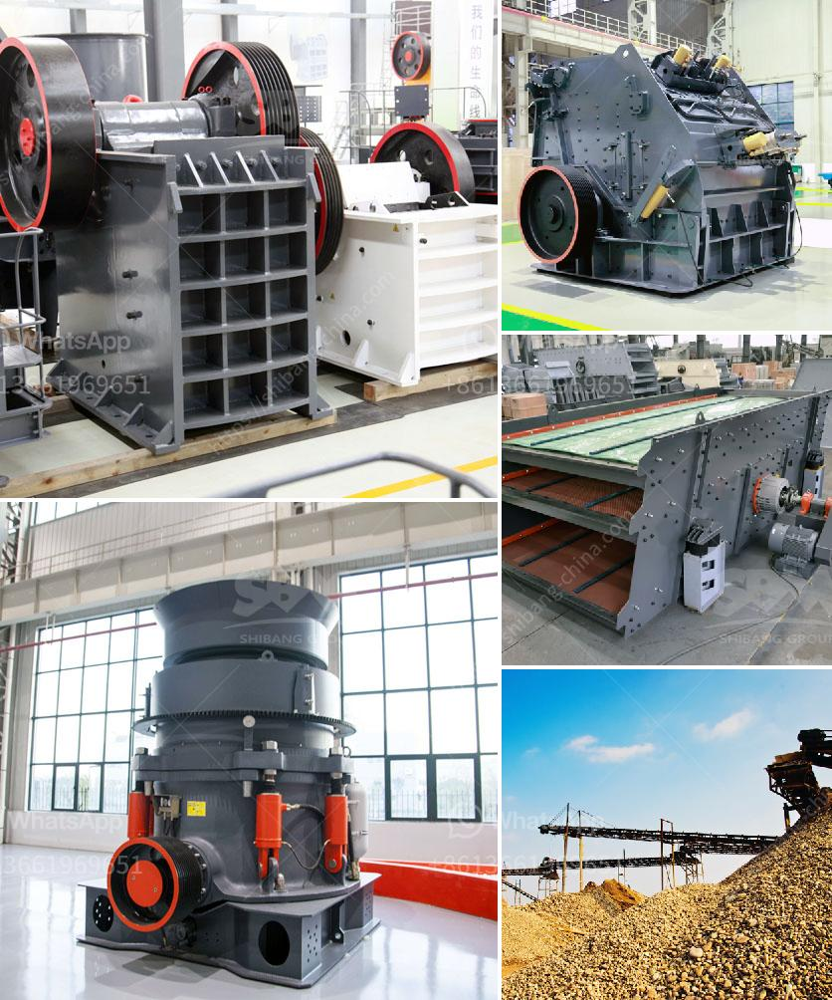

<h3>مصنع كسارة الحجر 100 tph</h3>
مصنع كسارة الحجر 100 tph هو مصنع مخصص لإنتاج الركام المستخدم في مشاريع البناء والبنية التحتية. يتم استخدامه لكسر الحجارة الصلبة إلى أحجام صغيرة قابلة للاستخدام في الخرسانة والأسفلت والرصف والأعمال الأخرى.

تحظى كسارة الحجر 100 tph بشعبية كبيرة في صناعة البناء بسبب كفاءتها العالية وقدرتها على إنتاج الركام بكميات كبيرة. يعني التصميم المدروس لهذا المصنع أنه يمكنه سحق الحجارة بفعالية وخفة وزنها من خلال مجموعة متنوعة من الكسارات المختلفة الموجودة بداخله.

ستة أنواع رئيسية من المعدات الرئيسية المستخدمة في مصنع كسارة الحجر 100 tph تشمل الكسارة الفكية ، الكسارة المخروطية ، الكسارة الثانوية ، الكسارة المضادة للصدمات ، الشاشة الاهتزازية والحزام الناقل. تعمل هذه المعدات بتنسيق معًا لتحقيق إنتاجية عالية وجودة ممتازة للركام.

يمتاز مصنع كسارة الحجر 100 tph بالعديد من المزايا. يوفر استخدامه الفعال للموارد وتحسين عمليات التكسير. كما يمكن للمصنع أن يتوافق مع أي عملية إنتاجية محددة وفقًا لمتطلبات العميل. يعتبر هذا المصنع مثاليًا للشركات التي تحتاج إلى إنتاج الركام بكميات كبيرة لمشاريع البناء ذات المواعيد النهائية الضيقة.

بصفة عامة ، مصنع كسارة الحجر 100 tph هو حلا فعالا وموثوقًا لإنتاج الركام في صناعة البناء. تحت الظروف الصحيحة ، يمكن لهذا المصنع تلبية احتياجات عملك وانتاج الركام ذو الجودة العالية التي تحتاج إليها. إذا كنت تبحث عن مصنع كسارة موثوق وذو كفاءة عالية لمشروعك القادم ، فقد تكون كسارة الحجر 100 tph الخيار الأمثل الذي يمكن أن يلبي احتياجاتك بشكل مثالي
<h3>Contact us</h3><ul><li><strong>Whatsapp:&nbsp;<a href="https://wa.me/8613661969651">+8613661969651</a></strong></li><li><a href="https://swt.shibang-china.com/?git&amp;zhl&amp;مصنع كسارة الحجر 100 tph"><strong>Online Service(chat now)</strong></a></li></ul><h3>Related</h3><ul><li><a href='آلة مسحوق رمل السيليكا إندونيسيا.md'>آلة مسحوق رمل السيليكا إندونيسيا</a></li><li><a href='معدات تحسين خامات مختلفة في جميع أنحاء العالم.md'>معدات تحسين خامات مختلفة في جميع أنحاء العالم</a></li><li><a href='عملية تصنيع لوح الجبس.md'>عملية تصنيع لوح الجبس</a></li><li><a href='سعر آلة طحن الرخام في الهند.md'>سعر آلة طحن الرخام في الهند</a></li><li><a href='آلة طحن الأسمنت الصغيرة.md'>آلة طحن الأسمنت الصغيرة</a></li></ul>