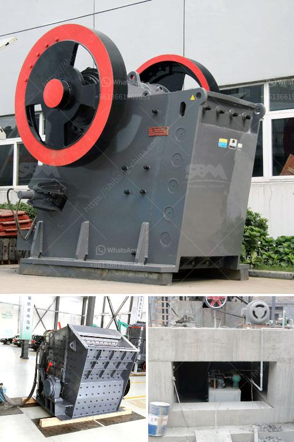

<h3>مصنع كسارة الحجر التلقائي</h3>
تعتبر كسارة الحجر التلقائية من أهم الآلات المستخدمة في صناعة البناء والتشييد وفي عملية تكسير الحجر. تستخدم هذه الكسارة لتحطيم الصخور الكبيرة إلى قطع صغيرة من الحصى والرمل، والتي يمكن استخدامها في العديد من التطبيقات المختلفة.

تقوم كسارة الحجر التلقائية بتكسير الحجارة بطريقة ميكانيكية، مما يقلل من حجمها ويجعلها ملائمة للاستخدام في مشاريع البناء المختلفة. يتم تشغيل هذه الكسارة عن طريق محرك كهربائي أو بواسطة المحرك الديزل، مما يجعلها متاحة في العديد من الأماكن، بما في ذلك المناطق النائية التي قد تفتقر إلى توفر الكهرباء.

كسارة الحجر التلقائية تأتي مع العديد من الميزات التقنية المبتكرة التي تسهل استخدامها وتحسن أدائها. فعلى سبيل المثال، توفر هذه الكسارة نظام تشحيم تلقائي للمزيد من الكفاءة والأداء الممتاز، مع واجهة مستخدم سهلة الاستخدام لتبسيط عملية التشغيل. كما تتميز بسرعة عالية في التشغيل والقدرة على معالجة كميات كبيرة من الحجارة في فترة زمنية قصيرة.

واحدة من الفوائد الرئيسية لاستخدام كسارة الحجر التلقائية هي الكفاءة العالية في توفير الوقت والجهد. فهي تعمل بسرعة فائقة، مما يعني أنها يمكنها تجهيز كميات كبيرة من الحجارة في وقت قصير. هذا يوفر الكثير من الوقت والجهد للعمال، مما يؤدي إلى زيادة الإنتاجية وتوفير التكاليف.

وبالإضافة إلى ذلك، تتميز كسارة الحجر التلقائية بالدقة والتشغيل الآمن. فهي تعتمد على تكنولوجيا المعالجة المتقدمة، مما يجعلها قادرة على تجهيز الحجارة بطريقة دقيقة وموحدة، مما يضمن جودة المواد النهائية. كما أنها مصممة بعناية لتوفير بيئة عمل آمنة للعمال، مع العديد من الوظائف الأمانية المضمنة لتجنب الحوادث.

في الختام، يمكن القول أن كسارة الحجر التلقائية هي أداة حديثة وفعالة في صناعة البناء والتشييد. تسهم في توفير الوقت والجهد، وتحسن الإنتاجية والجودة. كما أنها تقدم بيئة عمل آمنة للعمال. لذا، فإن استثمار في شراء مصنع كسارة الحجر التلقائية سيكون خطوة ذكية لكيان البناء الذي يرغب في تحسين أداءه وزيادة ربحيته.
<h3>Contact us</h3><ul><li><strong>Whatsapp:&nbsp;<a href="https://wa.me/8613661969651">+8613661969651</a></strong></li><li><a href="https://swt.shibang-china.com/?git&amp;zhl&amp;مصنع كسارة الحجر التلقائي"><strong>Online Service(chat now)</strong></a></li></ul><h3>Related</h3><ul><li><a href='كسارة في الفلبين.md'>كسارة في الفلبين</a></li><li><a href='شركة تصنيع آلات الحجر في إيروود.md'>شركة تصنيع آلات الحجر في إيروود</a></li><li><a href='تعليم مطحنة الكرة.md'>تعليم مطحنة الكرة</a></li><li><a href='الآلات المستخدمة في تصنيع الأسمنت.md'>الآلات المستخدمة في تصنيع الأسمنت</a></li><li><a href='موزع كسارة في إندونيسيا.md'>موزع كسارة في إندونيسيا</a></li></ul>