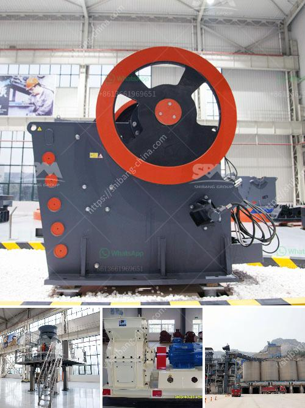

<h3>مصنع كسارة الحجر الجيري في الهند</h3>
تعتبر الهند واحدة من أكبر الدول المنتجة للحجر الجيري في العالم، حيث تحتوي على مصادر غنية من هذا الصخر الطبيعي في عدة مناطق. ومن بين هذه المناطق، تبرز ولاية راجستان كأحد أهم المراكز الصناعية لإنتاج وتصنيع الحجر الجيري.

يعتبر مصنع كسارة الحجر الجيري في الهند من المرافق التي تقدم مساهمة هامة في الصناعات الإنشائية والبناء. يتم استخدام الحجر الجيري في مجموعة متنوعة من التطبيقات، مثل إنتاج الأسمنت، وصناعة الحجارة، والزجاج، والحجر، وغيرها من المواد الصناعية الأخرى. لذلك، يتم استخراج الحجر الجيري من المناجم الطبيعية ومن ثم تكسيره وتصنيعه في المصنع.

يتم استخدام آلات التكسير والفرز المتخصصة في مصنع كسارة الحجر الجيري في الهند لتحويل الحجر الجيري الخام إلى حجم وشكل مفيد وقابل للاستخدام في الصناعة. تتضمن العمليات المستخدمة في المصنع تجهيز وتكسير الحجر الجيري بواسطة معدات الكسارة، ثم يتم نقله إلى آلات الفرز لفصل الحجم النهائي المرغوب من التربة والمخلفات. ويتم تخزين الحجر النهائي في صومعة تخزين خاصة حتى يتم شحنه للاستخدام في الصناعات المختلفة.

تعتبر الهند وجهة رئيسية للشركات المصنعة والمستوردين من الحجر الجيري، حيث يتم صناعة منتجات ذات جودة عالية وبأسعار منافسة، مما يجعلها بديلاً مفضلاً للحجر الجيري المستورد من دول أخرى. ومن خلال تصدير منتجاتها إلى العديد من الأسواق العالمية، تحافظ الهند على مكانتها كمنتج رئيسي للحجر الجيري.

يساهم مصنع كسارة الحجر الجيري في تعزيز الاقتصاد المحلي وتوفير فرص العمل للعديد من العاملين في قطاع البناء والهندسة المدنية. كما أنه يلعب دورًا مهمًا في تحقيق التنمية المستدامة، حيث تتم معالجة المخلفات الناجمة عن عملية التكسير والتصنيع بطرق صديقة للبيئة وتدويرها للاستخدامات الأخرى.

باختصار، يعتبر مصنع كسارة الحجر الجيري في الهند منشأة مهمة وحيوية في قطاع البناء والصناعات الإنشائية. يساهم في توفير الموارد الطبيعية الهامة ويساعد في تلبية احتياجات السوق المحلي والعالمي من الحجر الجيري. كما أنه يلعب دورًا في تعزيز التنمية المستدامة وتوفير فرص العمل للكثير من العاملين.
<h3>Contact us</h3><ul><li><strong>Whatsapp:&nbsp;<a href="https://wa.me/8613661969651">+8613661969651</a></strong></li><li><a href="https://swt.shibang-china.com/?git&amp;zhl&amp;مصنع كسارة الحجر الجيري في الهند"><strong>Online Service(chat now)</strong></a></li></ul><h3>Related</h3><ul><li><a href='محطة كسارة متنقلة للبيع.md'>محطة كسارة متنقلة للبيع</a></li><li><a href='عملية تصنيع بروميد الكالسيوم.md'>عملية تصنيع بروميد الكالسيوم</a></li><li><a href='آلات محجر كاملة للبيع في الصين.md'>آلات محجر كاملة للبيع في الصين</a></li><li><a href='موردين محمولين لكسارة الحجر.md'>موردين محمولين لكسارة الحجر</a></li><li><a href='كسارة الحجر الجرانيت الهند.md'>كسارة الحجر الجرانيت الهند</a></li></ul>