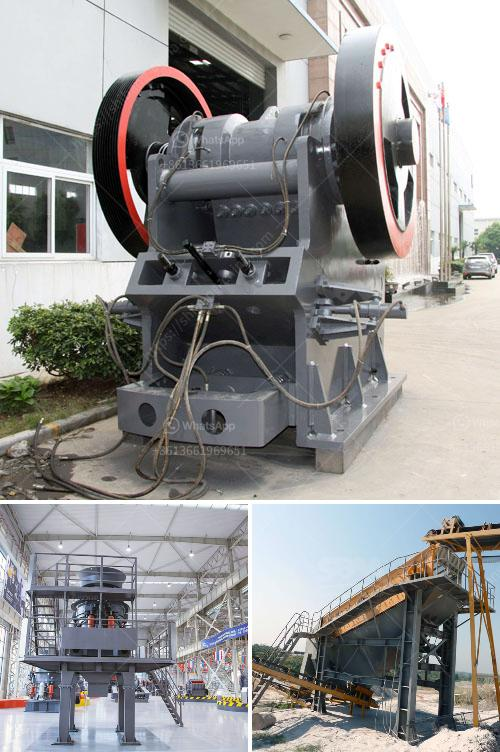

<h3>مصنع كسارة الحجر القديمة للبيع</h3>
يُعد مصنع كسارة الحجر القديمة واحدًا من المنشآت الصناعية التاريخية التي استُخدمت في معالجة وتكسير الحجر الطبيعي. ومع تطور التكنولوجيا وتقدم الصناعة، تم تحديث هذه المصانع وتطويرها لتتناسب مع الاحتياجات الحالية. ومع ذلك، تُعتبر المصانع القديمة التراث الصناعي الهام وتُعطي لمحة عن تاريخ وتقنية صناعة تكسير الحجر.

يتم عرض مصنع كسارة الحجر القديمة للبيع بسعر تتراوح بين 200-400 دولار. رغم كونها قديمة، إلا أنها قادرة على تحمل العديد من السنوات القادمة. السبب وراء ذلك هو استخدام مواد عالية الجودة في تصنيعها. بالإضافة إلى ذلك، يحتوي المصنع على محرك قوي يوفر القوة الكافية لتحمل عملية تكسير الحجر.

من المهم الإشارة إلى أن المصنع ليس فقط مناسب للأغراض الصناعية، ولكنه أيضًا يعتبر جزءًا من التراث التاريخي. يمكن للمشتري استخدامه كجزء من معرض تاريخي أو متحف خاص، حيث يمكن للزوار الاطلاع على عملية تكسير الحجر والتعرف على التكنولوجيا القديمة.

بالإضافة إلى ذلك، يمكن استخدام المصنع لأغراض أخرى خلاف تكسير الحجر، مثل طحن الحبوب أو تحضير الأعلاف الحيوانية. وبذلك، يمكن للمصنع أن يكون فرصة تجارية جديدة للمشتري، حيث يمكنه استخدامه لإنتاج منتجات مختلفة وتحقيق أرباح مالية.

في النهاية، يُعد مصنع كسارة الحجر القديمة فرصة استثمارية نادرة لجمع الشتات التاريخي والاستفادة منه. بفضل مرونته وموثوقيته، يمكن استخدامه في العديد من الأغراض المختلفة، سواء كتجربة تاريخية أو فرصة تجارية. لذا، إذا كنت تبحث عن فرصة للاستثمار في التراث الصناعي والتاريخي، فقد وجدت ما تبحث عنه في هذا المصنع.
<h3>Contact us</h3><ul><li><strong>Whatsapp:&nbsp;<a href="https://wa.me/8613661969651">+8613661969651</a></strong></li><li><a href="https://swt.shibang-china.com/?git&amp;zhl&amp;مصنع كسارة الحجر القديمة للبيع"><strong>Online Service(chat now)</strong></a></li></ul><h3>Related</h3><ul><li><a href='مطاحن الكرة للحجر الجيري في ماليزيا.md'>مطاحن الكرة للحجر الجيري في ماليزيا</a></li><li><a href='مصنعو كسارات الجيري.md'>مصنعو كسارات الجيري</a></li><li><a href='مطحنة الأسطوانة للحجر.md'>مطحنة الأسطوانة للحجر</a></li><li><a href='كسارة الفك المزدوجة بسعة 10 طن في الساعة.md'>كسارة الفك المزدوجة بسعة 10 طن في الساعة</a></li><li><a href='مخطط لمطحنة المطرقة العمودية.md'>مخطط لمطحنة المطرقة العمودية</a></li></ul>