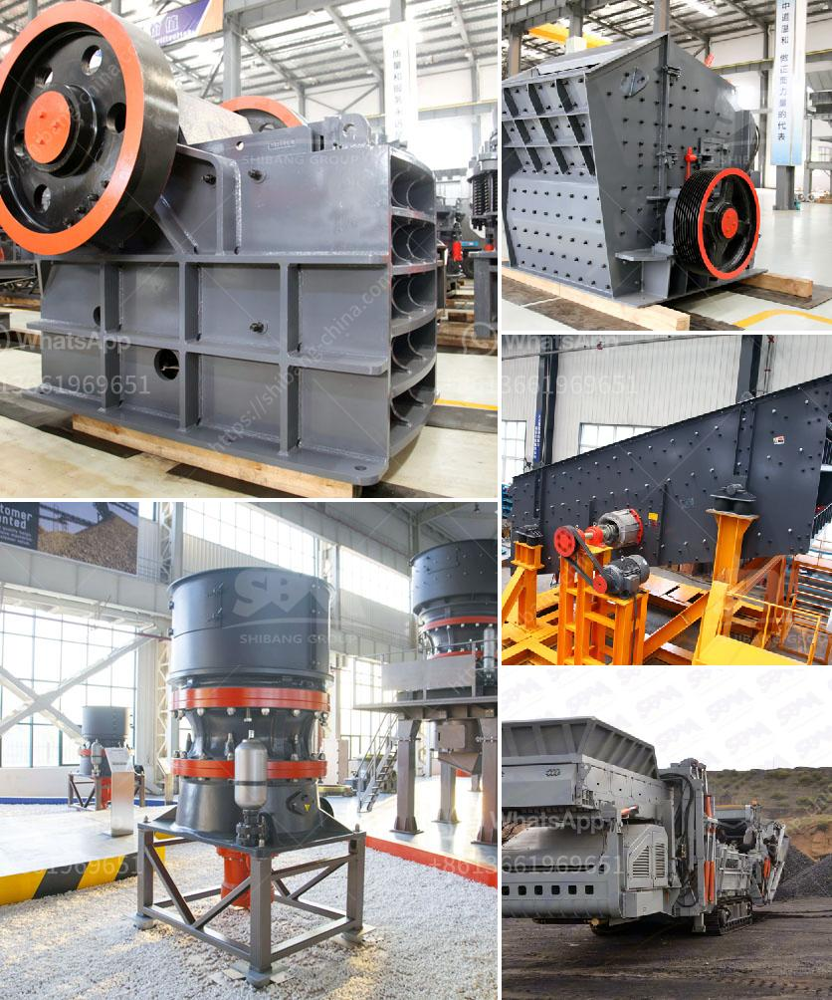

<h3>مصنع كسارة الحجر بسعة 100 طن</h3>
تعد كسارات الحجر واحدة من أهم المعدات في صناعة البناء والتشييد والتعدين. فهي تستخدم لسحق الأحجار الكبيرة إلى قطع صغيرة تستخدم في عمليات البناء أو في تصنيع الركام. واحدة من أهم الأنواع في هذا الصدد هي كسارة الحجر بسعة 100 طن.

يتميز هذا المصنع بقدرته على سحق الأحجار الكبيرة ذات السعة العالية، إذ يمكنه سحق حوالي 100 طن يوميًا. هذا يجعله مثاليًا للاستخدام في مشاريع البناء الكبيرة التي تتطلب كميات كبيرة من الركام. كما يتمتع بالقدرة على سحق الأحجار بتدرجات مختلفة، مما يجعله مناسبًا للاستخدام في مجموعة متنوعة من المشاريع.

بشكل عام، يتكون مصنع كسارة الحجر بسعة 100 طن من عدة أجزاء رئيسية. أولها، الأنابيب والناقلات التي تستخدم لنقل الأحجار من مكان التخزين إلى الكسارة. ثم يتم إدخال الأحجار إلى الكسارة حيث يتم سحقها. الدور الثالث للمصنع هو تصنيف الأحجار المسحوقة إلى تدرجات مختلفة باستخدام شاشات تصنيف.

تُستخدم كسارة الحجر ذات السعة العالية في عدة قطاعات مختلفة غير البناء. تجد تطبيقاتها في صناعة الأسفلت، حيث تستخدم الرمل والركام المحجوزين في إنتاج الأسفلت. كما يتم استخدامها في إنتاج الركام لصناعة الخرسانة المسلحة والجدران. تلك الكسارات يمكن أيضًا استخدامها في صناعة الطوب والبلوك والأحجار الزخرفية.

تقدم مصنع كسارة الحجر بسعة 100 طن العديد من المزايا. أبرزها القدرة على معالجة كميات كبيرة من الأحجار بكفاءة وسرعة عالية، مما يساهم في زيادة إنتاجية المشروع. بالإضافة إلى ذلك، يتميز هذا المصنع بسهولة الصيانة والتشغيل. يحتوي على جهاز التحكم بالكمبيوتر الذي يجعله سهل الاستخدام ويوفر وقتًا وجهدًا في عملية التشغيل.

باختصار، مصنع كسارة الحجر بسعة 100 طن هو أداة أساسية في صناعة البناء والتشييد والتعدين. بفضل قدرته على سحق الأحجار الكبيرة بكميات كبيرة، يمكن استخدامه في مجموعة متنوعة من المشاريع الكبيرة. يتميز بالكفاءة والسهولة في الصيانة والتشغيل، مما يجعله خيارًا مثاليًا للعديد من المستثمرين في صناعة البناء.
<h3>Contact us</h3><ul><li><strong>Whatsapp:&nbsp;<a href="https://wa.me/8613661969651">+8613661969651</a></strong></li><li><a href="https://swt.shibang-china.com/?git&amp;zhl&amp;مصنع كسارة الحجر بسعة 100 طن"><strong>Online Service(chat now)</strong></a></li></ul><h3>Related</h3><ul><li><a href='تقرير مشروع تعدين الكاولين الصغير.md'>تقرير مشروع تعدين الكاولين الصغير</a></li><li><a href='مصنع سحق حجر كامل بسعة 300 طن.md'>مصنع سحق حجر كامل بسعة 300 طن</a></li><li><a href='عملية تصنيع لوحات الجبس.md'>عملية تصنيع لوحات الجبس</a></li><li><a href='وكيل كسارة الفحم في إندونيسيا.md'>وكيل كسارة الفحم في إندونيسيا</a></li><li><a href='شركة تصنيع مطحنة الكرة الدقيقة في الهند.md'>شركة تصنيع مطحنة الكرة الدقيقة في الهند</a></li></ul>