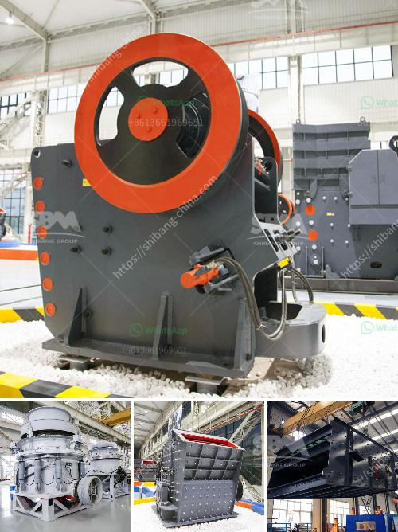

<h3>مصنع كسارة الحجر في ويست بنغال</h3>
يُعتبر مصنع كسارة الحجر في ولاية ويست بنغال من أبرز المشاريع الصناعية في المنطقة. يعمل هذا المصنع على تكسير الحجارة الكبيرة وتحويلها إلى حصى صغيرة تستخدم في البناء والأعمال الإنشائية. يلعب دوراً هاماً في توفير المواد اللازمة للمشاريع الكبرى التي تحدث في الولاية والمناطق المجاورة.

يتم تشغيل المصنع بواسطة آلات متطورة ومهندسين محترفين في مجال الهندسة والتصميم. يعمل هذا المصنع بكفاءة عالية وسرعة لانتاج كميات كبيرة من مواد البناء المحتاجة وفقًا للمواصفات والمعايير العالمية.

تعتبر مصانع الكسارات موثوقة وفعالة خاصة في تصنيع المواد الخرسانية والركام والرصف. تستخدم هذه الخامات في تطوير البنية التحتية للمدن والمدارس والمستشفيات والمنازل السكنية والكثير من المشاريع الأخرى التي تعزز التنمية العمرانية وتساهم في تحسين حياة الناس.

يوفر مصنع كسارة الحجر في ويست بنغال فرص عمل للعديد من العمال المحليين، مما يساهم في تعزيز اقتصادي المنطقة وتحسين مستوى المعيشة. يتم توظيف العديد من العمال في مجموعة متنوعة من الوظائف، بدءًا من العمال العاملين في الإنتاج وصولاً إلى الفنيين والمهندسين وغيرهم من العاملين المهرة.

يعتبر هذا المصنع جزءًا مهمًا من الصناعة في الولاية ويساهم في تحقيق الاكتفاء الذاتي للمواد الإنشائية المحلية بدلاً من الاعتماد على الاستيراد. يتم إنتاج مجموعة واسعة من المنتجات المتنوعة المطلوبة في مشاريع البناء.

يُعد المصنع ملتزمًا أيضًا بتطبيق معايير السلامة والصحة المهنية في العمل، حيث يعمل بصورة آمنة لضمان سلامة العاملين وحماية البيئة. توفر الشركة أيضًا التدريب والتعليم المستمر للعمال حول أحدث التقنيات والإجراءات الآمنة للعمل.

باختصار، يعد مصنع كسارة الحجر في ويست بنغال مؤسسة صناعية رائدة تسهم بشكل كبير في التنمية الاقتصادية والاجتماعية للمنطقة. يلتزم بتوفير منتجات ذات جودة عالية وفقًا للمعايير العالمية ويعمل بمعايير السلامة والصحة المهنية. يساهم في توفير فرص العمل وتعزيز الانتاج المحلي، مما يعزز التنمية الشاملة ورفاهية سكان المنطقة.
<h3>Contact us</h3><ul><li><strong>Whatsapp:&nbsp;<a href="https://wa.me/8613661969651">+8613661969651</a></strong></li><li><a href="https://swt.shibang-china.com/?git&amp;zhl&amp;مصنع كسارة الحجر في ويست بنغال"><strong>Online Service(chat now)</strong></a></li></ul><h3>Related</h3><ul><li><a href='مطحنة طحن الكرةستخدم لطحن الكرات.md'>مطحنة طحن الكرةستخدم لطحن الكرات</a></li><li><a href='البحث عن مطحنة الهامر.md'>البحث عن مطحنة الهامر</a></li><li><a href='مطحنة الطحن الصينية.md'>مطحنة الطحن الصينية</a></li><li><a href='تقرير مشروع مصنع الأسمنت الصغير.md'>تقرير مشروع مصنع الأسمنت الصغير</a></li><li><a href='تصنيع آلات السحق في بوليفيا.md'>تصنيع آلات السحق في بوليفيا</a></li></ul>