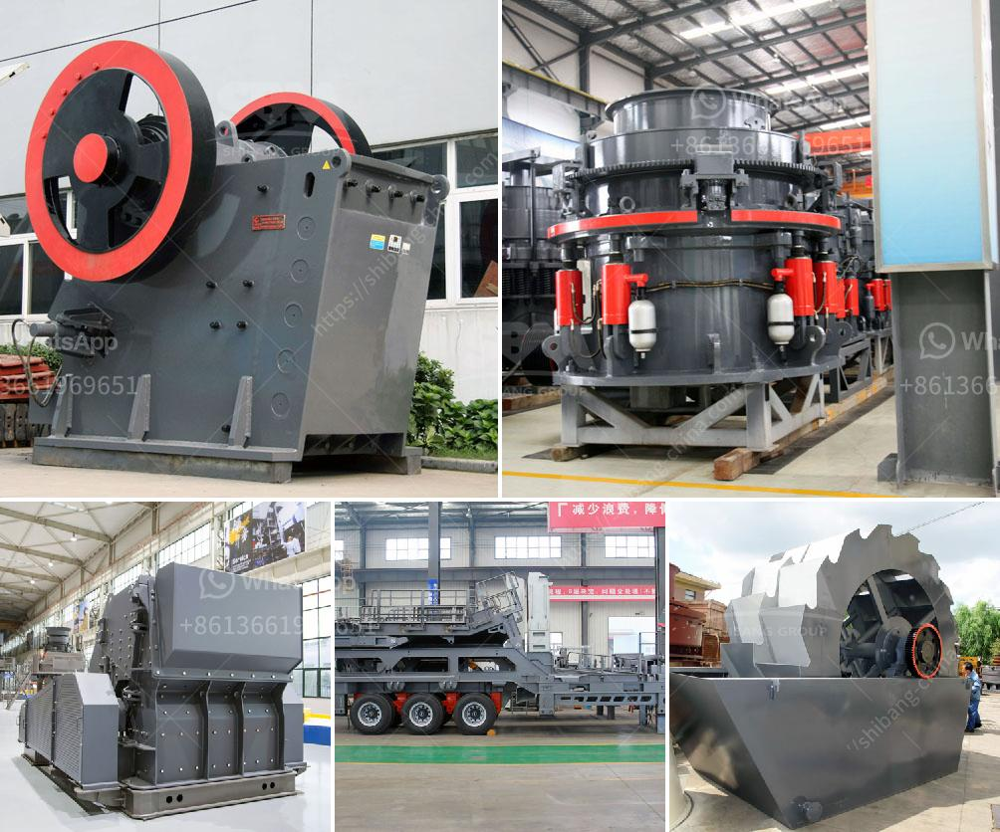

<h3>مصنع كسارة الحجر والجرانيت</h3>
تعتبر صناعة الحجر والجرانيت من الصناعات الهامة والمهمة في مجال البناء والتشييد، حيث يتم استخدامها في تجهيز العديد من المباني والمشاريع الكبرى. وفي هذه المقالة، سنتحدث عن مصنع كسارة الحجر والجرانيت ودورها في هذه الصناعة.

يقوم مصنع كسارة الحجر والجرانيت بتكسير وتصنيع هذه المواد الصلبة لاستخدامها في البناء بشكل فعال وفعّال. يعمل المصنع على تجهيز الحجر الخام والجرانيت وتحويلها إلى حجم مطلوب حسب احتياجات العملاء. ثم يتم تنقيتها وفرزها قبل استخدامها في المشاريع المختلفة.

تعتبر معدات مصنع كسارة الحجر والجرانيت متطورة ومتقدمة من حيث التقنية والكفاءة. تستخدم العديد من الآلات والمعدات في المصنع، مثل الكسارات والغرابيل والفرز والناقلات. يعمل هذا النظام المتكامل على تسهيل عملية التصنيع وضمان الجودة والدقة في إنتاج المواد.

تلعب مصانع كسارة الحجر والجرانيت دورًا مهمًا في تحقيق التنمية الاقتصادية وتوفير فرص العمل للعديد من العمال في المجتمعات المحلية. تعتبر هذه الصناعة مصدرًا مهمًا للدخل وتساهم في تعزيز النمو الاقتصادي للبلد.

علاوة على ذلك، تساهم مصانع كسارة الحجر والجرانيت في الحد من استخدام المصادر الطبيعية والمحافظة على البيئة. فبدلاً من استخدام الموارد الطبيعية الأخرى، يمكن إعادة استخدام الحجر والجرانيت القديم وإعادة تدويرها لصنع مواد جديدة. هذا يعني أنه يمكن لهذه الصناعة أن تقلل من تأثيرها على البيئة وتحافظ على المصادر الطبيعية للأجيال القادمة.

في الختام، يعتبر مصنع كسارة الحجر والجرانيت جزءًا أساسيًا من صناعة البناء والتشييد. يلعب دورًا حيويًا في توفير المواد اللازمة للمشاريع وتلبية احتياجات العملاء. بفضل تقدم التكنولوجيا والاهتمام المتزايد بالاستدامة، يمكن لهذه الصناعة أن تحقق التطور والنمو رغم التحديات التي تواجهها.
<h3>Contact us</h3><ul><li><strong>Whatsapp:&nbsp;<a href="https://wa.me/8613661969651">+8613661969651</a></strong></li><li><a href="https://swt.shibang-china.com/?git&amp;zhl&amp;مصنع كسارة الحجر والجرانيت"><strong>Online Service(chat now)</strong></a></li></ul><h3>Related</h3><ul><li><a href='شركة تصنيع مطحنة ريموند.md'>شركة تصنيع مطحنة ريموند</a></li><li><a href='مطحق الصخور في الفلبين.md'>مطحق الصخور في الفلبين</a></li><li><a href='مصنع طحن كلنكر الإسمنت في الهند.md'>مصنع طحن كلنكر الإسمنت في الهند</a></li><li><a href='تصميم آلة كسارة الحجر مخطط تدفق التجميع.md'>تصميم آلة كسارة الحجر مخطط تدفق التجميع</a></li><li><a href='تصميم محطة كسارة الحجر.md'>تصميم محطة كسارة الحجر</a></li></ul>