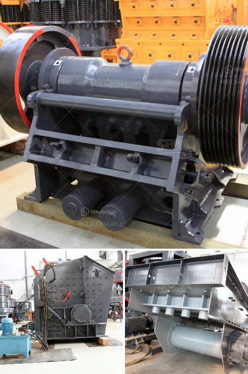

<h3>مصنع كسارة الحجر</h3>
تعتبر مصانع كسارة الحجر من أهم المرافق الصناعية التي تلعب دورًا حيويًا في صناعة البناء والبنية التحتية. وتتمثل مهمة هذه المصانع في تكسير الحجر الصخري إلى قطع صغيرة ومناسبة للاستخدام في البناء والأعمال الإنشائية.

يتكون مصنع كسارة الحجر من عدة أجزاء رئيسية، بما في ذلك الكسارة الفكية والكسارة التصادمية والغربال الاهتزازي والناقل الاهتزازي. تعمل جميع هذه الأجزاء معًا لضمان إنتاجية عالية وجودة ممتازة للمنتج النهائي.

تبدأ عملية التصنيع في المصنع بتحميل الحجر الصخري الكبير في الكسارة الفكية باستخدام المعدات الثقيلة. يتم سحق الحجر بواسطة الكسارة الفكية إلى قطع صغيرة جدًا. يتم نقل هذه القطع إلى الكسارة التصادمية حيث يتم تكسيرها وتفتيتها بشكل أكبر. يتم فرز المنتج النهائي بواسطة الغربال الاهتزازي حسب الحجم المطلوب للاستخدام المستقبلي. ثم يتم نقل الحصى الناتجة من الغربال الاهتزازي إلى الناقل الاهتزازي لنقلها إلى الموقع المطلوب.

يتميز مصنع كسارة الحجر بالقدرة العالية على التكسير والإنتاجية العالية، مما يجعلها مناسبة لتلبية الطلب الكبير على المواد الخام في صناعة البناء. كما تتميز بقدرتها على تكسير مختلف أنواع الحجارة بفعالية وسرعة، بغض النظر عن صلابتها.

وتعتبر مصانع كسارة الحجر على نحو خاص ذات أهمية كبيرة في الدول التي تعتمد بشكل رئيسي على البناء وتطوير البنية التحتية، حيث تلعب دورًا حاسمًا في توفير المواد الأساسية لهذه الصناعة الحيوية.

باختصار، فإن مصنع كسارة الحجر هو منشأة صناعية حيوية تلعب دورًا كبيرًا في صناعة البناء والبنية التحتية، حيث تقوم بتكسير الحجارة الكبيرة إلى قطع صغيرة تستخدم في البناء. تتميز هذه المصانع بإنتاجية عالية وجودة ممتازة للمنتج النهائي، مما يجعلها ضرورية بشكل كبير لتلبية الطلب الكبير على المواد الخام في صناعة البناء.
<h3>Contact us</h3><ul><li><strong>Whatsapp:&nbsp;<a href="https://wa.me/8613661969651">+8613661969651</a></strong></li><li><a href="https://swt.shibang-china.com/?git&amp;zhl&amp;مصنع كسارة الحجر"><strong>Online Service(chat now)</strong></a></li></ul><h3>Related</h3><ul><li><a href='المواصفات الفنية لمطحنة الكرة.md'>المواصفات الفنية لمطحنة الكرة</a></li><li><a href='كسارة متنقلة لخام الحديد.md'>كسارة متنقلة لخام الحديد</a></li><li><a href='شركة تصنيع مطاحن المطرقة في ماليزيا.md'>شركة تصنيع مطاحن المطرقة في ماليزيا</a></li><li><a href='كسارة الحجر في أوغندا.md'>كسارة الحجر في أوغندا</a></li><li><a href='آلة كسارة الحجر التركية.md'>آلة كسارة الحجر التركية</a></li></ul>