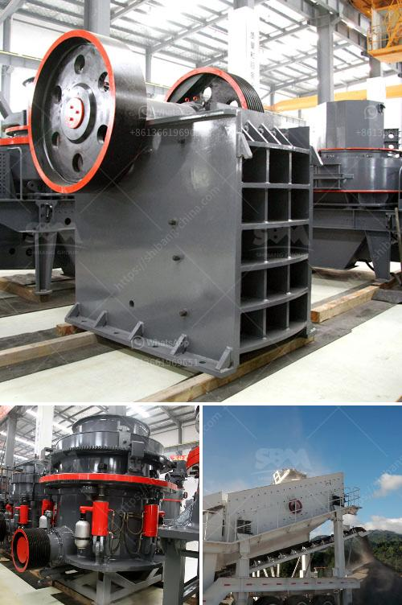

<h3>مصنع كسارة الحصى بالقرب من مانيلا</h3>
تعدّ صناعة البناء والتشييد من الصناعات الحيوية في العديد من البلدان. ومن بين المكونات الأساسية التي تدخل في صناعة البناء هي الرمل والحصى. ويتطلب توفير الرمل والحصى في الكمية والجودة المطلوبة استخدام مصانع الكسارات.

في محافظة تارلاك بالقرب من مانيلا، توجد مصانع للكسارات التي تقوم بإنتاج الحصى. يتم استخراج الحصى من المقالع الطبيعية القريبة من المحافظة، ثم يتم نقلها إلى المصانع للتكسير والفرز.

تعدّ مصانع الكسارات في هذه المنطقة من الأماكن الحيوية والحيوية التي تشهد نشاطاً كبيراً على مدار السنة. تعمل هذه المصانع على مدار الساعة لتكسير الحصى وتصنيفه وتعبئته استعدادًا للتسليم إلى شركات البناء والمقاولات.

ومن أجل ضمان جودة المنتج النهائي، يتم تطبيق معايير صارمة لعمليات التكسير والفرز. يتم استخدام كسارة الفك وكسارة الصدم ومجموعة متنوعة من الأدوات الأخرى لتكسير الحصى إلى أحجام مختلفة حسب متطلبات العملاء.

بعد عملية التكسير، يتم فرز الحصى حسب حجم الجزيئات والتصنيف في أحجام مختلفة من خلال استخدام أجهزة الفرز المتقدمة. يتم تعبئة الحصى في أكياس أو شاحنات بأوزان محددة استعدادًا للنقل والتسليم.

تعتبر هذه المصانع منشآت حديثة وذات تقنيات متطورة، مما يسمح لها بتحقيق إنتاجية عالية وتلبية احتياجات السوق. بالإضافة إلى ذلك، فإن هذه المصانع تلتزم بتطبيق أعلى معايير السلامة والبيئة لضمان سلامة العاملين والحد من التأثيرات السلبية على البيئة المحيطة.

وفي الختام، فإن مصانع الكسارات في محافظة تارلاك تلعب دورًا حيويًا في صناعة البناء والتشييد في المنطقة. تسهم هذه المصانع في توفير رمزهم والحصى ذو الجودة العالية للشركات والمؤسسات العاملة في هذا القطاع. كما تعدّ تلك المصانع مثالًا للتطوير التكنولوجي والالتزام بالمعايير البيئية والصحية في صناعة البناء والتشييد.
<h3>Contact us</h3><ul><li><strong>Whatsapp:&nbsp;<a href="https://wa.me/8613661969651">+8613661969651</a></strong></li><li><a href="https://swt.shibang-china.com/?git&amp;zhl&amp;مصنع كسارة الحصى بالقرب من مانيلا"><strong>Online Service(chat now)</strong></a></li></ul><h3>Related</h3><ul><li><a href='شركة تصنيع آلات كسارة الفك.md'>شركة تصنيع آلات كسارة الفك</a></li><li><a href='موردي آلات طحن الأسنان في مصر.md'>موردي آلات طحن الأسنان في مصر</a></li><li><a href='مطاحن صناعية للفحم.md'>مطاحن صناعية للفحم</a></li><li><a href='شاشة اهتزاز الحصى.md'>شاشة اهتزاز الحصى</a></li><li><a href='طحن الرمل السيليكا.md'>طحن الرمل السيليكا</a></li></ul>