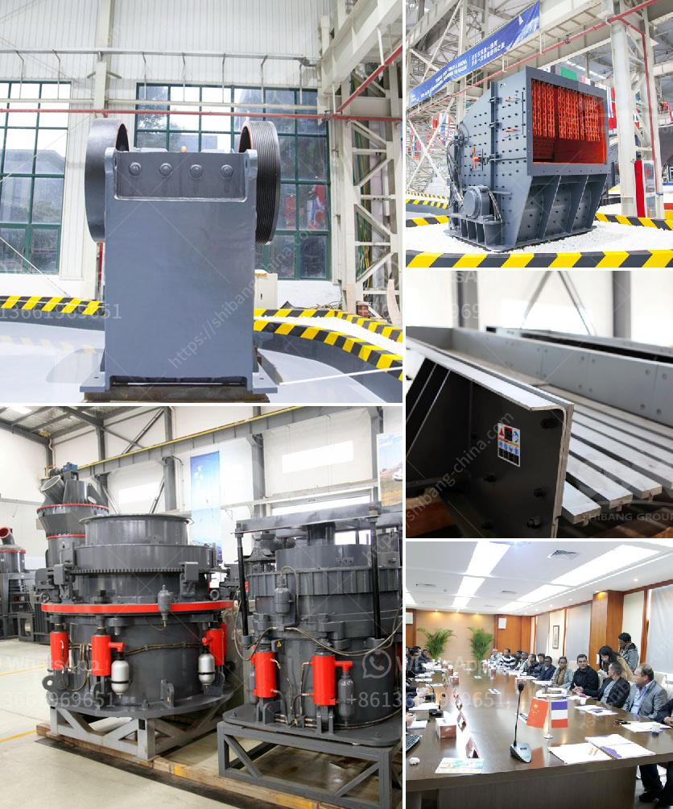

<h3>مصنع كسارة الدولوميت في الكويت</h3>
تعد الدولوميت من المعادن الهامة التي تستخدم في مجالات عديدة منها الصناعة والبناء والزراعة. وفي الكويت، يتم استخراج وتصنيع الدولوميت في مصنع خاص به في مدينة الشويخ.

تم تأسيس مصنع كسارة الدولوميت في الكويت بهدف تلبية احتياجات السوق المحلية والإقليمية لهذه المادة. يُعتبر المصنع واحداً من أهم المشاريع الصناعية في الكويت، ويعكس التزام الدولة بتطوير القطاع الصناعي وتعزيز الاقتصاد المحلي.

يتميز مصنع كسارة الدولوميت في الكويت بتقنيات حديثة ومعدات عالية الجودة. يتم استخدام أحدث التقنيات في عمليات التعدين والتكسير والطحن والتجهيز للدولوميت، مما يتيح الحصول على منتجات ذات جودة عالية ومواصفات متفوقة. يتم تصنيع المنتجات المستخرجة من الدولوميت في المصنع بما يتوافق مع المعايير القياسية المحلية والدولية.

تستخدم منتجات الدولوميت المصنعة في الكويت بشكل رئيسي في صناعة الصلب والمعادن، حيث تستخدم كمادة مضافة لتعدين الحديد والصلب وتحسين جودته. كما تستخدم أيضًا في صناعة الأسمدة والبناء والزراعة، حيث تعتبر مادة رئيسية في تحسين خواص التربة وزيادة إنتاجية الأغذية المزروعة.

تهدف الحكومة الكويتية من وراء إنشاء هذا المصنع إلى تشجيع الاستثمار في قطاع التعدين والصناعة، وتوفير فرص عمل للشباب الكويتي وزيادة المساهمة في تحقيق الاكتفاء الذاتي للدولة في هذا المجال. تعكس هذه المبادرة الحكومية التزام الدولة بتطوير القطاع الصناعي كجزء من خططها لتحقيق التنمية المستدامة وتنوي diversify على اقتصاد البلاد.

في الختام، يعد مصنع كسارة الدولوميت في الكويت مثالاً حياً على التحول الصناعي والقدرة التنافسية للبلاد في هذا القطاع. يساهم المصنع في تلبية احتياجات السوق المحلية والإقليمية من خلال توفير منتجات ذات جودة عالية وبأسعار تنافسية. ومن المتوقع أن يستمر الاستثمار في هذا المجال في المستقبل في ضوء النمو المستمر للصناعة والطلب على منتجات الدولوميت.
<h3>Contact us</h3><ul><li><strong>Whatsapp:&nbsp;<a href="https://wa.me/8613661969651">+8613661969651</a></strong></li><li><a href="https://swt.shibang-china.com/?git&amp;zhl&amp;مصنع كسارة الدولوميت في الكويت"><strong>Online Service(chat now)</strong></a></li></ul><h3>Related</h3><ul><li><a href='سعر معدات معالجة الكاولين.md'>سعر معدات معالجة الكاولين</a></li><li><a href='آلة صنع الحجر الخرساني في جنوب أفريقيا.md'>آلة صنع الحجر الخرساني في جنوب أفريقيا</a></li><li><a href='مصنع الجير والدولوميت في ماليزيا.md'>مصنع الجير والدولوميت في ماليزيا</a></li><li><a href='مصنع تكسير السلاغ في تاميل نادو.md'>مصنع تكسير السلاغ في تاميل نادو</a></li><li><a href='خط إنتاج الحجر الجيري.md'>خط إنتاج الحجر الجيري</a></li></ul>