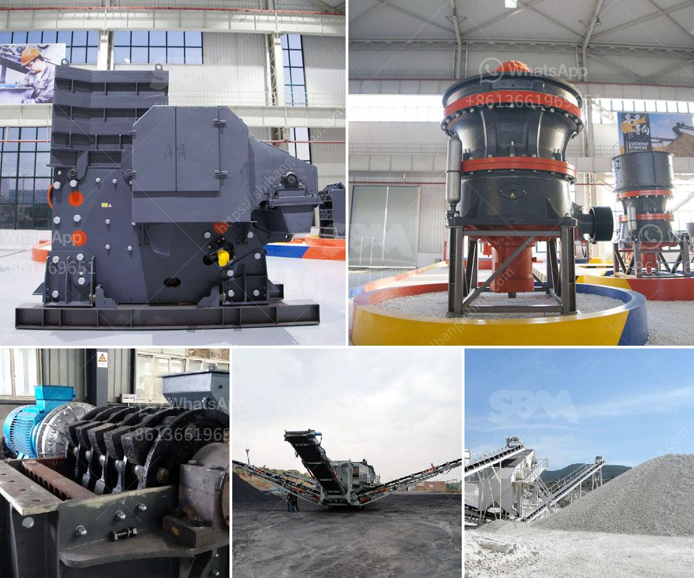

<h3>مصنع كسارة الدولوميت في ناجبور</h3>
تعتبر كسارة الدولوميت في ناجبور واحدة من أهم المصانع التي تنتج الكسارة في المنطقة. تأسست هذه المصنع في العقد الأخير وأصبحت من أبرز المنشآت الصناعية في المدينة.

يعد الدولوميت مادة معدنية تستخدم بشكل رئيسي في الصناعات الكيميائية والصناعات الأسمنتية. يتم استخراج الدولوميت من المحاجر ومن ثم يتم تكسيرها وتجهيزها في المصنع للحصول على منتج نهائي قابل للتصدير.

تعد الدولوميت قادرة على تحسين خواص الأسمنت وتقليل تكاليف الإنتاج في العديد من الصناعات. وبالإضافة إلى ذلك، فإنها تستخدم أيضًا في صنع الجص والأسمدة ومواد البناء والعديد من التطبيقات الأخرى.

تعتبر مصنع كسارة الدولوميت في ناجبور من أحدث المصانع التي تستخدم أحدث التقنيات في عملية الإنتاج. يتم استخدام الآلات والمعدات المتطورة لضمان جودة المنتج النهائي وتلبية متطلبات العملاء. كما يتم الاهتمام بشكل كبير بالاستدامة البيئية وتقليل أثر المصنع على البيئة المحيطة.

بفضل جودة المنتجات والتقنيات الحديثة، حققت كسارة الدولوميت في ناجبور شهرة كبيرة في جميع أنحاء المنطقة. تعتبر منتجاتها مطلوبة ومشهورة بجودتها العالية وقدرتها على المنافسة في الأسواق الدولية.

تسهم المصنع في توفير فرص العمل للمجتمع المحلي وتحسين مستوى المعيشة للعاملين في المصنع. بالإضافة إلى ذلك، يدعم المصنع المبادرات المجتمعية والمشاريع التنموية في المنطقة لتعزيز التنمية المستدامة وتحسين حياة السكان المحليين.

باختصار، تعتبر كسارة الدولوميت في ناجبور من أهم المصانع في المنطقة. تستخدم أحدث التقنيات في عملية الإنتاج وتوفر منتجات عالية الجودة، مما يساهم في تحسين الاقتصاد المحلي وتعزيز التنمية الاجتماعية والاقتصادية في المنطقة.
<h3>Contact us</h3><ul><li><strong>Whatsapp:&nbsp;<a href="https://wa.me/8613661969651">+8613661969651</a></strong></li><li><a href="https://swt.shibang-china.com/?git&amp;zhl&amp;مصنع كسارة الدولوميت في ناجبور"><strong>Online Service(chat now)</strong></a></li></ul><h3>Related</h3><ul><li><a href='آلة طحن مطحنة الرمل السيليكا.md'>آلة طحن مطحنة الرمل السيليكا</a></li><li><a href='شركات تصنيع آلات الكسارة في باكستان.md'>شركات تصنيع آلات الكسارة في باكستان</a></li><li><a href='آلة مطحنة المطارق.md'>آلة مطحنة المطارق</a></li><li><a href='مطحنة الأسطوانة في الهند.md'>مطحنة الأسطوانة في الهند</a></li><li><a href='مصنع معالجة المنغنيز.md'>مصنع معالجة المنغنيز</a></li></ul>