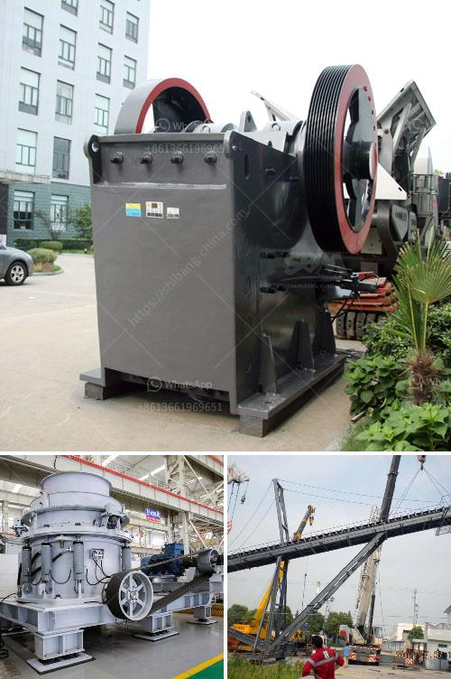

<h3>مصنع كسارة السخام في الهند</h3>
يعد مصنع كسارة السخام في الهند أحد المشاريع الرئيسية في قطاع التعدين والبناء، حيث يتم استخلاص وتجهيز السخام للاستخدام في العديد من الصناعات المختلفة. ولنتعرف في هذه المقالة على بعض المعلومات الأساسية عن هذا المصنع.

يقع مصنع كسارة السخام في الهند في إحدى المناطق الغنية بالمواد الخام والتي تحتوي على كميات هائلة من السخام الذي يمتاز بخصائص ممتازة للاستخدام الصناعي. يتكون هذا السخام من مجموعة متنوعة من المعادن والمركبات، مثل الحديد والألومنيوم والزنك والتيتانيوم والنحاس والزرنيخ والبوريوم والرصاص، إضافة إلى العديد من العناصر الأخرى.

يتم استخراج السخام من المناجم باستخدام عمليات التعدين المتقدمة، مثل الحفر والتفجير والتفتيت، ومن ثم يتم نقل المواد الخام إلى المصنع. يتم في المصنع تجهيز السخام وتحويله إلى منتجات جاهزة للبيع في الأسواق المحلية والعالمية.

يتم استخدام منتجات مصنع كسارة السخام في العديد من الصناعات مثل صناعة الصلب، حيث يتم استخدامها لإنتاج الحديد والصلب، وبالتالي تلبية الاحتياجات المتزايدة للبنية التحتية والمشاريع الإنشائية. كما تستخدم أيضًا في صناعة الألومنيوم لإنتاج قطع السيارات والمعدات الصناعية. بالإضافة إلى ذلك، يتم استخدام السخام في صناعة الزجاج والسيراميك والأسمنت والأسمدة وغيرها من الصناعات.

إن قطاع استخراج وتجهيز السخام في الهند يلعب دورًا حيويًا في تنمية الاقتصاد الوطني، حيث يشكل مصدرًا كبيرًا للعمالة ويساهم في إنشاء فرص عمل جديدة. يلتزم المصنع بمعايير الجودة العالية والممارسات البيئية الصديقة، ويعمل بالتعاون مع الجهات الحكومية لتعزيز السلامة والتنمية المستدامة في المنطقة المحيطة به.

باختصار، يعد مصنع كسارة السخام في الهند إحدى الوحدات الصناعية الرائدة في قطاع التعدين والبناء، حيث يقوم بتجهيز وتحويل السخام إلى منتجات مختلفة تلبي احتياجات الصناعات المختلفة. يلتزم المصنع بمعايير الجودة العالية والممارسات البيئية الصديقة، ويعمل على تعزيز التنمية الاقتصادية وتوفير فرص العمل في المنطقة المحيطة به.
<h3>Contact us</h3><ul><li><strong>Whatsapp:&nbsp;<a href="https://wa.me/8613661969651">+8613661969651</a></strong></li><li><a href="https://swt.shibang-china.com/?git&amp;zhl&amp;مصنع كسارة السخام في الهند"><strong>Online Service(chat now)</strong></a></li></ul><h3>Related</h3><ul><li><a href='حول شركة تكسير الفحم في إثيوبيا.md'>حول شركة تكسير الفحم في إثيوبيا</a></li><li><a href='مطحنة حجر نيجيريا.md'>مطحنة حجر نيجيريا</a></li><li><a href='حساب دورة في الدقيقة التشغيلية لمطحنة الكرة.md'>حساب دورة في الدقيقة التشغيلية لمطحنة الكرة</a></li><li><a href='معدات سحق الجرانيت.md'>معدات سحق الجرانيت</a></li><li><a href='كسارة الحجر الهامر.md'>كسارة الحجر الهامر</a></li></ul>