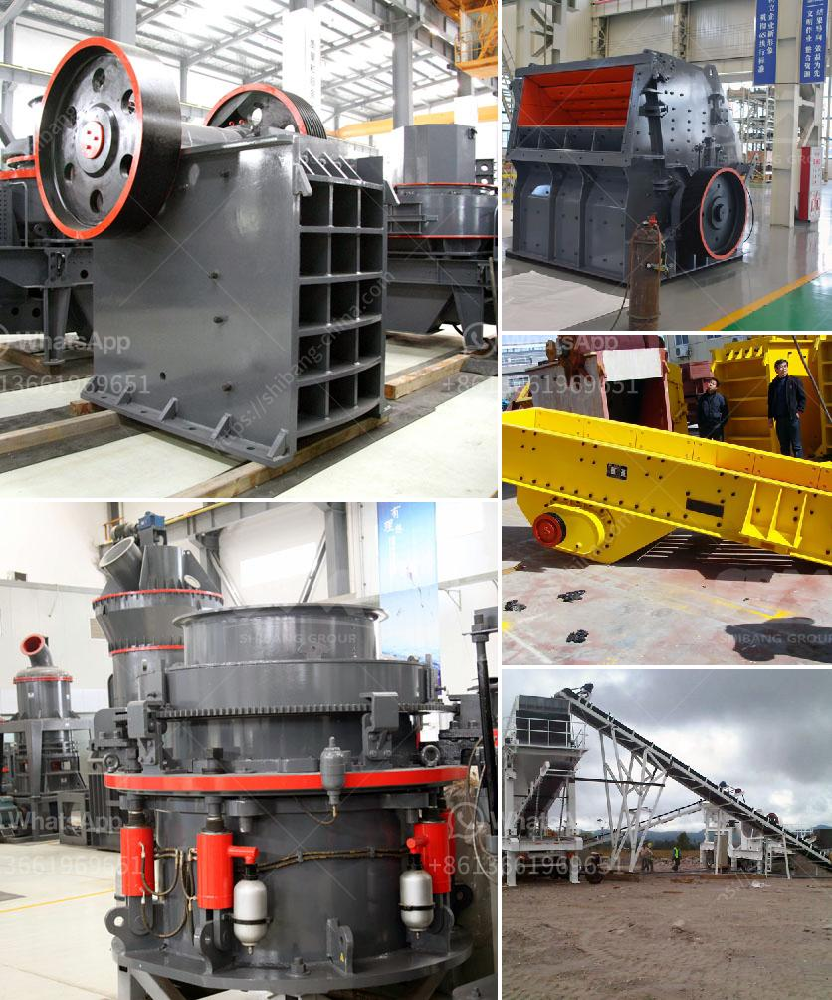

<h3>مصنع كسارة الصخور الذهبية المحمولة</h3>
تعتبر كسارة الصخور الذهبية المحمولة واحدة من أهم المعدات في صناعة التعدين الذهبي. فهي تستخدم لسحق الصخور الصلبة واستخلاص الذهب منها. تتميز هذه الكسارة بقدرتها على العمل في المواقع النائية والمناطق الجبلية ، حيث يكون من الصعب نقل الصخور إلى مصنع التعدين.

تعمل كسارة الصخور الذهبية المحمولة عن طريق تشغيل محرك الديزل أو الكهرباء ، مما يجعلها قادرة على العمل في أماكن بعيدة عن الشبكة الكهربائية. تتميز بأنها قادرة على سحق الصخور الكبيرة إلى حجم صغير في فترة زمنية قصيرة. كما أنها مزودة بحزام ناقل يقوم بنقل الصخور المسحوقة إلى مكان التكوين الثانوي لاستخلاص الذهب.

يوفر استخدام كسارة الصخور الذهبية المحمولة الكثير من المزايا. واحدة من هذه المزايا هي قابليتها للنقل بسهولة من موقع لآخر. يمكن أن يكون لدى شركات التعدين العديد من المناجم المنتشرة في عدة أماكن ، واستخدام كسارة محمولة يعني أنه يمكن نقلها بسهولة للاستفادة منها في أي منجم تعدين آخر.

بالإضافة إلى ذلك ، تعتبر كسارة الصخور الذهبية المحمولة ميسرة الاستخدام. يمكن لأي فرد يتعامل معها بسهولة تشغيلها وصيانتها. كما أنها توفر إنتاجية عالية ، مما يساهم في زيادة إنتاج المنجم وزيادة تعبئة الذهب.

ومع ذلك ، فإن استخدام كسارة الصخور الذهبية المحمولة له بعض العيوب أيضًا. على سبيل المثال ، فإن الاعتماد على مصنع صغير المقبض قد يؤدي إلى إنتاجية محدودة ، مما يعني أنه سيستغرق وقتًا أطول لاستخلاص الذهب المطلوب. بالإضافة إلى ذلك ، قد يتطلب توفير وقود لتشغيل المحرك الديزل أو توفير مصدر للكهرباء.

في الختام ، تعتبر كسارة الصخور الذهبية المحمولة أداة هامة في صناعة التعدين الذهبي. توفر الكفاءة والسهولة في النقل والاستخدام. على الرغم من بعض العيوب ، تعتبر هذه الكسارة حلاً مثاليًا لاستخلاص الذهب من المواقع النائية والمناطق الجبلية.
<h3>Contact us</h3><ul><li><strong>Whatsapp:&nbsp;<a href="https://wa.me/8613661969651">+8613661969651</a></strong></li><li><a href="https://swt.shibang-china.com/?git&amp;zhl&amp;مصنع كسارة الصخور الذهبية المحمولة"><strong>Online Service(chat now)</strong></a></li></ul><h3>Related</h3><ul><li><a href='مصنع فصل وتركيز المعادن في نيجيريا.md'>مصنع فصل وتركيز المعادن في نيجيريا</a></li><li><a href='آلة سحق الأسفلت بسعة 15 طن في الساعة.md'>آلة سحق الأسفلت بسعة 15 طن في الساعة</a></li><li><a href='آلة حبيبات الجبس في الهند.md'>آلة حبيبات الجبس في الهند</a></li><li><a href='أسعار معدات التكسير والفحص جنوب أفريقيا.md'>أسعار معدات التكسير والفحص جنوب أفريقيا</a></li><li><a href='آلة فاصلة للرمل والحصى للبيع في الفلبين.md'>آلة فاصلة للرمل والحصى للبيع في الفلبين</a></li></ul>