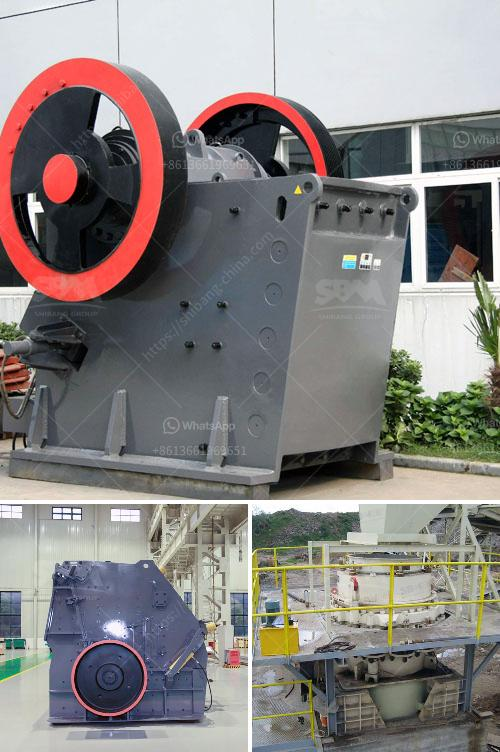

<h3>مصنع كسارة الصخور بسعة 150 طن</h3>
تعتبر مصانع كسارة الصخور أحد أهم الصناعات التي تستخدم في مجال التعدين والبناء. وتعد كسارة الصخور بسعة 150 طن من أهم وأكثر الكسارات استخدامًا في هذا القطاع. سنتناول في هذه المقالة مزايا واستخدامات مصنع كسارة الصخور بسعة 150 طن.

صممت مصانع كسارة الصخور بسعة 150 طن لتكسير وطحن الصخور الضخمة إلى حجم أصغر يمكن استخدامه في صناعات مختلفة. تعمل هذه المصانع بمبدأ المطرقة الدوارة، حيث يتم توجيه الحجارة الضخمة إلى فتحة التغذية بواسطة سير ناقل، ثم يتم ضرب الصخور بالمطارق الدوارة المثبتة على الدوار. ونتيجة لهذه العملية، تنكسر الصخور إلى قطع أصغر تستخدم في عمليات البناء والبناء.

مصنع كسارة الصخور بسعة 150 طن له العديد من المزايا. أحد أهمها هو قدرته على معالجة كميات كبيرة من الصخور في وقت قصير. تعزز قدرة 150 طن من هذه المصانع الإنتاج والإنتاجية في صناعات البناء. كما أنه يتميز بسهولة الصيانة والتشغيل، مما يساهم في زيادة كفاءة الإنتاج وتقليل التوقف التشغيلي.

يستخدم مصنع كسارة الصخور بسعة 150 طن في العديد من الصناعات، مثل صناعة الخرسانة والرمل والسكراب والطوب والأسفلت. يمكن استخدام الرمال المنتجة من هذه المصانع في مشاريع البناء المختلفة، مثل بناء الطرق والمباني وأعمال الأساس والترابيزة. كما يمكن استخدام السكراب الناتج عن المصنع في إعادة تدويره واستخدامه في عمليات الصهر وإعادة التصنيع.

يعد مصنع كسارة الصخور بسعة 150 طن خيارًا مثاليًا للشركات والمقاولين العاملين في قطاع التعدين والبناء. يساعد هذا المصنع في زيادة الإنتاج وتحسين جودة الناتج النهائي، مما يؤدي إلى زيادة الربحية وتحقيق أهداف الشركة.

في الختام، تعد مصانع كسارة الصخور بسعة 150 طن من أهم الآلات المستخدمة في صناعات التعدين والبناء. تتيح تلك المصانع للشركات تجهيز كميات كبيرة من الصخور واستخدامها في البناء والبناء. إن استخدام مصنع كسارة الصخور بسعة 150 طن يساهم في تحسين كفاءة العمل وزيادة الإنتاجية، مما يؤدي إلى تحقيق أهداف الشركات وتحقيق الربحية.
<h3>Contact us</h3><ul><li><strong>Whatsapp:&nbsp;<a href="https://wa.me/8613661969651">+8613661969651</a></strong></li><li><a href="https://swt.shibang-china.com/?git&amp;zhl&amp;مصنع كسارة الصخور بسعة 150 طن"><strong>Online Service(chat now)</strong></a></li></ul><h3>Related</h3><ul><li><a href='كسارة مخروط زينث.md'>كسارة مخروط زينث</a></li><li><a href='شركة تصنيع الكسارات في الصين.md'>شركة تصنيع الكسارات في الصين</a></li><li><a href='مصانع غسيل الذهب للبيع في غانا.md'>مصانع غسيل الذهب للبيع في غانا</a></li><li><a href='مصنع أسمنت للبيع في ألمانيا.md'>مصنع أسمنت للبيع في ألمانيا</a></li><li><a href='كسارة الأسطوانة PG 610 x 400.md'>كسارة الأسطوانة PG 610 x 400</a></li></ul>