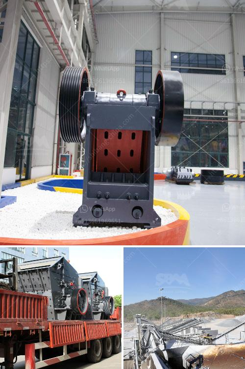

<h3>مصنع كسارة الفحم المحمول 400 طن في الساعة</h3>
من الخطوات الأساسية في عملية إنتاج الفحم هي تكسير الفحم إلى أحجام صغيرة. ومن أجل ذلك، تستخدم كسارات الفحم المحمولة، وهي أدوات فعالة وعالية الإنتاجية تستخدم في تكسير الفحم إلى جزيئات صغيرة.

يتم استخدام مصنع كسارة الفحم المحمول 400 طن في الساعة لتحويل كميات كبيرة من الفحم إلى حجم صغير في وقت قصير. يمكن أن يسهم هذا المصنع في زيادة الإنتاجية وتقليل التكاليف والجهد المبذول في عملية التكسير.

تعتبر مصانع الكسارة المحمولة مرنة وقابلة للنقل، حيث يمكن نقلها بسهولة من موقع لآخر. كما أنها تتميز بسهولة التشغيل والصيانة، مما يوفر الكثير من الوقت والجهد للمشغلين.

يمكن لمصانع الكسارة المحمولة أن تتكيف مع العديد من الظروف المختلفة وتغلب على التحديات المتعلقة بمواقع العمل المختلفة. يعد هذا الأمر مهمًا خاصة في صناعة التعدين حيث توجد العديد من التضاريس المختلفة والبيئات القاسية.

يتكون مصنع كسارة الفحم المحمول من محطة تغذية، وكسارة رئيسية، وغربال اهتزازي. يتم إعداد الفحم وتغذيته في المحطة، ثم يتم تكسيره بواسطة الكسارة الرئيسية، وتنخل الجسيمات الناتجة بواسطة الغربال الاهتزازي للحصول على حجم الجسيمات المطلوب.

من أهم مزايا مصنع كسارة الفحم المحمول 400 طن في الساعة هو قدرته على تكسير الفحم إلى حجم دقيق ومنتظم بكفاءة عالية. كما يتميز المصنع بقدرته على تكرار العملية بكفاءة تامة ودون أي اضطرابات.

باستخدام مصنع كسارة الفحم المحمول، يمكن تحسين عملية تكسير الفحم وزيادة الإنتاجية بشكل ملحوظ. كما يمكن للمصنع توفير الكثير من الوقت والجهد والتكاليف المرتبطة بعملية التكسير.

في النهاية، تعتبر مصانع كسارة الفحم المحمولة 400 طن في الساعة أدوات مهمة في عملية تكسير الفحم. فهي تساهم في زيادة الإنتاجية وتحسين كفاءة العمل وتقليل التكاليف. وبفضل قابليتها للنقل والتشغيل السهل، فهي تجعل عملية التكسير أكثر مرونة وسهولة.
<h3>Contact us</h3><ul><li><strong>Whatsapp:&nbsp;<a href="https://wa.me/8613661969651">+8613661969651</a></strong></li><li><a href="https://swt.shibang-china.com/?git&amp;zhl&amp;مصنع كسارة الفحم المحمول 400 طن في الساعة"><strong>Online Service(chat now)</strong></a></li></ul><h3>Related</h3><ul><li><a href='سعر كسارة الحجر في باكستان.md'>سعر كسارة الحجر في باكستان</a></li><li><a href='كسارة المطرقة في الصين.md'>كسارة المطرقة في الصين</a></li><li><a href='معدات طحن صناعية وأسعار معدات الطحن.md'>معدات طحن صناعية وأسعار معدات الطحن</a></li><li><a href='قائمة أسعار كسارة الفك.md'>قائمة أسعار كسارة الفك</a></li><li><a href='كسارة محمولة باركر 50 للبيع.md'>كسارة محمولة باركر 50 للبيع</a></li></ul>