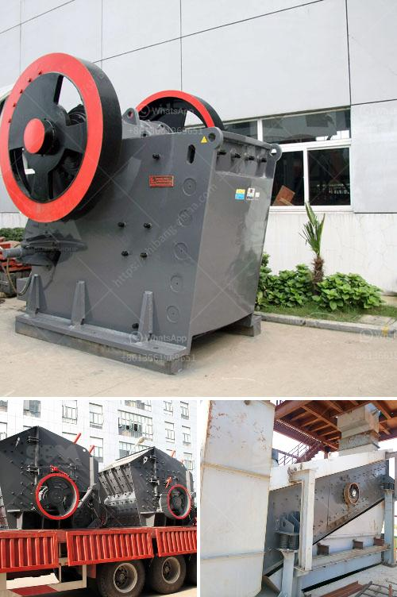

<h3>مصنع كسارة الفك في ولاية جوجارات الهند</h3>
يعتبر مصنع كسارة الفك في ولاية جوجارات بالهند واحدًا من أبرز وأهم المصانع في هذا القطاع. يقع المصنع في منطقة غوجارات في الغرب الهندي، وهو معروف بإنتاجه الكسارات عالية الجودة والفعالة.

تأسس هذا المصنع منذ عدة عقود ولديه سمعة طيبة في صناعة كسارات الفك. يتخصص المصنع في تصنيع معدات سحق الحجارة وتكسيرها. يعتبر الفك المتحرك والفك الثابت جزءًا أساسيًا من الكسارة، حيث يتم استخدامهما لسحق المواد الصلبة واحدة تلو الأخرى.

يمتاز مصنع كسارة الفك في جوجارات بالعديد من الميزات التي تجعله مميزًا عن غيره. أولاً، يتمتع المصنع بتجهيزات متقدمة وتكنولوجيا حديثة، وذلك يساعده على تحقيق أعلى مستويات الأداء والكفاءة. يتم تصميم المعدات بدقة لتلبية متطلبات العملاء وتحقيق أفضل النتائج.

ثانيًا، يوفر المصنع مجموعة واسعة من الكسارات بأحجام وسعات مختلفة، وبالتالي يلبي احتياجات العملاء المتنوعة. بغض النظر عن حجم المشروع أو نوع الحجر المعدني المراد سحقه، يوفر المصنع المنتج المناسب ويضمن الحصول على نتائج مرضية.

كما يعتمد المصنع على فريق عمل ذو خبرة وكفاءة عالية. يتمتع الموظفون بمعرفة متخصصة في مجال تصميم وتصنيع الكسارات، ويقومون بتلبية احتياجات العملاء بشكل فعال وفقًا للمواصفات المحددة والمعايير العالية.

علاوة على ذلك، يراعي المصنع في عمله ضوابط الجودة العالية. يتم اختبار كل قطعة من المعدات داخل المصنع للتأكد من أنها تعمل بشكل صحيح وتلبي المعايير المطلوبة. يضمن هذا النهج الاستدامة والموثوقية طويلة الأمد.

لا يقتصر العمل في المصنع على تصنيع الكسارات فحسب، بل يتضمن أيضًا خدمات ما بعد البيع. يقدم المصنع دعمًا فنيًا وخدمات ما بعد البيع للعملاء، بما في ذلك التدريب وتوفير قطع الغيار والصيانة المستمرة.

باختصار، يعد مصنع كسارة الفك في جوجارات ولاية رائدًا في صناعة تكسير الحجارة في الهند. يتميز بالجودة العالية والفعالية، وتكنولوجيا متطورة وفريق عمل محترف. يلبي احتياجات العملاء المتنوعة ويهدف إلى تحقيق الأداء الأمثل والرضا التام للعملاء.
<h3>Contact us</h3><ul><li><strong>Whatsapp:&nbsp;<a href="https://wa.me/8613661969651">+8613661969651</a></strong></li><li><a href="https://swt.shibang-china.com/?git&amp;zhl&amp;مصنع كسارة الفك في ولاية جوجارات الهند"><strong>Online Service(chat now)</strong></a></li></ul><h3>Related</h3><ul><li><a href='كسارة الحجر وأسعارها.md'>كسارة الحجر وأسعارها</a></li><li><a href='أسعار كسارة الحجر.md'>أسعار كسارة الحجر</a></li><li><a href='تدوير نفايات البناء.md'>تدوير نفايات البناء</a></li><li><a href='مصنع سحق وطحن.md'>مصنع سحق وطحن</a></li><li><a href='كسارات الحجر في بوكارامانجا.md'>كسارات الحجر في بوكارامانجا</a></li></ul>