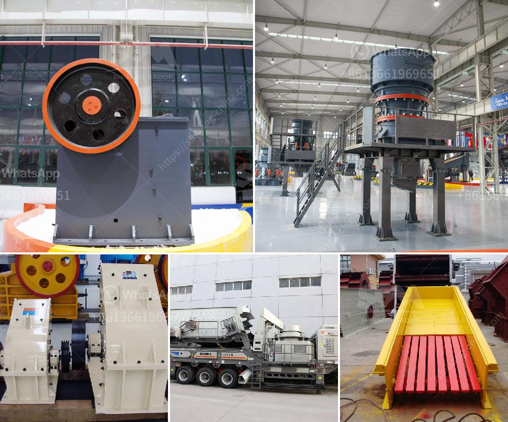

<h3>مصنع كسارة الفك للبيع في أفريقيا</h3>
تعتبر صناعة البناء والتشييد من القطاعات الحيوية في اقتصاد العديد من البلدان حول العالم، ويعتبر استخدام الكسارات الفكية أمرًا ضروريًا في هذه الصناعة. تعتبر كسارة الفك واحدة من أنواع الكسارات الرئيسية التي تستخدم لسحق المواد الصلبة والكبيرة إلى قطع أصغر وأكثر مناسبة للاستخدام النهائي في البناء والتشييد.

وتلعب أفريقيا دورًا مهمًا في صناعة البناء والتشييد، حيث تشهد العديد من الدول التوسع في البنية التحتية وتطوير المشاريع العمرانية. لذا، يتطلب استخدام الكسارات الفكية زيادة في الطلب على هذه المعدات في جميع أنحاء القارة.

يتطلب تأسيس مصنع لصناعة كسارات الفك قسطًا من التخطيط والاستثمار. يجب أن تكون الموقع المختار ملائمًا، حيث يكون لديك الوصول إلى الموارد الطبيعية التي تحتاجها لإنتاج الكسارات الفكية مثل الصخور والرمال والحصى. من الأهمية بمكان أن يتم تزويد المصنع بأحدث التقنيات والمعدات لضمان جودة وكفاءة إنتاج الكسارات.

يمكن القول إن مصنع كسارة الفك للبيع في أفريقيا هو فرصة استثمارية هامة، حيث يمكن استغلال الطلب المتزايد على هذه المعدات في القارة. ومن المتوقع أن يتزايد الطلب مع مرور الوقت بسبب نمو السكان وزيادة الاحتياجات البنية التحتية.

وتعتبر كسارات الفك جيدة في تحقيق الكفاءة والاستدامة البيئية للعمليات، حيث يمكنها سحق المواد الكبيرة بكفاءة عالية مع خسارة أقل للموارد. هذا يقود إلى تحسين عملية إعادة التدوير واستخدام المواد الصلبة في المشاريع الأخرى.

بالإضافة إلى ذلك، مصنع كسارة الفك للبيع في أفريقيا يمكن أن يسهم في التنمية الاقتصادية للبلدان، حيث يوفر فرص عمل للشباب ويحفّز النمو الاقتصادي المحلي. كما يمكن أن يؤدي إلى تحسين البنية التحتية وتطوير القطاع البنائي في البلد.

في الختام، تعتبر مصانع كسارة الفك للبيع في أفريقيا فرصة استثمارية مثيرة، حيث يمكن الاستفادة من الطلب المتزايد على الكسارات في القارة ومساهمة في التنمية الاقتصادية المحلية. كما يمكن لمثل هذه المصانع أن تلعب دورًا هامًا في تحسين البنية التحتية وتطوير القطاع البنائي في أفريقيا.
<h3>Contact us</h3><ul><li><strong>Whatsapp:&nbsp;<a href="https://wa.me/8613661969651">+8613661969651</a></strong></li><li><a href="https://swt.shibang-china.com/?git&amp;zhl&amp;مصنع كسارة الفك للبيع في أفريقيا"><strong>Online Service(chat now)</strong></a></li></ul><h3>Related</h3><ul><li><a href='كسارة عمودية.md'>كسارة عمودية</a></li><li><a href='مصنع غسيل الذهب تروميل للبيع في دبي.md'>مصنع غسيل الذهب تروميل للبيع في دبي</a></li><li><a href='سعر آلة الطحن في ماليزيا.md'>سعر آلة الطحن في ماليزيا</a></li><li><a href='مطحنة المطرقة للجبس.md'>مطحنة المطرقة للجبس</a></li><li><a href='كسارة تأثير خام الحديد المتنقلة في الهند.md'>كسارة تأثير خام الحديد المتنقلة في الهند</a></li></ul>