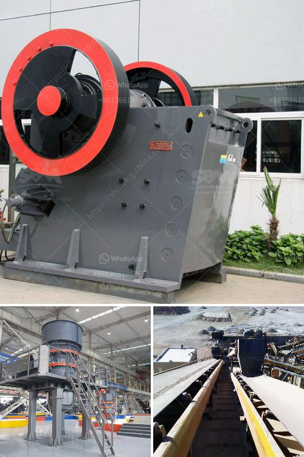

<h3>مصنع كسارة الفك</h3>
تعتبر كسارة الفك من أهم الآلات المستخدمة في صناعة التعدين والبناء والهندسة البيئية. تستخدم كسارة الفك لسحق المواد الخام بحجمها الأولي إلى قطع أصغر حجما، مما يسهل عملية معالجتها في الخطوات التالية للإنتاج. تعتبر مصانع كسارة الفك متعددة الاستخدامات وفعالة في تلبية متطلبات العمل.

يتألف مصنع كسارة الفك من عدة أجزاء رئيسية، بما في ذلك هيكل الإطار، والفك المتحرك والثابت، والعمود المرفقي، ونظام التعديل، ونظام التشحيم، والفك المتأرجح، والربط، والمشبك وغيرها من الأجزاء الهامة. كل هذه الأجزاء تعمل بتناغم لتحقيق عملية السحق للمواد وفقًا للاستخدام المطلوب.

تتميز مصانع كسارة الفك بمزايا عديدة. فهي تحتوي على سعة سحق كبيرة ونسبة تخفيض عالية، مما يسمح بسحق المواد بشكل أكثر كفاءة. كما تتميز بتصميم متين وقوي يضمن عمرًا طويلًا للجهاز وقدرة على مقاومة الضغط والتآكل. بالإضافة إلى ذلك، فإن توفر مصانع كسارة الفك بمختلف الأحجام والقوى يساعد على استخدامها في مجموعة متنوعة من التطبيقات.

تعد مصانع كسارة الفك أيضًا سهلة الصيانة والاستخدام. يتم تثبيت نظام التعديل للفك بحيث يمكن ضبط الحجم الناتج بسرعة وسهولة. كما أن تصميم الهيكل المفتوح يسهل الوصول إلى الفك لأعمال الصيانة والتنظيف.

في الختام، فإن مصانع كسارة الفك تعتبر أداة لا غنى عنها في صناعة التعدين والبناء. توفر خصائصها الفريدة وكفاءتها في السحق أداءً عاليًا وجودةً ممتازة في سحق المواد الخام. يمكن أن تستخدم في مجموعة واسعة من التطبيقات وتكون قادرة على معالجة العديد من المواد المختلفة. بالإضافة إلى ذلك، فإن سهولة الصيانة والاستخدام تجعلها خيارًا مثاليًا للعديد من الصناعات المختلفة.
<h3>Contact us</h3><ul><li><strong>Whatsapp:&nbsp;<a href="https://wa.me/8613661969651">+8613661969651</a></strong></li><li><a href="https://swt.shibang-china.com/?git&amp;zhl&amp;مصنع كسارة الفك"><strong>Online Service(chat now)</strong></a></li></ul><h3>Related</h3><ul><li><a href='معالجة خام الدولوميت.md'>معالجة خام الدولوميت</a></li><li><a href='سعر كسارة الحجر.md'>سعر كسارة الحجر</a></li><li><a href='اليابان لمصنع تكسير متنقل.md'>اليابان لمصنع تكسير متنقل</a></li><li><a href='شركة تصنيع معدات الجبس.md'>شركة تصنيع معدات الجبس</a></li><li><a href='معدات مصنع حجر الرمل.md'>معدات مصنع حجر الرمل</a></li></ul>