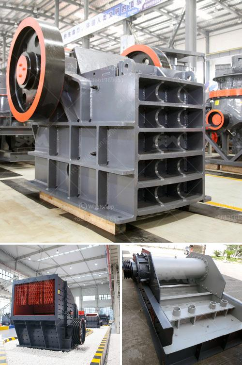

<h3>مصنع كسارة الكاولين في أوزبكستان</h3>
يُعتبر الكاولين من المواد الخام الهامة في صناعات مختلفة مثل السيراميك والأدوات المنزلية والورق والطلاء والمواد البلاستيكية. وتعتبر أوزبكستان من الدول التي تمتلك كميات كبيرة من الكاولين، مما جعلها تهتم بإنشاء مصانع لاستخراجه وتجهيزه للاستخدام الصناعي.

في أوزبكستان، تقع العديد من المصانع التي تقوم بتصنيع وتجهيز الكاولين، ومن بينها مصنع كسارة الكاولين الذي يعتبر واحدًا من أبرز المصانع في البلاد. يقع المصنع في منطقة يتميز فيها الكاولين بنقاوته وجودته، مما يساهم في توفير منتج نهائي ذو جودة عالية.

يهدف المصنع إلى استخدام تكنولوجيا حديثة وعمليات إنتاج متقدمة لضمان جودة وكفاءة عالية في تجهيز الكاولين. يتكون عملية تصنيع المصنع من عدة مراحل، تبدأ بمرحلة استخراج الكاولين من المناجم وتنقيته من الشوائب والأتربة. ثم يتم طحن الكاولين وتفتيته إلى حبيبات دقيقة تستخدم في تصنيع المنتجات النهائية.

يستخدم المصنع أحدث التقنيات في عملية طحن الكاولين وتفتيته، بحيث تتم هذه العملية بسرعة وفاعلية ، مما يزيد من إنتاجية المصنع. بالإضافة إلى ذلك ، تستخدم الآلات الحديثة فلاتر لفصل المياه المستخدمة في عملية الغسيل، مما يساهم في حماية البيئة من التلوث.

مصنع كسارة الكاولين في أوزبكستان يولي اهتمامًا كبيرًا لأمان العمال والتزامه بالممارسات الصحية والسلامة في مكان العمل. يوفر المصنع لعماله بيئة عمل آمنة ومريحة، مع وجود جميع التدابير الوقائية اللازمة للحفاظ على سلامتهم.

من المهم أيضًا أن يشار إلى أن المصنع يلتزم بالمسؤولية الاجتماعية ، حيث يتبع معايير صارمة لحفظ البيئة والاستدامة. يقوم المصنع بإعادة تدوير النفايات ومعالجتها بطرق آمنة، ويحرص على تقليل بصورة كبيرة الأثر البيئي لعملياته.

يُعد مصنع كسارة الكاولين في أوزبكستان نموذجًا جيدًا للاستدامة والجودة في صناعة استخراج الكاولين. يعتبر المصنع رائدًا في مجاله في البلاد ، ويساهم بشكل كبير في دعم الاقتصاد الوطني وتوفير فرص العمل المحلية.

بهذا المصنع ، يستطيع أوزبكستان تصدير منتجاتها الكاولينية ذات الجودة العالية إلى الأسواق الدولية، مما يعزز مكانتها كمصدر رئيسي للكاولين في المنطقة.

باختصار، يمثل مصنع كسارة الكاولين في أوزبكستان نموذجًا للتنمية المستدامة في صناعة الكاولين، بفضل جودة منتجاته والالتزام بالممارسات العالمية في مجال الصحة والسلامة والبيئة.
<h3>Contact us</h3><ul><li><strong>Whatsapp:&nbsp;<a href="https://wa.me/8613661969651">+8613661969651</a></strong></li><li><a href="https://swt.shibang-china.com/?git&amp;zhl&amp;مصنع كسارة الكاولين في أوزبكستان"><strong>Online Service(chat now)</strong></a></li></ul><h3>Related</h3><ul><li><a href='تنقية الجرافيت في معالجة المعادن.md'>تنقية الجرافيت في معالجة المعادن</a></li><li><a href='الديسيبلات التي تنشأ عن كسارة الفك هيبرو.md'>الديسيبلات التي تنشأ عن كسارة الفك هيبرو</a></li><li><a href='مصانع التكسير الكاملة في جيرميستون.md'>مصانع التكسير الكاملة في جيرميستون</a></li><li><a href='مصنع طحن الذهب في زيمبابوي.md'>مصنع طحن الذهب في زيمبابوي</a></li><li><a href='آلة عملية مطحنة الأسطوانة.md'>آلة عملية مطحنة الأسطوانة</a></li></ul>