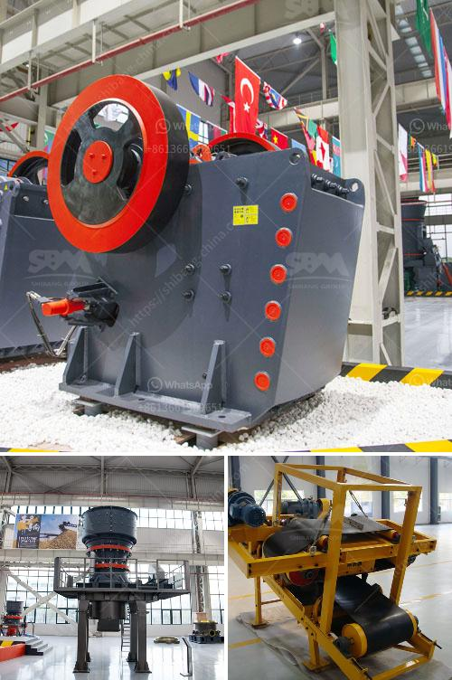

<h3>مصنع كسارة المحاجر في إيطاليا</h3>
يعتبر مصنع كسارة المحاجر في إيطاليا واحدًا من أهم المصانع في هذا القطاع. فإيطاليا تعتبر واحدة من أبرز الدول المنتجة للرخام والجرانيت على مستوى العالم، وذلك يعود إلى تاريخها الطويل في صناعة الحجارة ومعروفيتها بالجودة العالية والتصاميم الراقية في هذا القطاع.

تتميز كسارة المحاجر في إيطاليا بتصاميمها العصرية والفعّالة التي تتيح استخدام التكنولوجيا الحديثة في عمليات التصنيع والإنتاج. تعتمد هذه المصانع على آلات متطورة ومعدات حديثة تستخدم لاستخراج وتصنيع الصخور الصلبة وتحويلها إلى منتجات نهائية عالية الجودة.

تتواجد هذه المصانع في مناطق محاجر الرخام والجرانيت في إيطاليا مثل توسكانا وساردينيا وسيسيليا وليجوريا. يتم استخراج الصخور من المحاجر بطرق تقليدية أو باستخدام الآلات الثقيلة لنقلها إلى المصنع حيث يتم تكسيرها وتجهيزها للتصنيع.

يتم استخدام تقنيات حديثة ومعدات متطورة في مصانع كسارة المحاجر في إيطاليا لتحقيق الإنتاجية العالية وتلبية متطلبات السوق المتنوعة. يتم استخدام الكسارات والغرابيل والمطاحن والمناشيل لتكسير الصخور وفصلها وتحويلها إلى منتجات نهائية مثل البلاط والألواح والمصنوعات الجاهزة.

تعتبر منتجات كسارة المحاجر في إيطاليا مرغوبة عالميًا بسبب جودتها العالية والتصاميم الفريدة التي تناسب الأسواق العالمية. فهي تعد مصدرًا رئيسيًا لاستيراد الحجارة الطبيعية في العديد من الدول.

وبفضل هذه المصانع، تعمل صناعة كسارة المحاجر في إيطاليا على تعزيز الاقتصاد المحلي وتوفير فرص العمل للمواطنين. فهي تساهم في تعزيز النمو الاقتصادي وتحفيز الاستثمار في البنية التحتية وتنمية المناطق الريفية.

باختصار، يعد مصنع كسارة المحاجر في إيطاليا رائدًا في قطاع الرخام والجرانيت عالميًا، حيث يتميز بتصاميمه العصرية واستخدام التكنولوجيا المتقدمة في إنتاج المنتجات ذات الجودة العالية. يعمل هذا المصنع على تعزيز الاقتصاد المحلي وتوفير فرص العمل، مما يجعله جزءًا أساسيًا من الصناعة الإيطالية المتميزة في هذا القطاع.
<h3>Contact us</h3><ul><li><strong>Whatsapp:&nbsp;<a href="https://wa.me/8613661969651">+8613661969651</a></strong></li><li><a href="https://swt.shibang-china.com/?git&amp;zhl&amp;مصنع كسارة المحاجر في إيطاليا"><strong>Online Service(chat now)</strong></a></li></ul><h3>Related</h3><ul><li><a href='شركة تصنيع كسارات الحجر.md'>شركة تصنيع كسارات الحجر</a></li><li><a href='مصنع سحق الحجر في ألمانيا.md'>مصنع سحق الحجر في ألمانيا</a></li><li><a href='كيف يعمل مطحنة الطحن.md'>كيف يعمل مطحنة الطحن</a></li><li><a href='كسارة حجر مستعملة في أونتاريو.md'>كسارة حجر مستعملة في أونتاريو</a></li><li><a href='مصنع معالجة المنغنيز.md'>مصنع معالجة المنغنيز</a></li></ul>