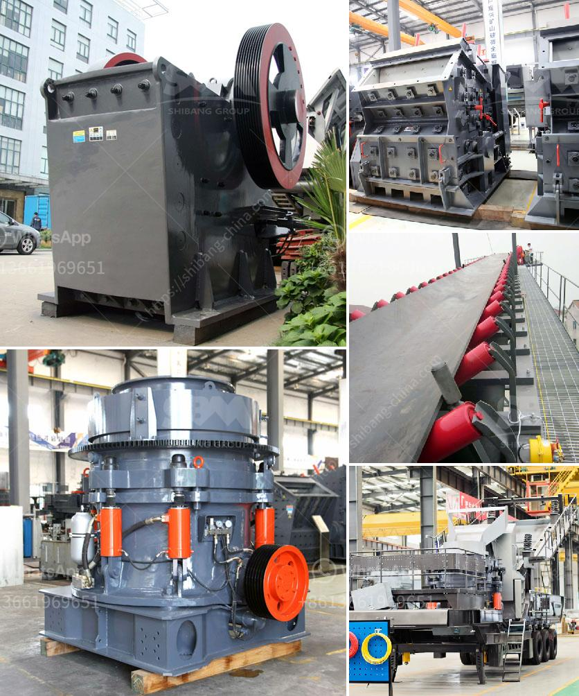

<h3>مصنع كسارة المطرقة</h3>
تعتبر كسارة المطرقة واحدة من الآلات الهامة في صناعة التكسير والطحن. تستخدم هذه الآلة في تكسير المواد الصلبة وغير القابلة للتحطيم بسهولة ، مثل الحجر والفحم والصخور والخامات المعدنية. تتكون كسارة المطرقة من جزئين رئيسيين ، وهما جهاز الدوران والمطرقة.

يعمل مصنع كسارة المطرقة بشكل أساسي عن طريق تحويل الطاقة الميكانيكية إلى طاقة كهربائية من خلال استخدام محرك كهربائي. يتم تشغيل جهاز الدوران على سرعة عالية لتوليد طاقة تؤثر في المواد الموجودة في جهاز الطحن. تعمل المطارق التي تكون متصلة بجهاز الدوران على سحق المواد بفعل قوة الأثر.

تتميز كسارة المطرقة بعدة مزايا. أحد هذه المزايا هو أنها قادرة على تكسير المواد بسرعة وفعالية. بفضل جهاز الطحن عالي السرعة ، يمكن أن تقوم الكسارة بتجزئة المواد بسهولة ، حتى التي يصعب تكسيرها بواسطة غيرها من الآلات. علاوة على ذلك ، فإن هذه الكسارة توفر قدرا كبيرًا من القوة ، مما يسمح بتكسير الصخور الصلبة والمعادن الصلبة بسهولة.

كما أنه يمكن أن يتم التحكم في حجم المواد التي يتم تكسيرها بواسطة كسارة المطرقة. يمكن تغيير قوة الضربة وسرعة الدوران للتحكم في حجم المواد الناتجة. يمكن أن يكون هذا الميزة مفيدًا في صناعات معالجة المعادن والبناء ، حيث يكون هناك حاجة دقيقة إلى حجم المواد.

بالإضافة إلى ذلك ، تعتبر كسارة المطرقة آلة قابلة للتكييف ومرنة في الاستخدام. يمكن استخدامها في مختلف الصناعات والتطبيقات ، وتناسب احتياجات مختلفة. وبفضل التصميم المضغوط والهيكل المتين ، يمكن لمصنع كسارة المطرقة العمل لفترات طويلة دون أي مشاكل تقنية.

باختصار ، تعتبر كسارة المطرقة واحدة من الآلات الأساسية في صناعة التكسير والطحن. تقدم هذه الآلة مزايا عديدة ، بما في ذلك القدرة على تكسير المواد الصلبة بسهولة وفعالية ، وقدرة التحكم في حجم المواد ، والمرونة في الاستخدام. يمكن استخدام مصنع كسارة المطرقة في العديد من الصناعات والتطبيقات المختلفة ، مما يجعلها أداة قوية وضرورية في عمليات التكسير والطحن.
<h3>Contact us</h3><ul><li><strong>Whatsapp:&nbsp;<a href="https://wa.me/8613661969651">+8613661969651</a></strong></li><li><a href="https://swt.shibang-china.com/?git&amp;zhl&amp;مصنع كسارة المطرقة"><strong>Online Service(chat now)</strong></a></li></ul><h3>Related</h3><ul><li><a href='معدات مصنع الإسمنت اللازمة.md'>معدات مصنع الإسمنت اللازمة</a></li><li><a href='استشاريو تحسين خام الحديد في الهند.md'>استشاريو تحسين خام الحديد في الهند</a></li><li><a href='كوماتسو بي آر كسارة للبيع.md'>كوماتسو بي آر كسارة للبيع</a></li><li><a href='شاشات وكسارات الركام.md'>شاشات وكسارات الركام</a></li><li><a href='كسارات محمولة مستعملة للبيع في جنوب أفريقيا.md'>كسارات محمولة مستعملة للبيع في جنوب أفريقيا</a></li></ul>