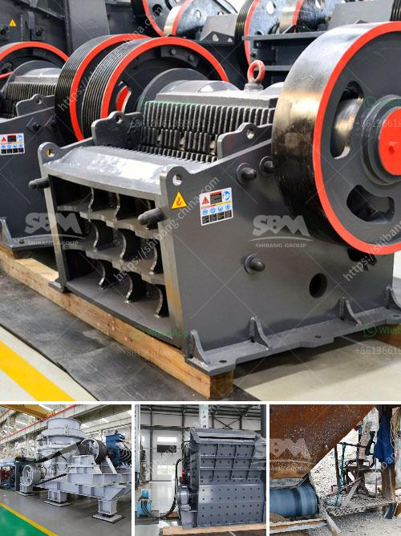

<h3>مصنع كسارة حجر البازلت</h3>
تشكل صناعة البناء والتشييد قطاعًا حيويًا في الاقتصاد العالمي، وتتطلب استخدام مواد بناء متنوعة وفعالة. واحدة من هذه المواد هي حجر البازلت، الذي يستخدم على نطاق واسع في العديد من التطبيقات البنائية.

يتم استخراج حجر البازلت من المقالع أو المناجم، وبعد ذلك يتم نقلها إلى المصانع حيث يتم معالجتها وتحويلها إلى مواد نهائية. وأحد المصانع المهمة في هذا المجال هو مصنع كسارة حجر البازلت.

يعد مصنع كسارة حجر البازلت منشأة متكاملة يتم فيها سحق وطحن حجر البازلت للحصول على المنتجات النهائية. يعمل المصنع بعملية تكنولوجية متطورة تتطلب استخدام معدات خاصة لتحقيق نتائج عالية الجودة.

تبدأ عملية تصنيع المنتجات من خلال سحق حجر البازلت إلى أجزاء صغيرة باستخدام كسارات الفك والكسارات المخروطية. ومن ثم، يتم فرز حجم الجسيمات باستخدام شاشات اهتزازية. تُستخدم الكسارات المحورية العمودية لتجديد الشكل الهندسي للحجر وإنتاج الركام النهائي المطلوب.

يتم بعد ذلك تخزين المنتجات النهائية في المخازن حتى يتم توزيعها للزبائن. يلتزم مصنع كسارة حجر البازلت بضمان جودة المنتجات واحترام المعايير الفنية العالية. يتم فحص المنتجات للتأكد من أنها تلبي متطلبات العملاء والمعايير المحددة.

تعتبر منتجات مصنع كسارة حجر البازلت متعددة الاستخدامات، وهي تستخدم في العديد من التطبيقات البنائية المختلفة مثل الطرق، والجسور، والأساسات. يتميز حجر البازلت بمقاومته العالية للتآكل وقوته الميكانيكية، مما يجعله مادة بناء مثالية.

علاوة على ذلك، يعتبر حجر البازلت صديقًا للبيئة، حيث أنه يحتوي على نسبة عالية من المعادن الطبيعية ويمكن إعادة استخدامه بعد نهاية دورة حياته كمادة بناء ثانوية.

في النهاية، فإن مصنع كسارة حجر البازلت يلعب دورًا حيويًا في تلبية احتياجات صناعة البناء والتشييد. فهو يستخرج ويعالج حجر البازلت لإنتاج منتجات عالية الجودة، وبفضل خصائص هذه المنتجات، تجد استخدامات واسعة في العديد من التطبيقات البنائية. من خلال الاهتمام بالتفاصيل وتقديم خدمة عملاء ممتازة، يقدم مصنع كسارة حجر البازلت مادة بناء ذات جودة عالية ومستدامة.
<h3>Contact us</h3><ul><li><strong>Whatsapp:&nbsp;<a href="https://wa.me/8613661969651">+8613661969651</a></strong></li><li><a href="https://swt.shibang-china.com/?git&amp;zhl&amp;مصنع كسارة حجر البازلت"><strong>Online Service(chat now)</strong></a></li></ul><h3>Related</h3><ul><li><a href='استفسار حول آلة السحق.md'>استفسار حول آلة السحق</a></li><li><a href='معدات تكسير الكالسايت.md'>معدات تكسير الكالسايت</a></li><li><a href='كسارة حجر الكاولين.md'>كسارة حجر الكاولين</a></li><li><a href='سعر التحسين العالي لطحن الكرة.md'>سعر التحسين العالي لطحن الكرة</a></li><li><a href='تصنيع مكره مطحنة الكرة.md'>تصنيع مكره مطحنة الكرة</a></li></ul>