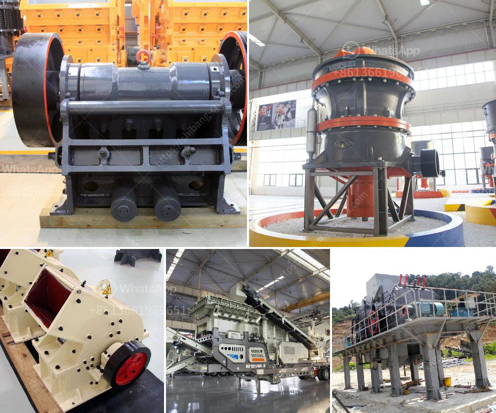

<h3>مصنع كسارة حجر محمول في تركيا</h3>
تركيا بلد يعتبر من أهم الوجهات لصناعة الحجر والرخام في العالم، حيث تتواجد فيه موارد طبيعية هائلة تسهم في نمو صناعة التعدين والبناء. ومن أهم الشركات التي تعمل في هذا القطاع في تركيا هي شركة "كسارة حجر محمول". 

تأسست شركة "كسارة حجر محمول" في تركيا عام 2005، وهي تعمل في مجال تصميم وتصنيع وتركيب الكسارات المحمولة والمحطات الثابتة للتعدين والبناء. تعتبر هذه الكسارات المحمولة منتجات تنافسية ومبتكرة في سوق البناء والتعدين، حيث تعمل على سحق وغربلة الصخور والمواد الخام بكفاءة وسرعة عالية.

تتميز كسارات حجر محمول بعدة مزايا تجعلها الخيار المثالي للعملاء في قطاع التعدين والبناء في تركيا وحول العالم. فهي مصممة بشكل محمول وقابلة للنقل بسهولة بين المواقع المختلفة، مما يجعلها مثالية للعمل في المشاريع المتنقلة. توفر هذه الكسارات أعلى مستويات الأداء بفضل تقنيات الكسارة المتقدمة والتكنولوجيا الحديثة، مما يؤدي إلى توفير الوقت والجهد والتكاليف.

توجد في تركيا عدة مصانع لشركة "كسارة حجر محمول"، حيث تتميز هذه المصانع بتجهيزات ومعدات عالية الجودة، وتعمل وفقًا لأحدث المعايير العالمية للجودة والسلامة. تستخدم الشركة أحدث التقنيات والآلات في صناعة الكسارات المحمولة، بالإضافة إلى تبني تقنيات التحكم الإلكتروني والمعلوماتية في إنتاجها، مما يساهم في ضمان الأداء العالي وتقديم منتجات موثوقة وفعالة للعملاء.

على مستوى التصدير، تعد شركة "كسارة حجر محمول" من أكبر المصدرين للكسارات المحمولة في تركيا، حيث تتمتع بسمعة جيدة واسعة الانتشار في الأسواق العالمية. تتعاون الشركة مع العديد من الشركات العالمية الكبرى في قطاع التعدين والبناء، وتستمر في توسيع شبكة عملائها وتحقيق نمو مستدام في أعمالها.

باختصار، يمثل مصنع "كسارة حجر محمول" في تركيا رائدة في صناعة الكسارات المحمولة في البلاد وخارجها. تعتبر منتجاتها منتجات ذات جودة عالية وأداء ممتاز، مما يجعلها الاختيار الأمثل للشركات والأفراد الذين يعملون في قطاع التعدين والبناء. تسهم شركة "كسارة حجر محمول" في تعزيز الاقتصاد التركي وزيادة صادرات البلاد، كما أنها تلعب دورًا مهمًا في التنمية المستدامة وتوفير فرص العمل للعديد من العاملين في هذا المجال.
<h3>Contact us</h3><ul><li><strong>Whatsapp:&nbsp;<a href="https://wa.me/8613661969651">+8613661969651</a></strong></li><li><a href="https://swt.shibang-china.com/?git&amp;zhl&amp;مصنع كسارة حجر محمول في تركيا"><strong>Online Service(chat now)</strong></a></li></ul><h3>Related</h3><ul><li><a href='كسارات الفك المستخدمة في الفلبين.md'>كسارات الفك المستخدمة في الفلبين</a></li><li><a href='مصنع طحن الذهب في زيمبابوي.md'>مصنع طحن الذهب في زيمبابوي</a></li><li><a href='تبطين أنابيب مطحنة فحم الحجر.md'>تبطين أنابيب مطحنة فحم الحجر</a></li><li><a href='تأجير كسارة صغيرة دبلن.md'>تأجير كسارة صغيرة دبلن</a></li><li><a href='سحق النفايات الخرسانية والحديد.md'>سحق النفايات الخرسانية والحديد</a></li></ul>