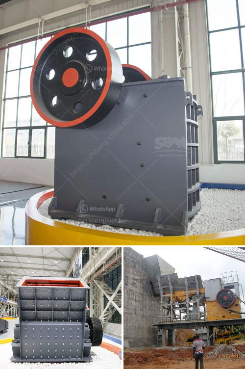

<h3>مصنع كسارة خام الحديد</h3>
تعتبر صناعة التعدين والمعالجة الحديدية من أهم الصناعات في عصرنا الحالي، وكسارة خام الحديد هي واحدة من أهم المعدات المستخدمة في هذا المجال. يستخدم مصنع كسارة خام الحديد لسحق الخام الحديدي إلى جسيمات صغيرة وتجهيزها قبل دخولها إلى عملية الصهر والتكرير.

يتكون مصنع كسارة خام الحديد عادةً من ثلاثة أجزاء رئيسية: العربة الأولية ، الكسارة الفكية ، والسير المتحرك. تتمثل مهمة العربة الأولية في نقل خام الحديد إلى الكسارة بطريقة فعالة وسلسة. ثم يتم سحق الخام الحديدي بواسطة الكسارة الفكية ، حيث تقوم قوة الضغط بكسر الجسيمات إلى قطع صغيرة من الحجم المطلوب. بعد ذلك ، يتم نقل الجسيمات المسحوقة إلى السير المتحرك بواسطة المحرك ، حيث يتم فحصها وفصلها باستخدام مجموعة متنوعة من الشاشات والأقفاص.

إن استخدام مصنع كسارة خام الحديد له العديد من الفوائد. قد يؤدي سحق الخام إلى جسيمات صغيرة إلى زيادة كفاءة العملية اللاحقة للتكرير والصهر. بالإضافة إلى ذلك ، يمكن استخدام الكسارة لتجهيز أنواع مختلفة من خامات الحديد بوزن وحجم مختلفين. تسمح هذه المرونة بتلبية احتياجات العديد من المشاريع المختلفة التي تتعامل مع الحديد.

مصانع كسارة خام الحديد قد تتفاوت في الحجم والقدرة حسب احتياجات المشروع المحدد. تتوفر مصانع كبيرة تتجاوز قدرة مئات الأطنان في الساعة ، في حين يكون لدى البعض الآخر سعة أقل. بغض النظر عن الحجم والسعة ، يجب أن يتم تصميم المصنع بشكل جيد لضمان عملية سلسة وفعالة. يجب أن يتم توفير الصيانة والإصلاح المنتظمين للآلات ومعدات المصنع لضمان أنها تعمل بكفاءة ودقة.

وفي الختام، يمكن القول أن مصنع كسارة خام الحديد هو جزء أساسي من سلسلة التصنيع للحديد وفقًا للاستخدامات المختلفة للمعدن الحديد، تستخدم في العديد من المشاريع الكبرى في البناء والتشييد وصناعة السيارات والعديد من الصناعات الأخرى. إنها تلعب دورًا هامًا في إيجاد ركائز حضارتنا الحديثة وتحقيق التقدم والازدهار.
<h3>Contact us</h3><ul><li><strong>Whatsapp:&nbsp;<a href="https://wa.me/8613661969651">+8613661969651</a></strong></li><li><a href="https://swt.shibang-china.com/?git&amp;zhl&amp;مصنع كسارة خام الحديد"><strong>Online Service(chat now)</strong></a></li></ul><h3>Related</h3><ul><li><a href='موردي كسارات الصخور في جنوب أفريقيا.md'>موردي كسارات الصخور في جنوب أفريقيا</a></li><li><a href='مصنع تكسير الحجر في نيجيريا.md'>مصنع تكسير الحجر في نيجيريا</a></li><li><a href='عملية مصنع الأحجار الكوارتز 3080.md'>عملية مصنع الأحجار الكوارتز 30-80</a></li><li><a href='سعر كسارة الحجر في جنوب أفريقيا.md'>سعر كسارة الحجر في جنوب أفريقيا</a></li><li><a href='كسارة الكرة للحديد فقط الشركة.md'>كسارة الكرة للحديد فقط الشركة</a></li></ul>