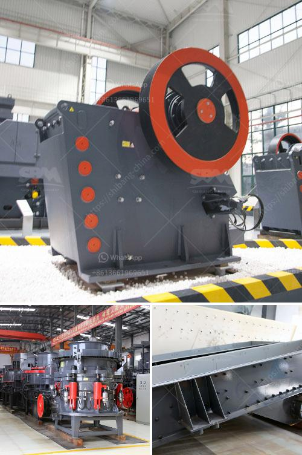

<h3>مصنع كسارة في الهند</h3>
يعتبر قطاع صناعة التعدين والبناء من أهم القطاعات الاقتصادية في الهند، حيث تعد الهند واحدة من أكبر الدول المنتجة والمصدرة للمواد الخام والمواد البناء. ومن بين المصانع الرئيسية في قطاع التعدين والبناء بالهند، تأتي في مقدمتها مصانع الكسارات.

تعتبر مصانع الكسارات من أساسيات عمليات التعدين والإنشاءات، حيث يتم استخدامها لكسر الصخور والأحجار الكبيرة إلى قطع صغيرة بأحجام متناسبة. وتتميز الكسارات الموجودة في الهند بالدقة والكفاءة العالية في عمليات التكسير، مما يجعلها هامة جداً في القطاع.

تعتبر الهند واحدة من أكبر المنتجين للحصى والرمل في العالم. وتستخدم مصانع الكسارات لتكسير الحجارة الكبيرة وتحويلها إلى أحجام صغيرة من الحصى والرمل، والتي يمكن استخدامها في مختلف الأغراض الإنشائية. وهذا يكون مهماً جداً لأن الحصى والرمل هما من أهم المواد الأساسية في عمليات البناء والإنشاءات.

مصانع الكسارات في الهند تستخدم التكنولوجيا الحديثة في صناعة المعدات والآلات المستخدمة في عمليات التكسير. وتعتمد هذه المصانع على الكسارات الفكية والكسارات التصادمية لتحقيق نتائج عالية الجودة وفعالية في الأداء. وتقدم المصانع الكسارات بمختلف الأحجام والقدرات، مما يتيح مجالاً واسعاً للاختيار وفقاً لاحتياجات العملاء.

يعتبر قطاع صناعة الكسارات في الهند من القطاعات ذات الأهمية الكبيرة في الاقتصاد المحلي، حيث يساهم بشكل كبير في تلبية الاحتياجات المحلية للحصى والرمل والمواد البنائية الأخرى. كما يُعزز دور المصانع الكسارات الهندية في سوق التصدير، حيث تقوم بتصدير منتجاتها إلى العديد من الدول الأخرى، مما يعزز العائدات الاقتصادية للهند.

بالاختصار، تعتبر مصانع الكسارات في الهند مصانع حيوية في قطاع التعدين والبناء، حيث تلعب دوراً بارزاً في تلبية الاحتياجات المحلية والعالمية للحصى والرمل وأهم المواد الأساسية الأخرى لعمليات البناء والإنشاءات. ومع استخدام التكنولوجيا الحديثة والجودة العالية، تعد مصانع الكسارات في الهند محطة تصنيع مهمة تعزز دور الهند كواحدة من الدول الرائدة في صناعة التعدين والبناء.
<h3>Contact us</h3><ul><li><strong>Whatsapp:&nbsp;<a href="https://wa.me/8613661969651">+8613661969651</a></strong></li><li><a href="https://swt.shibang-china.com/?git&amp;zhl&amp;مصنع كسارة في الهند"><strong>Online Service(chat now)</strong></a></li></ul><h3>Related</h3><ul><li><a href='كتالوج كسارة الفك بوزولانا.md'>كتالوج كسارة الفك بوزولانا</a></li><li><a href='مصنع غسيل محمول للفحم.md'>مصنع غسيل محمول للفحم</a></li><li><a href='آلة طحن الرخام للبيع.md'>آلة طحن الرخام للبيع</a></li><li><a href='تكلفة وحدة طحن الأسمنت في الهند.md'>تكلفة وحدة طحن الأسمنت في الهند</a></li><li><a href='آلة كسارة الرمل السيليكا المصنعة.md'>آلة كسارة الرمل السيليكا المصنعة</a></li></ul>