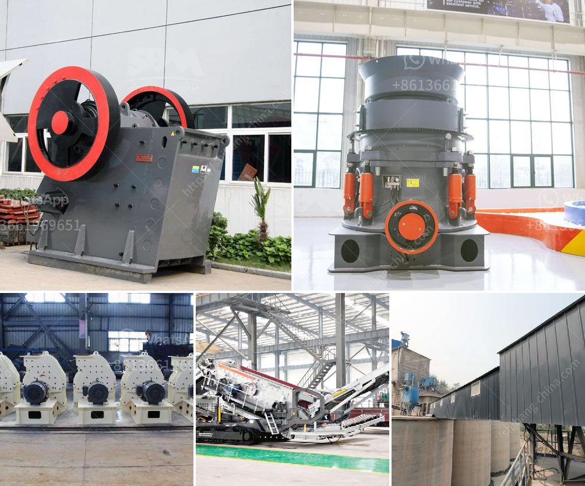

<h3>مصنع كسارة في كينيا</h3>
تحظى صناعة التعدين بأهمية كبيرة في العديد من الدول النامية، بما في ذلك كينيا. وفي إطار هذا القطاع، يشهد مصنع كسارة في كينيا تطوراً مذهلاً في السنوات الأخيرة. يتم اعتبار هذا المصنع بمثابة العمود الفقري لصناعة التعدين في البلاد، إذ يقدم فرص عمل للعديد من الأشخاص ويسهم في التنمية الاقتصادية للبلاد.

يعتبر مصنع الكسارة في كينيا من أهم المشاريع المدعومة من الحكومة بغرض دعم صناعة التعدين. يشمل المشروع إنشاء مجموعة من الكسارات والمطاحن ووسائل النقل التي تعزز عملية استخراج المواد الخام وتكسيرها للحصول على مواد إنشائية عالية الجودة.

تساهم هذه الصناعة في تعزيز البنية التحتية للبلاد وتلبية احتياجات السكان من المواد الإنشائية المختلفة. فبفضل جودة المواد التي يتم إنتاجها، يتم استخدامها في البناء والتشييد، وتعتبر أحد العوامل الرئيسية في عمليات التطور الحضري وتحسين البنية التحتية في البلاد.

يعنى مصنع الكسارة بتوفير فرص عمل للعديد من العاملين، من الفنيين والمهندسين إلى العمال المساعدين. كما يساهم في تطوير المهارات والخبرات لدى العمال بواسطة تقديم تدريبات وورش عمل متخصصة. بالإضافة إلى ذلك، تعمل الشركة المشغلة للمصنع على توفير بيئة عمل آمنة وصحية وداعمة للموظفين.

يضمن مصنع الكسارة في كينيا احترام القوانين واللوائح البيئية، حيث يعمل على تحقيق التوازن بين الحفاظ على المحيط الطبيعي واحتياجات الإنتاج. تتضمن التدابير البيئية جمع وتخزين المياه الناتجة من عملية التكسير، ومعالجة الغبار والضجيج الناتجين، والاستفادة من المخلفات وإعادة تدويرها حيثما أمكن ذلك.

في الختام، يمثل مصنع الكسارة في كينيا قطاعاً حيوياً في صناعة التعدين بالبلاد. يسهم هذا المصنع بشكل كبير في النمو الاقتصادي وتحسين البنية التحتية بتوفير مواد إنشائية عالية الجودة. بفضل الطرق الحديثة واحترام القوانين البيئية، يوجد في هذا المصنع مثال حي على كيفية دمج التطور الاقتصادي والحفاظ على المحيط الطبيعي بشكل مستدام.
<h3>Contact us</h3><ul><li><strong>Whatsapp:&nbsp;<a href="https://wa.me/8613661969651">+8613661969651</a></strong></li><li><a href="https://swt.shibang-china.com/?git&amp;zhl&amp;مصنع كسارة في كينيا"><strong>Online Service(chat now)</strong></a></li></ul><h3>Related</h3><ul><li><a href='كسارة للبيع في كيرالا.md'>كسارة للبيع في كيرالا</a></li><li><a href='كسارة مخروطية hp300.md'>كسارة مخروطية hp300</a></li><li><a href='معدات سحق للإيجار.md'>معدات سحق للإيجار</a></li><li><a href='تجارة سحق الخرسانة للبيع.md'>تجارة سحق الخرسانة للبيع</a></li><li><a href='مطحنة ريموند لمعالجة البازلت الجاف.md'>مطحنة ريموند لمعالجة البازلت الجاف</a></li></ul>