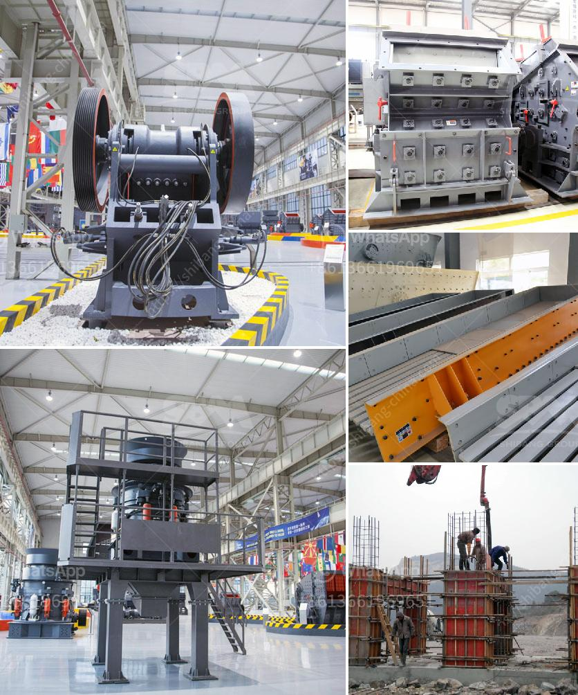

<h3>مصنع كسارة كامل للبيع في جنوب أفريقيا</h3>
نظرًا للطلب المتزايد على مواد البناء في جنوب أفريقيا، يعد مصنع الكسارة الكامل للبيع في هذا البلد فرصة استثمارية مهمة. يعتبر الجنوب الأفريقيون من بين أسرع مناطق النمو العقاري في العالم، وهذا يعني أن الحاجة إلى مواد البناء مرتفعة. يمكن لمستثمرين يبحثون عن فرصة تجارية رابحة من خلال شراء هذا المصنع.

ينبغي أن يكون المصنع الذي يتم عرضه للبيع مُجهَزًا بأحدث التقنيات والمعدات لتصنيع الركام المطلوب. يتطلب المصنع كسارات لسحق الصخور وغرابيل لفصل الحصى والرمال من الأتربة والشوائب. كما يجب أن يتوفر نظام لغسل الحصى وتصفيته، حيث يتم تنقية الحصى والرمال من الشوائب والأتربة. يجب أن يكون المصنع مصممًا بطريقة تتيح إعادة استخدام المياه وتقليل النفايات.

واحدة من العوامل الهامة الأخرى هي وجود نظام تحكم عالي الجودة وذكاء اصطناعي يساعد في مراقبة وإدارة عمليات الإنتاج بكفاءة. يجب أن يكون المصنع قادرًا على إنتاج مجموعة واسعة من المنتجات المتنوعة المطلوبة في مجال البناء، بما في ذلك الركام الخشن والركام الناعم والرمال والحصى، بأحجام وخصائص مواصفات مختلفة.

بالإضافة إلى ذلك، يجب أن يتمتع المصنع بموقع جغرافي مثالي لنقل المنتجات بكفاءة من خلال السكك الحديدية أو الطرق السريعة أو النهر المجاور. يمكن أن تكون مواقع قرب المصانع من مناطق الإنشاءات أو المشاريع الكبيرة فرصة كبيرة لزيادة الطلب على المنتجات المصنعة.

علاوة على ذلك، ينبغي أن يتمتع المصنع بشهادات جودة معترف بها دولياً مثل شهادة الآيزو، وذلك لضمان جودة المنتج والامتثال للمعايير الدولية. يعد الالتزام بالجودة والتقنية المتقدمة أحد العوامل المهمة لجذب العملاء والزيادة في حصة السوق.

باختصار، فإن مصنع الكسارة الكامل للبيع في جنوب أفريقيا يعد فرصة استثمارية مربحة. يجب أن يكون المصنع مجهزًا بأحدث التقنيات والمعدات، ويجب أن يتمتع بموقع جيد لنقل المنتجات. يتطلب نجاح المصنع الالتزام بالجودة وتجاوز توقعات العملاء. مع الطلب المتزايد على مواد البناء في البلاد، سيكون لديك احتمالات كبيرة لتحقيق نجاح كبير في هذا القطاع.
<h3>Contact us</h3><ul><li><strong>Whatsapp:&nbsp;<a href="https://wa.me/8613661969651">+8613661969651</a></strong></li><li><a href="https://swt.shibang-china.com/?git&amp;zhl&amp;مصنع كسارة كامل للبيع في جنوب أفريقيا"><strong>Online Service(chat now)</strong></a></li></ul><h3>Related</h3><ul><li><a href='ناقل البناء للبيع.md'>ناقل البناء للبيع</a></li><li><a href='سعر مصنع الكسارة الهندسي الجديد 200 طن في الساعة.md'>سعر مصنع الكسارة الهندسي الجديد 200 طن في الساعة</a></li><li><a href='معدات كسارة المحجر المحمولة المستخدمة.md'>معدات كسارة المحجر المحمولة المستخدمة</a></li><li><a href='تكلفة تعدين الفحم في جنوب أفريقيا للطن الواحد.md'>تكلفة تعدين الفحم في جنوب أفريقيا للطن الواحد</a></li><li><a href='شركة تصنيع آلات كسارة الرخام.md'>شركة تصنيع آلات كسارة الرخام</a></li></ul>