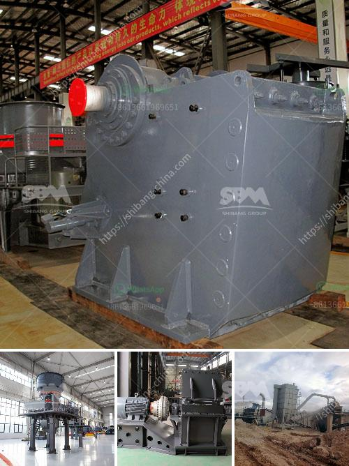

<h3>مصنع كسارة للبيع في المملكة العربية السعودية</h3>
تعد المملكة العربية السعودية واحدة من أكبر الدول العربية وأكثرها تطورًا في مجال البنية التحتية والإنشاءات. تشهد السعودية اليوم طفرة كبيرة في قطاع الإنشاءات والبناء، ومن أهم مكونات هذا القطاع هو الحجر والرمل الذي يستخدم في الكثير من الإنشاءات.

لتلبية الطلب المتزايد على الحجر والرمل، تم تأسيس مصانع الكسارات في المملكة العربية السعودية. تعتبر هذه المصانع منشآت تقوم بسحق الصخور والحجارة وتحويلها إلى مواد بناء قابلة للاستخدام. ويمكن شراء مصنع كسارة في المملكة العربية السعودية المستعمل، أو بناء مصنع جديد حسب احتياجات المشروع.

يعتبر شراء مصنع كسارة في المملكة العربية السعودية فرصة مثالية للمستثمرين الذين يرغبون في الدخول في صناعة البناء والإنشاءات. فمن خلال توفر هذا المصنع، يتمكن المستثمرون من توفير المواد الخام المستخدمة في الإنشاءات بطريقة مستدامة وأكثر اقتصادية.

تتضمن مكونات مصنع الكسارة ماكينات ومعدات متطورة مثل الكسارات الفكية والمخروطية والصدمية وغرابيل التصنيف والناقلات والأطواق. ويتطلب تشغيل هذه الماكينات والمعدات مهارات خاصة وخبرة في مجال الكسارات.

تتميز المملكة العربية السعودية بوجود كميات كبيرة من الحجر والصخور الموجودة في الجبال والمناطق الجافة. هذا الثروة الطبيعية الغنية تجعل من الممكن تأسيس مصانع الكسارات في المملكة بسهولة، وتوفير موارد طبيعية قابلة للاستغلال وتلبية احتياجات السوق المحلي والإقليمي.

إن وجود مصنع كسارة في المملكة العربية السعودية يقدم فرص عمل جديدة ويسهم في تنمية الصناعة المحلية. إضافة إلى ذلك، تعد هذه الصناعة فرصة للاستثمار في مجال البيئة والاستدامة، حيث يتم استغلال الموارد الطبيعية بشكل صحيح وفعال.

بالنظر إلى الفرص الاستثمارية المتاحة في مجال صناعة الكسارات في المملكة العربية السعودية، فإن شراء مصنع كسارة قد يكون خطوة استثمارية ناجحة ومربحة. إذا كنت تبحث عن فرصة استثمارية تقدم أرباحًا مستدامة وفرص عمل جديدة، فإن صناعة الكسارات في المملكة العربية السعودية هي اختيار واعٍ.
<h3>Contact us</h3><ul><li><strong>Whatsapp:&nbsp;<a href="https://wa.me/8613661969651">+8613661969651</a></strong></li><li><a href="https://swt.shibang-china.com/?git&amp;zhl&amp;مصنع كسارة للبيع في المملكة العربية السعودية"><strong>Online Service(chat now)</strong></a></li></ul><h3>Related</h3><ul><li><a href='آلات تكسير الحصى.md'>آلات تكسير الحصى</a></li><li><a href='خط إنتاج طلاء الحجر.md'>خط إنتاج طلاء الحجر</a></li><li><a href='مصنع الجبس في نيجيريا.md'>مصنع الجبس في نيجيريا</a></li><li><a href='محطة كسارة محمولة من الهند.md'>محطة كسارة محمولة من الهند</a></li><li><a href='كسارة الفحم بالمطرقة.md'>كسارة الفحم بالمطرقة</a></li></ul>