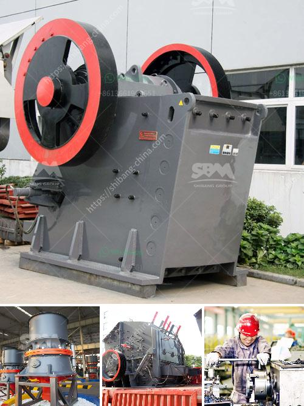

<h3>مصنع كسارة للبيع في باكستان</h3>
عند البحث عن مصنع كسارة للبيع في باكستان، ستجد أن هناك العديد من الخيارات المتاحة. يعد قطاع الكسارات واحدًا من القطاعات الحيوية في صناعة البناء والتشييد في باكستان، حيث يتطلب الطلب المستمر على المواد الخام المكسرة للاستخدام في البناء والطرق. لذلك، قد يكون استثمار في مصنع كسارة فرصة جيدة لتحقيق العوائد المالية.

ما يميز باكستان في قطاع الكسارات هو التنوع الجغرافي والثروات الطبيعية الهائلة التي تتوفر في البلاد. يتميز العديد من المناطق في باكستان بطبيعة جبلية خلابة ووفرة في الصخور والحصى والرمال، مما يخلق الفرصة لتشغيل مصنع كسارة ناجح.

عند النظر في الاستثمار في مصنع كسارة في باكستان، هناك عوامل مهمة يجب أخذها في الاعتبار. أولاً، يجب التحقق من ترخيص المشروع والامتثال للقوانين المحلية والقوانين البيئية. يجب على المشتري أيضًا التأكد من وجود طلب مستمر على المواد المكسرة في المنطقة المحيطة بالمصنع المحتمل.

حجم المصنع والمعدات المطلوبة هي أيضًا عوامل أساسية يجب مراعاتها. يمكن أن يكون لديك مصنع صغير للأغراض التجارية الصغيرة أو مصنع كبير لتلبية الطلب الكبير. يجب شراء المعدات المناسبة مثل الكسارات والغرابيل ووحدات المعالجة الثانوية والناقلات، وفحصها وصيانتها بشكل منتظم لضمان العمل المستدام للمصنع.

أخيرًا، يجب على المشتري أن يدرس الجوانب المالية للاستثمار. يجب أن يقدر التكاليف اللازمة لشراء المعدات وإنشاء المصنع وتأمين المواد الخام وتشغيل العمليات. من المهم أن يكون لديك خطة تسويقية جيدة لجذب العملاء وتحقيق الأرباح.

باختصار، استثمار في مصنع كسارة في باكستان قد يكون فرصة جيدة لتحقيق النجاح والعوائد المالية. ومع ذلك، يجب أن تتخذ القرار بعناية وبالتشاور مع الخبراء في هذا المجال. إذا تم اتخاذ القرار الصحيح وتنفيذه بشكل صحيح، فقد يكون لديك مصنع كسارة ناجح ومربح في باكستان.
<h3>Contact us</h3><ul><li><strong>Whatsapp:&nbsp;<a href="https://wa.me/8613661969651">+8613661969651</a></strong></li><li><a href="https://swt.shibang-china.com/?git&amp;zhl&amp;مصنع كسارة للبيع في باكستان"><strong>Online Service(chat now)</strong></a></li></ul><h3>Related</h3><ul><li><a href='طحن مطحنة الاسمنت.md'>طحن مطحنة الاسمنت</a></li><li><a href='معدات طحن رفيعة جداً رطبة.md'>معدات طحن رفيعة جداً رطبة</a></li><li><a href='آلة كسارة الحجر للبيع في نيوزيلندا.md'>آلة كسارة الحجر للبيع في نيوزيلندا</a></li><li><a href='معدات معالجة الجبس والكالسينيشن.md'>معدات معالجة الجبس والكالسينيشن</a></li><li><a href='آلة فحص في سنغافورة.md'>آلة فحص في سنغافورة</a></li></ul>