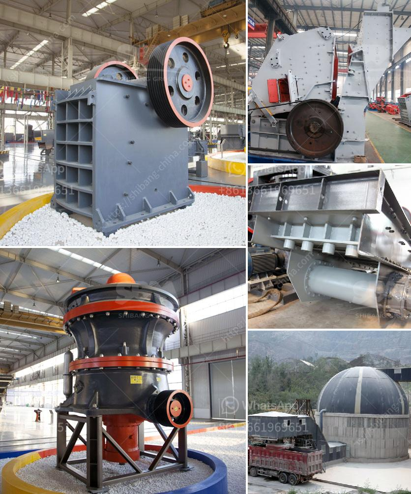

<h3>مصنع كسارة للبيع في جنوب أفريقيا</h3>
منذ سنوات عديدة، تطور قطاع التعدين في جنوب أفريقيا بشكل ملحوظ. واحدة من الصناعات الرائدة في هذا القطاع هي صناعة الكسارات. تعتبر الكسارات جزءًا أساسيًا من عمليات التعدين، حيث تقوم بسحق المواد الخام لإنتاج مواد نهائية قابلة للاستخدام في البناء والبنية التحتية والطرق.

في الوقت الحالي، يوجد العديد من المصانع التي تنتج الكسارات في جنوب أفريقيا. واحدة من هذه المصانع هي مصنع كسارة للبيع في جنوب أفريقيا. هذا المصنع يوفر فرص عمل للعديد من العاملين في القطاع، ويعزز الاقتصاد المحلي.

المصنع مجهز بأحدث التقنيات والمعدات اللازمة لإنتاج الكسارات بجودة عالية وأسعار تنافسية. يتم تصميم الكسارات بعناية لتلبية احتياجات العملاء المختلفة. بغض النظر عما إذا كان العميل يحتاج إلى كسارة ثابتة أو متحركة، يمكن تلبية جميع المتطلبات. تتوفر الكسارات في مجموعة متنوعة من الأحجام والأشكال والقدرات، لذا يمكن للعملاء تحديد الكسارة المناسبة لتلبية احتياجاتهم الخاصة.

بجانب ذلك، يتميز المصنع بجودة خدمة العملاء التي يقدمها. فريق عمل محترف ومدرب بشكل جيد يهتم بمتطلبات العملاء ويعمل جاهداً لخدمتهم بأفضل شكل ممكن. يتم تقديم الاستشارات الفنية والإرشادات التقنية للعملاء لضمان تحقيق أقصى استفادة من الكسارات.

من الجوانب الإيجابية الأخرى لهذا المصنع هو التركيز على الاستدامة البيئية. تتوافر في المصنع تقنيات حديثة للتحكم في الانبعاثات واستخدام المواد الصديقة للبيئة. يتم تحقيق التوازن بين الإنتاجية والحفاظ على البيئة في عمليات الإنتاج.

في النهاية، يمثل هذا المصنع فرصة لا تعوض للمستثمرين في جنوب أفريقيا. بفضل تطور صناعة التعدين، يوجد طلب مستمر على الكسارات. لذا، فإن الاستثمار في مصنع كسارة في جنوب أفريقيا سيكون استثمارًا مناسبًا للحصول على عائد مالي جيد وتعزيز قطاع التعدين في البلاد.

في الختام، تعد صناعة الكسارات في جنوب أفريقيا أمرًا حيويًا لقطاع التعدين، ومصنع كسارة للبيع يوفر فرص عمل ويساهم في تطور الاقتصاد المحلي. إن الجودة العالية والتركيز على الخدمة والاستدامة تجعل هذا المصنع خيارًا مثاليًا للمستثمرين المهتمين بصناعة التعدين في جنوب أفريقيا.
<h3>Contact us</h3><ul><li><strong>Whatsapp:&nbsp;<a href="https://wa.me/8613661969651">+8613661969651</a></strong></li><li><a href="https://swt.shibang-china.com/?git&amp;zhl&amp;مصنع كسارة للبيع في جنوب أفريقيا"><strong>Online Service(chat now)</strong></a></li></ul><h3>Related</h3><ul><li><a href='تكلفة آلة الكسارة.md'>تكلفة آلة الكسارة</a></li><li><a href='مصنع كسارة الفك للبيع في أفريقيا.md'>مصنع كسارة الفك للبيع في أفريقيا</a></li><li><a href='كيفية بدء منجم المحاجر.md'>كيفية بدء منجم المحاجر</a></li><li><a href='موردي آلات الأسمنت ووحدة الطحن.md'>موردي آلات الأسمنت ووحدة الطحن</a></li><li><a href='دراسة جدوى لمصنع تكسير بذور جوز النخيل.md'>دراسة جدوى لمصنع تكسير بذور جوز النخيل</a></li></ul>