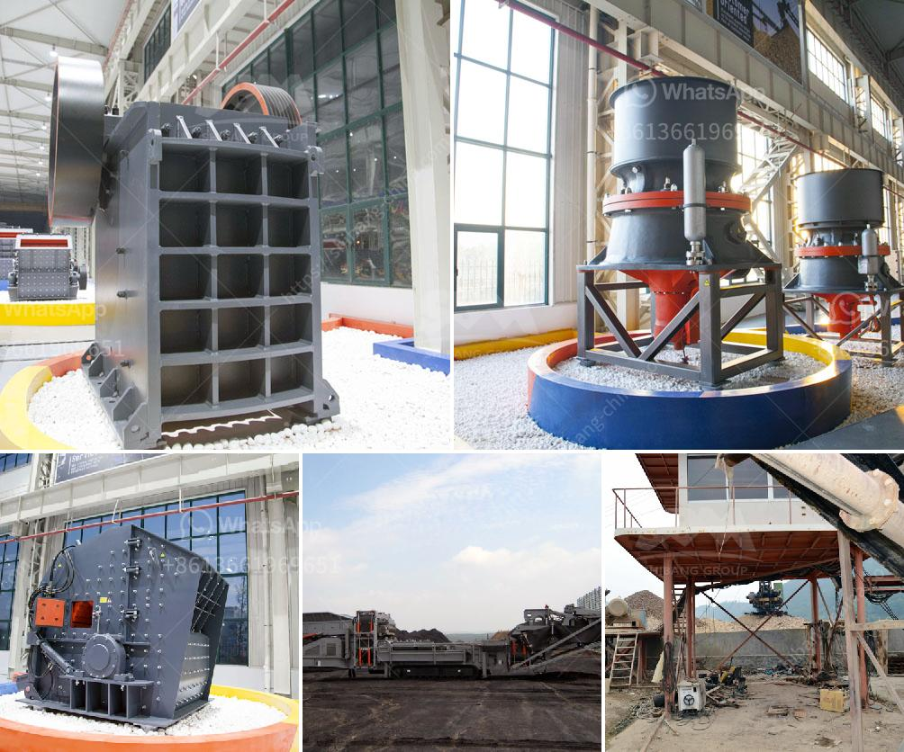

<h3>مصنع كسارة للفحم</h3>
تعتبر كسارة الفحم أحد المعدات الأساسية في صناعة توليد الطاقة من الفحم. يقوم هذا المصنع بسحق الفحم إلى قطع صغيرة ومن ثم نقلها إلى مرحلة معالجة أخرى، حيث يتم استخدام هذا الفحم كوقود لإنتاج الطاقة الحرارية.

يتكون مصنع كسارة الفحم من عدة أجزاء رئيسية، بما في ذلك الجهاز الميكانيكي والنظام الهيدروليكي وناقل الفحم والفلتر. عملية التشغيل تتم عن طريق إرسال الفحم من خلال الناقل إلى قسم الكسارة، حيث يتم طحنه إلى قطع صغيرة مناسبة للحرق. بعد ذلك، يتم إرسال الفحم المسحوق إلى مرحلة المعالجة الأخرى، حيث يتم تنقيته من الشوائب المحتملة ومن ثم يتم تحميله في المرجل الحراري لتوليد الكهرباء.

تعد كسارة الفحم أحد أجزاء النظام الأساسية في صناعة التعدين واستخراج الفحم. فهي تزيد من كفاءة عملية الحرق وتخفض نسبة الانبعاثات الضارة. كما أنها تضمن استخدام أكبر للفحم وبالتالي تقلل من تبذير الموارد وتوفر تكلفة إنتاج أقل.

وبالإضافة إلى ذلك، فإن توفير مصنع كسارة للفحم يمثل مزايا بيئية هامة. إذ يساهم في تقليل انبعاثات ثاني أكسيد الكربون والرواسب السائلة والصوتية. فالفحم يعتبر وقوداً نظيفًا نسبيًا مقارنة بالنفط والغاز الطبيعي، وبالتالي فإن استخدامه في توليد الطاقة يعمل على تقليل التأثيرات السلبية على البيئة وتلوث الهواء.

لخلاصة، فإن مصنع كسارة الفحم يلعب دورًا حيويًا في توليد الكهرباء واستخدام الفحم كوقود للطاقة. بفضل تحسين الكفاءة والسلامة البيئية، يحافظ على استدامة هذه الصناعة ويحد من التأثير على البيئة المحيطة.
<h3>Contact us</h3><ul><li><strong>Whatsapp:&nbsp;<a href="https://wa.me/8613661969651">+8613661969651</a></strong></li><li><a href="https://swt.shibang-china.com/?git&amp;zhl&amp;مصنع كسارة للفحم"><strong>Online Service(chat now)</strong></a></li></ul><h3>Related</h3><ul><li><a href='مصنع كسارة حجر البازلت.md'>مصنع كسارة حجر البازلت</a></li><li><a href='كسارة صخور لخام الكروم أو الكروميت.md'>كسارة صخور لخام الكروم أو الكروميت</a></li><li><a href='آلة غسيل الرمال.md'>آلة غسيل الرمال</a></li><li><a href='كسارة حجر الكاولين.md'>كسارة حجر الكاولين</a></li><li><a href='مطحنة نيجيريا.md'>مطحنة نيجيريا</a></li></ul>