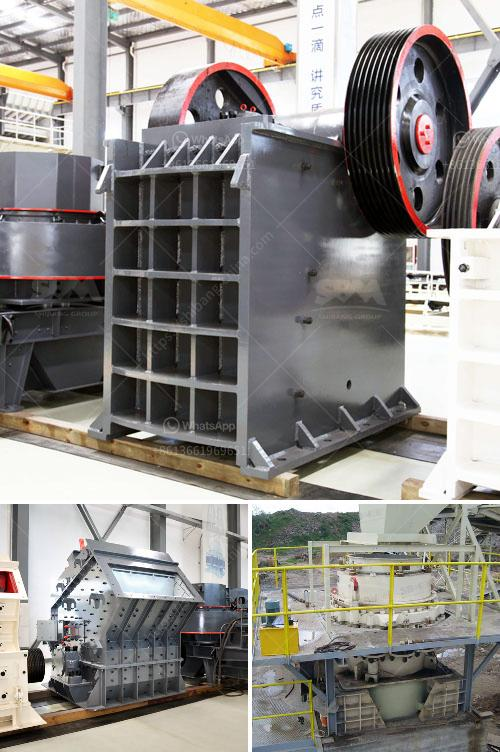

<h3>مصنع كسارة متنقلة للبيع</h3>
تعد الكسارات المتنقلة إحدى التجهيزات الثابتة التي تستخدم في صناعة التعدين والبناء. تم تصميم هذه الكسارات لتكون قابلة للنقل والتنقل بسهولة من موقع إلى آخر، مما يوفر الوقت والجهد في عمليات الإنتاج والبناء.

يتكون مصنع الكسارة المتنقلة من وحدة الكسر الأساسية ووحدة التغذية، حيث يتم تغذية المواد الخام إلى الكسارة باستخدام حزام ناقل. تم تجهيز الكسارة بفك قوي لتكسير المواد الصلبة مثل الصخور والخامات. هذا الفك يعمل عن طريق ضغط المواد بين الفك الثابت والفك المتحرك، مما يؤدي إلى تكسير المادة إلى قطع صغيرة من الحجم المطلوب.

يحتوي مصنع الكسارة المتنقلة أيضًا على شاشة هزازة تستخدم لفصل المواد المكسرة حسب الحجم. يتم ترتيب الشاشة بطريقة تسمح للمواد التي تلبي المواصفات المطلوبة بالمرور والانتقال إلى مرحلة المنتج النهائي، في حين يتم إعادة التدوير للمواد التي لا تلبي المواصفات المطلوبة.

تصمم الكسارات المتنقلة للبيع عادةً للعمل في الأماكن النائية حيث لا تتوفر الكسارات الثابتة أو للعمل في مشاريع البناء المؤقتة حيث يلزم نقل الكسارة بانتظام من موقع لآخر. بفضل تصميمها المتنقل، يمكن نقل هذه الكسارات على شاحنات أو مقطورات خاصة بها، مما يجعلها مرنة للاستخدام في مختلف الظروف.

بالإضافة إلى ذلك، تعمل الكسارات المتنقلة بفعالية عالية وتوفر أداءً ممتازًا في سحق المواد المختلفة. يمكن استخدامها لسحق الصخور الصلبة، والخامات، والركام الصخري، والخرسانة المعاد تدويرها، والأنقاض، وغيرها العديد من المواد التي تستخدم في صناعة البناء والتعدين.

في النهاية، يمثل شراء مصنع الكسارة المتنقلة فرصة ممتازة للمستثمرين الذين يعملون في صناعة التعدين والبناء. يسمح هذا الاستثمار بتوفير وسيلة فعالة لسحق وغربلة المواد المختلفة بكفاءة عالية وتقليل التكاليف والجهد. بالإضافة إلى ذلك، يمكن استخدام الكسارة المتنقلة في مشاريع البناء المؤقتة حيث لا يلزم الاستثمار في كسارة ثابتة. في المجموع، فإن مصنع الكسارة المتنقلة يعد استثمارًا مثمرًا وفعالًا.
<h3>Contact us</h3><ul><li><strong>Whatsapp:&nbsp;<a href="https://wa.me/8613661969651">+8613661969651</a></strong></li><li><a href="https://swt.shibang-china.com/?git&amp;zhl&amp;مصنع كسارة متنقلة للبيع"><strong>Online Service(chat now)</strong></a></li></ul><h3>Related</h3><ul><li><a href='قطع غيار كسارة مخروطية hp 500.md'>قطع غيار كسارة مخروطية hp 500</a></li><li><a href='كسارة الفك ميم FR.md'>كسارة الفك ميم FR</a></li><li><a href='مصنعين محطم في جنوب أفريقيا.md'>مصنعين محطم في جنوب أفريقيا</a></li><li><a href='معدات التعدين لإنتاج الحجر الجيري للبيع.md'>معدات التعدين لإنتاج الحجر الجيري للبيع</a></li><li><a href='مطحنة للحجر الجيري في إيطاليا في بيرجامو.md'>مطحنة للحجر الجيري في إيطاليا في بيرجامو</a></li></ul>