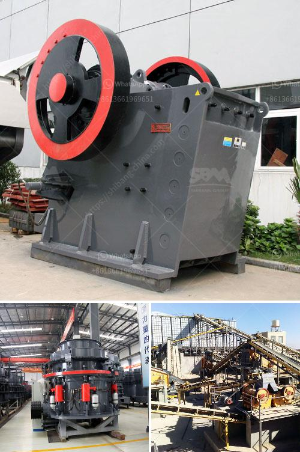

<h3>مصنع كسارة متنقلة مثبتة على الطرق</h3>
تعتبر كسارة متنقلة مثبتة على الطرق أحد الابتكارات التكنولوجية الحديثة في صناعة البناء والتشييد، حيث تمثل حلاً فعالاً لمشاكل تكسير الصخور والمواد الخام داخل موقع البناء.

يُعتبر استخدام مثل هذه الكسارات على الطرق مهماً بسبب العديد من الفوائد التي تترتب على ذلك. فأولاً وقبل كل شيء، فإنها تقلل من تكاليف النقل والنفايات، حيث يتم تحويل المواد الخام المستخدمة إلى منتجات جاهزة للاستخدام في موقع البناء. بالإضافة إلى ذلك، توفر هذه الكسارات الوقت والجهد، حيث يتم تثبيتها بالقرب من موقع العمل بحيث يكون بإمكان العمال تكسير المواد الخام واستخدامها على الفور في الأعمال الإنشائية.

من النواحي البيئية، فإن استخدام الكسارات المتنقلة على الطرق يُعتبر خيارًا صديقًا للبيئة. فبدلاً من إرسال المواد الخام إلى مواقع كسارة ثابتة بعيدة، يمكن استخدام الكسارة المتنقلة لتكسير هذه المواد على الفور، مما يقلل من حركة المرور وانبعاثات الغازات الضارة في الطرق. علاوة على ذلك، تعمل الكسارات المتنقلة على استخدام الوقت والطاقة بشكل أكثر فعالية، مما يزيد من كفاءة العمل ويخفض تكاليف الإنتاج.

هناك العديد من الاستخدامات المحتملة للكسارات المتنقلة على الطرق. فقد يتحتم على المقاولين تكسير الصخور والحجارة الكبيرة لإعادة استخدامها في أعمال الرصف والتعبيد. كما يُمكن استخدام الكسارات المتنقلة في مشروعات التشييد الكبيرة مثل بناء الجسور والأنفاق، حيث يتطلب العمل بكميات كبيرة من المواد الخام.

باختصار، تعتبر الكسارات المتنقلة المثبتة على الطرق تكنولوجيا مبتكرة ومفيدة في صناعة البناء والتشييد. توفر هذه الكسارات الكفاءة والسهولة في العمل وتقلل من التكاليف وتلعب دورًا هامًا في حماية البيئة. إن مستقبل استخدام الكسارات المتنقلة على الطرق يبدو واعدًا ومشرقًا، حيث يُتوقع أن تظل تطوراتها وتحسيناتها تتواصل لتلبية احتياجات الصناعة والمجتمع.
<h3>Contact us</h3><ul><li><strong>Whatsapp:&nbsp;<a href="https://wa.me/8613661969651">+8613661969651</a></strong></li><li><a href="https://swt.shibang-china.com/?git&amp;zhl&amp;مصنع كسارة متنقلة مثبتة على الطرق"><strong>Online Service(chat now)</strong></a></li></ul><h3>Related</h3><ul><li><a href='مطحنة أسمنت صغيرة مستعملة في الإمارات.md'>مطحنة أسمنت صغيرة مستعملة في الإمارات</a></li><li><a href='مطحنة الاسمنت الرأسية الثانية للبيع.md'>مطحنة الاسمنت الرأسية الثانية للبيع</a></li><li><a href='كسارة صخور محمولة صغيرة.md'>كسارة صخور محمولة صغيرة</a></li><li><a href='مصنع إنتاج مسحوق الجبس في أوروبا.md'>مصنع إنتاج مسحوق الجبس في أوروبا</a></li><li><a href='مصنع إنتاج كربونات الكالسيوم.md'>مصنع إنتاج كربونات الكالسيوم</a></li></ul>