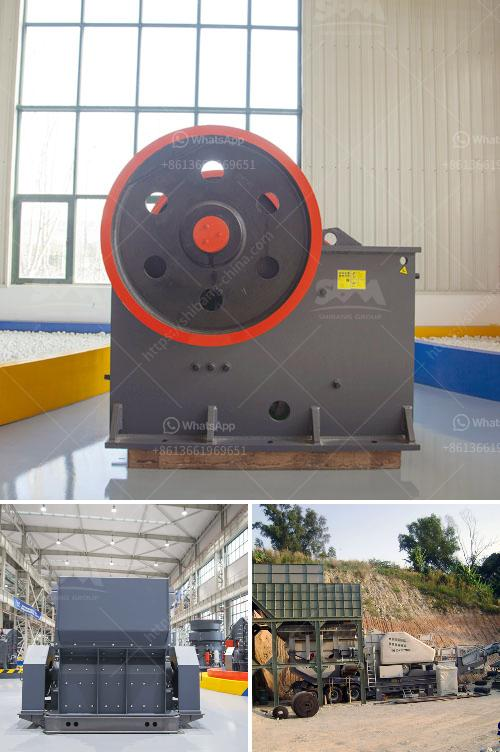

<h3>مصنع كسارة متنقلة من نوع الزاحف</h3>
تعد كسارة المتنقلة من نوع الزاحف من الآلات الحديثة والمتقدمة في مجال صناعة التكسير والمعالجة الصناعية. وهي تستخدم على نطاق واسع في مختلف الصناعات مثل صناعة البناء والتشييد وصناعة التعدين وغيرها. تتميز هذه الكسارة بقدرتها على التنقل بسهولة على سطح مستوٍ وأرض غير مستوية، مما يتيح للشركات الاستفادة القصوى من إنتاجيتها وفعاليتها.

تحتوي كسارة المتنقلة من نوع الزاحف على مكونات متنوعة ومتميزة تجعلها تصلح للعمل في الظروف القاسية والتضاريس المختلفة. فقد تم تجهيزها بمحرك قوي قادر على تشغيل الكسارة بكفاءة عالية وإنتاجية كبيرة. ويساهم النظام الهيدروليكي المتقدم في تشغيل الكسارة بكفاءة عالية ويسهم في تقليل التكلفة والاعتماد على القدرة البشرية.

بفضل نظام التحكم الذكي الذي يتميز بها هذه الكسارة، يمكن للمشغل ضبط الآلة بسهولة وتحسين الإنتاجية دون الحاجة إلى إعدادات معقدة. كما تساعد الواجهة البسيطة والسهلة الاستخدام في تيسير عملية التحكم والتشغيل.

تتوفر كسارة المتنقلة من نوع الزاحف بعدة أحجام وطاقات متنوعة تلبي احتياجات مختلف الشركات والمشاريع. وتتميز هذه الكسارة بقدرتها على تكسير المواد الصلبة والخشنة بكفاءة عالية وتحويلها إلى مواد دقيقة ومناسبة للاستخدام النهائي.

بالإضافة إلى ذلك، تحتوي كسارة المتنقلة من نوع الزاحف على صيانة سهلة وغير مكلفة. فقد تم تصميم هذه الكسارة بطريقة تسمح للفنيين والمشغلين بالوصول إلى المكونات الحيوية بسهولة والقيام بالصيانة والإصلاح عند الحاجة.

يُعد استخدام مصنع الكسارة المتنقلة من نوع الزاحف فعالًا للغاية في عمليات التكسير والمعالجة الصناعية. حيث يتيح للشركات تحقيق الكفاءة والإنتاجية العالية وتقليل التكاليف وتحسين الأداء البيئي. وتوفر لها القدرة على التنقل بحرية بين المناطق المختلفة ، مما يتيح للشركات الاستفادة من مواردها بشكل مثالي وتلبية الطلبات بكفاءة.
<h3>Contact us</h3><ul><li><strong>Whatsapp:&nbsp;<a href="https://wa.me/8613661969651">+8613661969651</a></strong></li><li><a href="https://swt.shibang-china.com/?git&amp;zhl&amp;مصنع كسارة متنقلة من نوع الزاحف"><strong>Online Service(chat now)</strong></a></li></ul><h3>Related</h3><ul><li><a href='أسعار كسارة الحجر بسعة 500 طن في الساعة.md'>أسعار كسارة الحجر بسعة 500 طن في الساعة</a></li><li><a href='معدات تكسير الحجر زينيث.md'>معدات تكسير الحجر زينيث</a></li><li><a href='آلة تعدين الرمال التقليدية في ماليزيا.md'>آلة تعدين الرمال التقليدية في ماليزيا</a></li><li><a href='تأجير كسارة الفك في جدة.md'>تأجير كسارة الفك في جدة</a></li><li><a href='كسارة الفك هي.md'>كسارة الفك هي</a></li></ul>