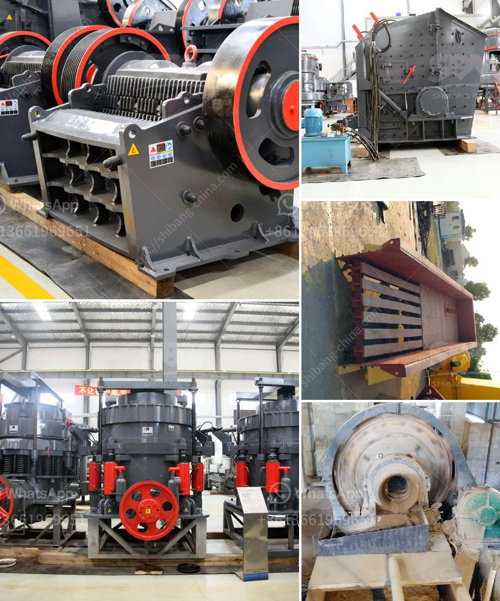

<h3>مصنع كسارة مستعمل بسعر 100 طن في الساعة للبيع</h3>
يعد مصنع الكسارة المستعملة بسعر 100 طن في الساعة المتاح للبيع واحدًا من الخيارات المناسبة لعمليات التعدين والبناء. يتوفر مصنع الكسارة بأسعار تتراوح بين 200 إلى 400 ألف دولار، وهو سعر معقول جدًا في هذه الصناعة. سنتحدث في هذه المقالة عن بعض الجوانب التي يجب مراعاتها قبل القرار بشراء مثل هذا المصنع.

أولًا وقبل كل شيء، يجب أن نتأكد من حالة المصنع. على الرغم من أنه يتم بيعه بسعر أقل من المصانع الجديدة، إلا أنه يجب إجراء فحص شامل للتأكد من سلامة وكفاءة الماكينة. يُفضل الاستعانة بمهندسين متخصصين للقيام بالتفحص، للتأكد من أنه لا توجد أي تلفيات تؤثر على أداء المصنع.

ثانيًا، يجب دراسة احتياجات الإنتاج ومقارنتها مع القدرة الإنتاجية للمصنع. هناك فائدة كبيرة في القدرة على إنتاج كمية معينة من المواد في وقت قصير، وبالتالي يمكن تعزيز إنتاجية العمل وتحقيق الربح المطلوب.

بعد ذلك، يجب أخذ الاعتبار التكلفة الإجمالية للتشغيل. قد يكون سعر المصنع بالفعل مناسبًا، ولكن يجب تقدير تكاليف الصيانة والمشاكل المحتملة التي قد تنشأ في المستقبل وأيضًا تكاليف الطاقة والعمالة. قد يكون المصنع الجديد أفضل في هذا الشأن.

علاوة على ذلك، يجب النظر في متوافر قطع الغيار وكفاءة الخدمة الفنية للمصنع المستعمل. يجب التأكد من أنه يمكن الحصول بسهولة على القطع والمكونات اللازمة للصيانة اللاحقة، وأن الفنيين المؤهلين متوفرون للتعامل مع مشاكل أيضًا.

أخيرًا، يجب النظر في السوق المحلية وفرص البيع في حالة توفر العملاء الذين يحتاجون إلى المنتج المقدم. لا يجب أن يكون هناك عدم توفر الطلب على المواد المكسرة لأنه قد يؤثر على عملية البيع والربح المستقبلي للشركة العاملة على المصنع.

باختصار، مصنع الكسارة المستعمل بسعر 100 طن في الساعة يتيح فرصة لعمليات التعدين والبناء بتوفير ميزانية الشركة. ومع ذلك، يجب مراعاة عدة عوامل قبل شراء هذا المصنع، بما في ذلك حالته، وقدرته الإنتاجية، وتكاليف التشغيل، وتوافر قطع الغيار وخدمات ما بعد البيع وطلب المنتج في السوق.
<h3>Contact us</h3><ul><li><strong>Whatsapp:&nbsp;<a href="https://wa.me/8613661969651">+8613661969651</a></strong></li><li><a href="https://swt.shibang-china.com/?git&amp;zhl&amp;مصنع كسارة مستعمل بسعر 100 طن في الساعة للبيع"><strong>Online Service(chat now)</strong></a></li></ul><h3>Related</h3><ul><li><a href='آلة تعبئة مسحوق التلك.md'>آلة تعبئة مسحوق التلك</a></li><li><a href='عملية تصنيع خام البنتونيت.md'>عملية تصنيع خام البنتونيت</a></li><li><a href='مصنعين للكسارات المتنقلة.md'>مصنعين للكسارات المتنقلة</a></li><li><a href='آلة ميكرونيزر الحجر الجيري مطحنة ميكرونيزر.md'>آلة ميكرونيزر الحجر الجيري مطحنة ميكرونيزر</a></li><li><a href='سعر مصنع كسارة محمولة في نيجيريا.md'>سعر مصنع كسارة محمولة في نيجيريا</a></li></ul>