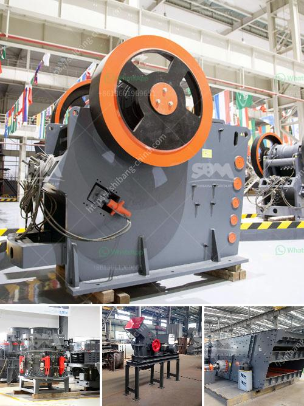

<h3>مصنع كسارة مستعمل في الإمارات</h3>
تعد الإمارات من الدول النامية التي تشهد تطوراً اقتصادياً سريعاً في العقود الأخيرة، حيث يشهد قطاع البناء والتشييد نمواً هائلاً. ومن المفارقات الجديرة بالاهتمام هو الاستعانة بمصانع كسارة مستعملة في هذا القطاع.

تعتبر المصانع المستعملة لكسارة الحجارة من الأدوات الأساسية في صناعة البناء، فهي تستخدم لتحويل الصخور والحجارة الكبيرة إلى مواد صغيرة الحجم يمكن استخدامها في عمليات البناء المختلفة. ومصنع الكسارة المستعملة هو عبارة عن معدات وآلات تستخدم في عملية سحق الصخور وتصنيع المواد الخرسانية الجاهزة، وهي تستخدم بشكل واسع في مشاريع البنية التحتية والتشييد في الإمارات.

يتم شراء مصانع الكسارة المستعملة من الأسواق العالمية، حيث تقوم الشركات الإماراتية بشرائها بأسعار أقل من سعر المصانع الجديدة. يتم استيراد المعدات المستعملة بعناية، حيث يتم فحصها واختبارها للتأكد من جودتها قبل شرائها واستخدامها في مختلف مشاريع البناء والتشييد.

يعود الاعتماد على المصانع المستعملة لعدة أسباب، أهمها التكلفة الأقل. فعند شراء مصنع كسارة مستعملة، يمكن للشركات توفير تكاليف كبيرة مقارنة بشراء مصنع جديد. كما أن الشركات تستفيد أيضًا من التكنولوجيا المتقدمة والمتوفرة في تلك المصانع المستعملة، حيث تتطلب عملية الإنشاء والتشييد الحديثة استخدام تقنيات متطورة لتحسين الإنتاجية وتقليل التكاليف.

من الآثار الجيدة لاستخدام مصنع كسارة مستعملة أيضًا هو الحفاظ على البيئة. إذ يتم إعادة استخدام المعدات في المصانع المستعملة بدلاً من التخلص منها، مما يحد من التلوث البيئي الناتج عن صناعة المعدات الجديدة. بالإضافة إلى ذلك، يؤدي استخدام المصانع المستعملة في البناء إلى تقليل الاعتماد على استخراج المواد الطبيعية، وبالتالي الحفاظ على الموارد الطبيعية والحد من تأثيرات استغلالها على البيئة.

استخدام مصنع كسارة مستعملة في الإمارات يعد خيارًا حكيمًا وفعالًا من الناحية الاقتصادية والبيئية. فهو يوفر الوقت والجهد والموارد المالية والموارد الطبيعية في الإنشاء والتشييد. كما أنه يساهم في زيادة الإنتاجية وتحسين جودة المواد الناتجة. هذا بالإضافة إلى التأثير الإيجابي على الاقتصاد المحلي من خلال تشجيع الاستثمارات في قطاع البناء وخلق فرص عمل جديدة.
<h3>Contact us</h3><ul><li><strong>Whatsapp:&nbsp;<a href="https://wa.me/8613661969651">+8613661969651</a></strong></li><li><a href="https://swt.shibang-china.com/?git&amp;zhl&amp;مصنع كسارة مستعمل في الإمارات"><strong>Online Service(chat now)</strong></a></li></ul><h3>Related</h3><ul><li><a href='مطحنة محمولة في أستراليا بيرث.md'>مطحنة محمولة في أستراليا بيرث</a></li><li><a href='مطحنة الكرات لكربونات الكالسيوم.md'>مطحنة الكرات لكربونات الكالسيوم</a></li><li><a href='مطحنة الكرات في تنزانيا.md'>مطحنة الكرات في تنزانيا</a></li><li><a href='تقرير الجدوى لاستفادة من خام النحاس.md'>تقرير الجدوى لاستفادة من خام النحاس</a></li><li><a href='سؤال حول عملية الطحن بالكرات.md'>سؤال حول عملية الطحن بالكرات</a></li></ul>