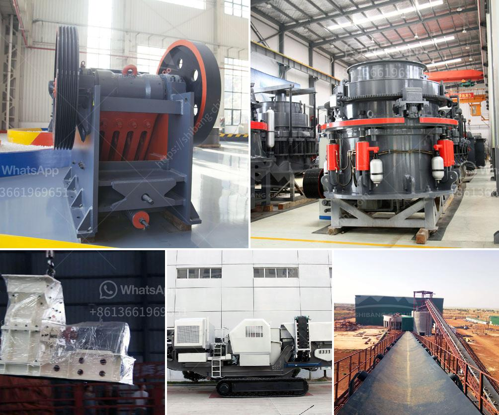

<h3>مصنع لطحن الأسمنت في الهند</h3>
يعتبر صناعة الأسمنت من الصناعات الهامة في الهند، حيث تشتهر الهند بإنتاجها الكبير للأسمنت. وتوجد العديد من المصانع التي تقوم بعملية طحن الأسمنت في البلاد، وسنتحدث في هذه المقالة عن أحد هذه المصانع.

يقع مصنع طحن الأسمنت الذي سنتناوله في ولاية الهند، ويعتبر واحدًا من أكبر المصانع في البلاد. يتميز المصنع بموقعه الاستراتيجي الذي يسمح بسهولة نقل المواد الخام من المناطق القريبة. تستخدم المصانع عملية طحن الأسمنت لتحويل المواد الأساسية مثل الحجر الجيري والطين إلى مسحوق الأسمنت النهائي.

تتضمن عملية طحن الأسمنت عدة خطوات. أولاً، يتم سحق المواد الخام المستخدمة في إنتاج الأسمنت بواسطة كسارات. ثم يتم نقل المواد السحقت إلى مطحنة الأسمنت حيث يتم طحنها إلى حجم صغير جدًا. يتم القيام بذلك بواسطة استخدام الكرات المعدنية الثقيلة داخل المطحنة، والتي تساعد على سحق المواد الخام إلى مسحوق ناعم.

بعد طحن المواد الخام، تمر المواد السائبة إلى مصفاة الأسمنت حيث يتم ضبط النسب المطلوبة من المكونات. تتم إضافة الجبس إلى المسحوق المطحون للتحكم في وقت تصلب الأسمنت وتجنب تشكيل التجاويف غير المرغوب فيها داخل المنتج النهائي.

بمجرد الانتهاء من عملية طحن الأسمنت، يتم نقل المنتج النهائي إلى مستودعات التخزين الخاصة بالمصنع. يتم تعبئة الأسمنت في أكياس أو أوعية أخرى قابلة للنقل قبل أن تتم توزيعها في الأسواق المحلية والعالمية.

تعتبر صناعة طحن الأسمنت في الهند قطاعًا حيويًا يساهم في النمو الاقتصادي للبلاد. وتؤمن هذه المصانع فرص عمل هامة للعديد من العمال المهرة، إضافة إلى دعمها للاقتصاد المحلي من خلال التوظيف والتنمية المستدامة.

بشكل عام، فإن مصانع طحن الأسمنت في الهند تلعب دورًا كبيرًا في تلبية احتياجات السوق المحلية والعالمية من الأسمنت. وتركز هذه المصانع على رفع مستوى الجودة وزيادة الإنتاجية لتلبية الطلب المتزايد على الأسمنت في الهند وفي أنحاء العالم.

لخلاصة، يعتبر مصنع طحن الأسمنت في الهند مصنعًا هامًا يساهم في تعزيز الاقتصاد المحلي وتوفير فرص عمل للعديد من العمال. يتم الانتاج في هذه المصانع بطرق متقدمة وتقنيات حديثة لضمان جودة المنتج النهائي وتلبية احتياجات السوق المتزايدة.
<h3>Contact us</h3><ul><li><strong>Whatsapp:&nbsp;<a href="https://wa.me/8613661969651">+8613661969651</a></strong></li><li><a href="https://swt.shibang-china.com/?git&amp;zhl&amp;مصنع لطحن الأسمنت في الهند"><strong>Online Service(chat now)</strong></a></li></ul><h3>Related</h3><ul><li><a href='مصنع غسل الذهب المحمول للبيع.md'>مصنع غسل الذهب المحمول للبيع</a></li><li><a href='غربال وكسارة للبيع.md'>غربال وكسارة للبيع</a></li><li><a href='آلة طحن وتلميع الصخور.md'>آلة طحن وتلميع الصخور</a></li><li><a href='كسارة الحجر في شرق لندن.md'>كسارة الحجر في شرق لندن</a></li><li><a href='دليل تصميم كسارة مخروط بتنسيق PDF.md'>دليل تصميم كسارة مخروط بتنسيق PDF</a></li></ul>