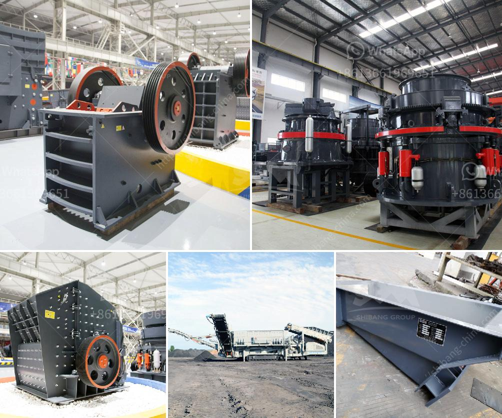

<h3>مصنع لطحن الحجر الجيري والجبس للإسمنت</h3>
يعد مصنع طحن الحجر الجيري والجبس للإسمنت من المصانع الهامة في صناعة الإسمنت بشكل عام. فالحجر الجيري والجبس هما المكونين الأساسيين في إنتاج الإسمنت، حيث يتم طحنهما بشكل منفصل أولاً ثم خلطهما معًا بنسبة محددة للحصول على الإسمنت النهائي.

عملية الطحن تتم في المصنع باستخدام مطاحن خاصة تعمل بالطاقة الكهربائية. يتم سحق الحجر الجيري والجبس في مطاحن هذا المصنع حتى يتم تحويلهما إلى مسحوق ناعم. يتم استخدام هذا المسحوق الناعم لتحسين خصائص الإسمنت وجعله أكثر قابلية للخلط والتشكيل.

عملية طحن الحجر الجيري تشمل مراحل عدة تتضمن سحق الحجر الكبير إلى جزيئات أصغر ثم طحنه في مطحنة الكرات أو المطاحن العمودية. إن هدف هذه العملية هو الحصول على حبيبات من الحجم المطلوب، وذلك بعد معالجتها بمجموعة من المعدات المتخصصة مثل الفرعونة والتصنيف والفحص.

أما عملية طحن الجبس، فهي تتطلب معدات مماثلة ولكن بعض الخطوات قد تختلف. فعادةً، يتم نقل الجبس من المناجم إلى المصنع حيث يتم سحقه وطحنه حتى يتم تحويله إلى مسحوق ناعم.

بعد الانتهاء من طحن الحجر الجيري والجبس، يتم خلطهما معًا بنسبة محددة بحيث يتم تكوين الإسمنت النهائي. هذا الخليط يتم تسخينه في فرن الإسمنت عند درجات حرارة عالية تصل إلى حوالي 1400 درجة مئوية. وفي هذا الفرن، يحدث تفاعل كيميائي يسمى "الاحتراق" يقوم بتحويل الخليط إلى مادة تشبه الحجر تسمى الكلنكر.

بعد الانتهاء من الحرق، يتم طحن الكلنكر إلى مسحوق ناعم مع إضافة بعض المواد الأخرى مثل الجبس والأسمنت اللاهلي. هذه المواد تعمل على تحسين خصائص الإسمنت مثل قوته ومتانته، وتنظيم زمن تصلبه.

باستكمال عملية طحن الحجر الجيري والجبس للإسمنت في هذا المصنع، يتم استخدام الإسمنت النهائي في العديد من التطبيقات مثل البناء والهندسة المدنية والديكور. فالإسمنت هو المواد الأساسية في بناء الأعمال التحتية والهياكل الضخمة، وقد يستخدم أيضاً في إصلاح الأعمال الخرسانية والترميم. كما يمكن استخدام الإسمنت أيضاً في صناعة الطوب والبلاط والمنتجات الخرسانية الأخرى.

في الختام، يعد مصنع طحن الحجر الجيري والجبس للإسمنت من المصانع الحيوية في صناعة الإسمنت. فعملية طحن هذين المكونين الأساسيين تساهم في تحسين خواص الإسمنت وجعله أكثر قدرة على الاستخدام في العديد من التطبيقات الصناعية والبناء.
<h3>Contact us</h3><ul><li><strong>Whatsapp:&nbsp;<a href="https://wa.me/8613661969651">+8613661969651</a></strong></li><li><a href="https://swt.shibang-china.com/?git&amp;zhl&amp;مصنع لطحن الحجر الجيري والجبس للإسمنت"><strong>Online Service(chat now)</strong></a></li></ul><h3>Related</h3><ul><li><a href='تجهيزات تعدين الفحم للبيع في ألمانيا.md'>تجهيزات تعدين الفحم للبيع في ألمانيا</a></li><li><a href='شركات تصنيع آلات الكسارة في شنغهاي.md'>شركات تصنيع آلات الكسارة في شنغهاي</a></li><li><a href='أهداف مطحنة الكرة.md'>أهداف مطحنة الكرة</a></li><li><a href='مطحنة الكرة في كازاخستان.md'>مطحنة الكرة في كازاخستان</a></li><li><a href='مطحنة الكرات للحجر الجيري.md'>مطحنة الكرات للحجر الجيري</a></li></ul>