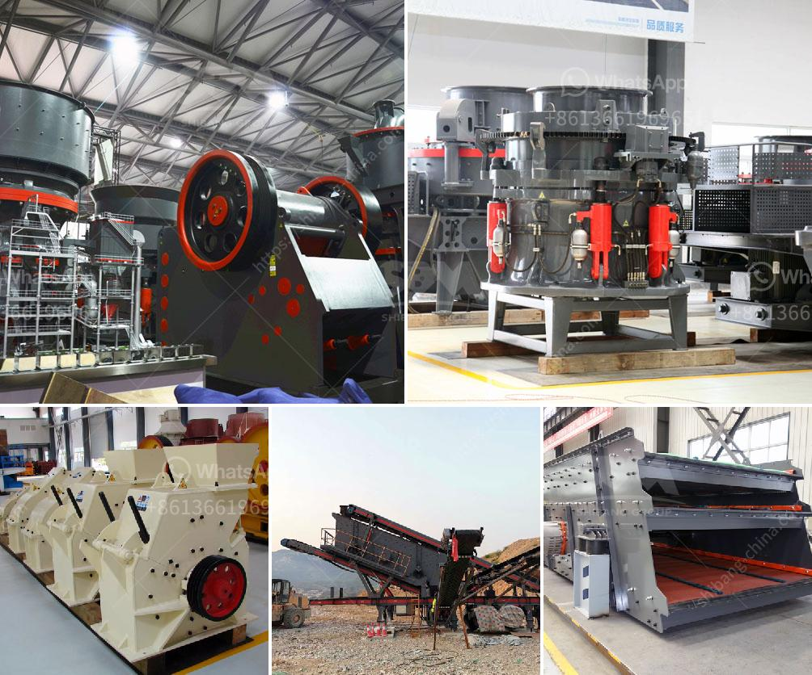

<h3>مصنع للبيع في الفلبين</h3>
تعد الفلبين وجهة مثالية لراغبي الاستثمار في صناعة التصنيع والبيع. تضم الفلبين سلسلة من المصانع المتطورة والحديثة التي تقدم فرصًا استثمارية مثيرة للغاية. واحدة من هذه الفرص هي مصنع للبيع في الفلبين.

يعتبر مصنع البيع في الفلبين فرصة ممتازة للمستثمرين الذين يرغبون في دخول صناعة التصنيع في هذا البلد المزدهر. تحظى الفلبين بموقع استراتيجي وميزة جغرافية تجعلها وجهة مثالية للمشاريع الصناعية. توجد شبكة تجارية قوية في الفلبين مع وجود اتفاقيات تجارية مع العديد من الدول الأخرى. كما أن العمالة الماهرة والتكلفة المنخفضة للعمالة هما عاملان أساسيان يجعلان الفلبين خيارًا رائعًا للمستثمرين.

واحدة من الصناعات الواعدة في الفلبين هي صناعة الأغذية والمشروبات. يعد المصنع الخاص بإنتاج الأغذية والمشروبات فرصة مثالية للاستثمار. يمكنك تصنيع مجموعة متنوعة من المنتجات مثل المشروبات الغازية ، الأطعمة المجمدة ، المعلبة والمجمدة ، ومشتقات الحبوب. ستجد العديد من الشركات المحلية والعالمية الكبرى تعمل في هذا القطاع في الفلبين. ومع ذلك ، فإن الطلب المتزايد على المنتجات الغذائية والمشروبات يجعل هناك مساحة للمزيد من الاستثمارات في هذا القطاع.

بالإضافة إلى ذلك ، يمكن أيضًا النظر في تأسيس مصنع للملابس في الفلبين. تعتبر صناعة الملابس والأزياء من أكبر الصناعات في الفلبين ، حيث تشهد الطلب المستمر والنمو المستدام. يتميز قطاع الأزياء في الفلبين بجودة عالية وتصميمات متقدمة ، مما يجعل الملابس المصنوعة في الفلبين مطلوبة في السوق العالمية.

عند التفكير في شراء مصنع في الفلبين ، يجب أن تأخذ في الاعتبار بعض العوامل المهمة. قبل الاستثمار في أي مصنع ، يجب عليك أن تقوم بإجراء البحوث اللازمة. يجب أن تكون على دراية بالأنظمة والقوانين القائمة في الفلبين. يجب أن تبحث عن السوق وتقييم الطلب والمنافسة. يجب أن تكون على دراية بتكاليف التشغيل والعمالة والمواد الخام.

باختصار ، مصنع البيع في الفلبين يمثل فرصة استثمارية ممتازة في صناعة التصنيع. مع طلب مستدام ومتزايد على المنتجات الغذائية والمشروبات والملابس ، من المؤكد أن الاستثمار في مصنع في الفلبين سيكون ناجحًا. يجب عليك القيام بالبحوث اللازمة واتخاذ القرار الحكيم قبل الاستثمار في أي مشروع صناعي في الفلبين.
<h3>Contact us</h3><ul><li><strong>Whatsapp:&nbsp;<a href="https://wa.me/8613661969651">+8613661969651</a></strong></li><li><a href="https://swt.shibang-china.com/?git&amp;zhl&amp;مصنع للبيع في الفلبين"><strong>Online Service(chat now)</strong></a></li></ul><h3>Related</h3><ul><li><a href='سعر آلة كسارة الحجر العملاقة.md'>سعر آلة كسارة الحجر العملاقة</a></li><li><a href='كسارة الفك الصينية PE 150 250 في الفلبين.md'>كسارة الفك الصينية PE 150 250 في الفلبين</a></li><li><a href='سعر كسارة الصخور.md'>سعر كسارة الصخور</a></li><li><a href='عملية تصنيع الإسمنت بالطريقة الرطبة.md'>عملية تصنيع الإسمنت بالطريقة الرطبة</a></li><li><a href='مطحنة طحن الكرةستخدم لطحن الكرات.md'>مطحنة طحن الكرةستخدم لطحن الكرات</a></li></ul>