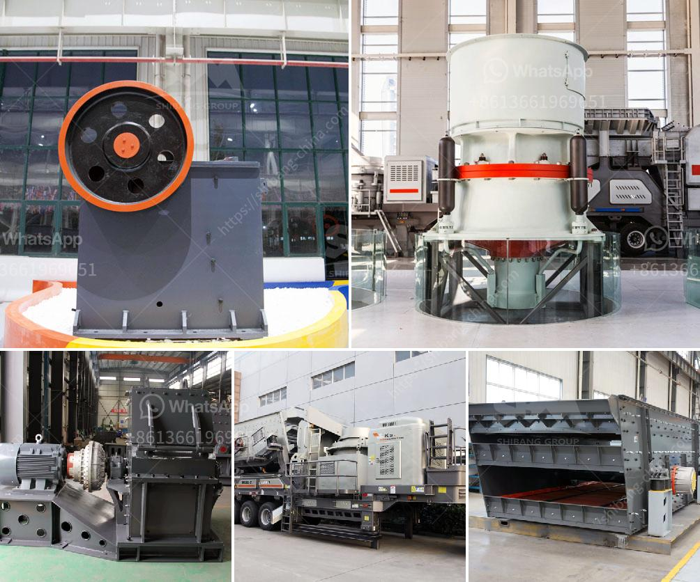

<h3>مصنع لوحات الجبس الجديد في الهند</h3>
في السنوات الأخيرة، شهدت صناعة لوحات الجبس في الهند نمواً ملحوظاً، حيث تم افتتاح مصنع لوحات الجبس الجديد في إحدى المناطق الصناعية الناشئة في الهند. يُعتبر هذا المصنع من أكبر المصانع في البلاد ويهدف إلى تلبية احتياجات السوق المحلية والعالمية.

يتميز المصنع الجديد بتقنيات إنتاجية حديثة ومختبر مجهز بأعلى المعايير الدولية. يتم استخدام أحدث التقنيات في عمليات التصنيع والإنتاج لضمان الجودة العالية والمواصفات المطلوبة من المنتجات. بالإضافة إلى ذلك، يتم توظيف فريق مؤهل من العاملين في المصنع وتزويدهم بالتدريب اللازم للقيام بأعمالهم بكفاءة وفعالية.

تعتبر لوحات الجبس من المواد الأساسية في صناعة البناء، حيث تستخدم في تشييد الجدران والأسقف ذات الجودة العالية. تتميز منتجات المصنع الجديد بقوة هيكلية عالية واستقرار نسبي، مما يساعد على تحسين جودة الأبنية وتقليل التشققات والتلف العام. وبفضل مرونة تصنيع الجبس، يمكن استخدامه في تصميم الأشكال المعقدة والمبتكرة.

تعد المواد المستخدمة في إنتاج لوحات الجبس صديقة للبيئة وقابلة للتحلل، مما يعزز استدامة البناء ويطور صناعة البنية التحتية في الهند. كما أن استخدام الجبس في بناء الأبنية يساهم في تحسين العزل الحراري والمقاومة للحريق، وبالتالي، يزيد من سلامة المباني ويقلل من استهلاك الطاقة.

كما توفر هذه الصناعة فرص عمل للعديد من العاملين المهرة والغير مهرة، مما يساهم في تحقيق التنمية الاقتصادية وتخفيض معدلات البطالة في المنطقة. بالإضافة إلى ذلك، يعمل المصنع على تعزيز التكنولوجيا والابتكار في قطاع البناء في الهند، وبالتالي، يساهم في تطوير الصناعة الوطنية وزيادة التحويل الصناعي في البلاد.

من المتوقع أن يلعب المصنع الجديد دوراً هاماً في تلبية الطلب المتزايد على لوحات الجبس في الهند والعالم. ومع تزايد عدد المشاريع الإنشائية في البلاد وتوجه الشركات المحلية والعالمية نحو استخدام طرق البناء الحديثة، فإن هذا المصنع سيكون له القدرة على تلبية هذه الاحتياجات وتوفير المنتجات ذات الجودة العالية.

باختصار، يمثل المصنع الجديد لوحات الجبس في الهند تحولاً هاماً في صناعة البناء وتعزيز التكنولوجيا والابتكار في هذا المجال. سيساهم هذا المصنع في دعم الاقتصاد المحلي وتوفير الوظائف وتنمية الصناعة الوطنية، مما سيعزز موقع الهند كواحدة من الدول الرائدة في صناعة البناء.
<h3>Contact us</h3><ul><li><strong>Whatsapp:&nbsp;<a href="https://wa.me/8613661969651">+8613661969651</a></strong></li><li><a href="https://swt.shibang-china.com/?git&amp;zhl&amp;مصنع لوحات الجبس الجديد في الهند"><strong>Online Service(chat now)</strong></a></li></ul><h3>Related</h3><ul><li><a href='آلة مطحنة الكرة في الصين.md'>آلة مطحنة الكرة في الصين</a></li><li><a href='مطحنة الكرات لكربونات الكالسيوم.md'>مطحنة الكرات لكربونات الكالسيوم</a></li><li><a href='معدات تأثير المحجر.md'>معدات تأثير المحجر</a></li><li><a href='مسحوق الدولوميت 200 شبكة.md'>مسحوق الدولوميت 200 شبكة</a></li><li><a href='سعر كسارة الباريت.md'>سعر كسارة الباريت</a></li></ul>