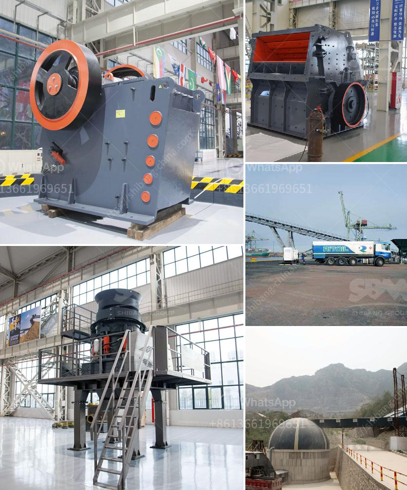

<h3>مصنع محطم الدولوميت في ماليزيا</h3>
يعتبر مصنع محطم الدولوميت في ماليزيا واحدًا من أبرز المصانع الصناعية في البلاد. يقع المصنع في إحدى المناطق الجميلة والطبيعية في ماليزيا، مما يضفي على المصنع جمالية خاصة ويجعله وجهة سياحية مثيرة للاهتمام.

يعتبر المصنع مصدرًا رئيسيًا ومهمًا لإنتاج الدولوميت في ماليزيا. الدولوميت هو نوع من الصخور الرسوبية التي تتكون أساسًا من الكالسيت والمغنسيت، وتستخدم عادة في العديد من الصناعات مثل الصناعات الزراعية والبناء والدوائية والزجاجية والسيراميك. يتم استخراج الدولوميت من المحجر ويتم نقله إلى المصنع ليتم معالجته وتكسيره بواسطة المحطم.

تعتبر ماليزيا واحدة من أهم الموردين للدولوميت في العالم، حيث تتمتع بموقع جغرافي ملائم وامتلاك مصادر كبيرة من هذه الصخور الرائعة. يستفيد المصنع من هذه الموارد الطبيعية الوفيرة والعالية الجودة لإنتاج منتجات ذات جودة عالية تلبي احتياجات السوق المحلية والعالمية.

تتبع مصانع محطم الدولوميت في ماليزيا أفضل المعايير العالمية في عمليات الإنتاج والتصنيع. يتم استخدام أحدث التقنيات والتجهيزات في المصنع لضمان الجودة والكفاءة في العمليات. يتم اختبار الدولوميت المستخرج بعناية قبل إدخاله في المصنع للتأكد من أنه يلبي المعايير المطلوبة.

تتمتع المصانع الماليزية بسمعة طيبة في جميع أنحاء العالم، حيث يتم تصدير منتجاتها إلى العديد من الدول. تعتبر جودة منتجات المصنع وتنوع استخداماتها مزايا يفضلها العملاء في جميع أنحاء العالم. تساهم الصناعة المحلية بشكل كبير في النمو الاقتصادي لماليزيا وتوفر فرص عمل للعديد من السكان المحليين.

بالإضافة إلى الجانب الاقتصادي، يعتبر المحجر والمصنع وجهة سياحية رائعة للزوّار. يمكن للزائرين الاستمتاع بجمال الطبيعة وعمليات التصنيع، وفهم كيفية استخراج وتصنيع الدولوميت. كما يتاح للزوار فرصة شراء المنتجات المصنعة محليًا بأسعار معقولة وجودة عالية.

في الختام، يعتبر مصنع محطم الدولوميت في ماليزيا موردًا هامًا للدولوميت في ماليزيا والعالم. يتميز المصنع بتقنيات الإنتاج الحديثة والجودة العالية لمنتجاته. تعد الصناعة المحلية منطقة سياحية رائعة ومحركًا اقتصاديًا مهمًا للبلاد.
<h3>Contact us</h3><ul><li><strong>Whatsapp:&nbsp;<a href="https://wa.me/8613661969651">+8613661969651</a></strong></li><li><a href="https://swt.shibang-china.com/?git&amp;zhl&amp;مصنع محطم الدولوميت في ماليزيا"><strong>Online Service(chat now)</strong></a></li></ul><h3>Related</h3><ul><li><a href='مصنع كسارة الحجر الأبيض في الفلبين.md'>مصنع كسارة الحجر الأبيض في الفلبين</a></li><li><a href='سعر آلة المحجر.md'>سعر آلة المحجر</a></li><li><a href='شركة تصنيع آلات رمل السيليكا في الهند.md'>شركة تصنيع آلات رمل السيليكا في الهند</a></li><li><a href='كسارة الفك الجديدة من نوع زينيث.md'>كسارة الفك الجديدة من نوع زينيث</a></li><li><a href='آلة تكسير الحجر للبيع.md'>آلة تكسير الحجر للبيع</a></li></ul>