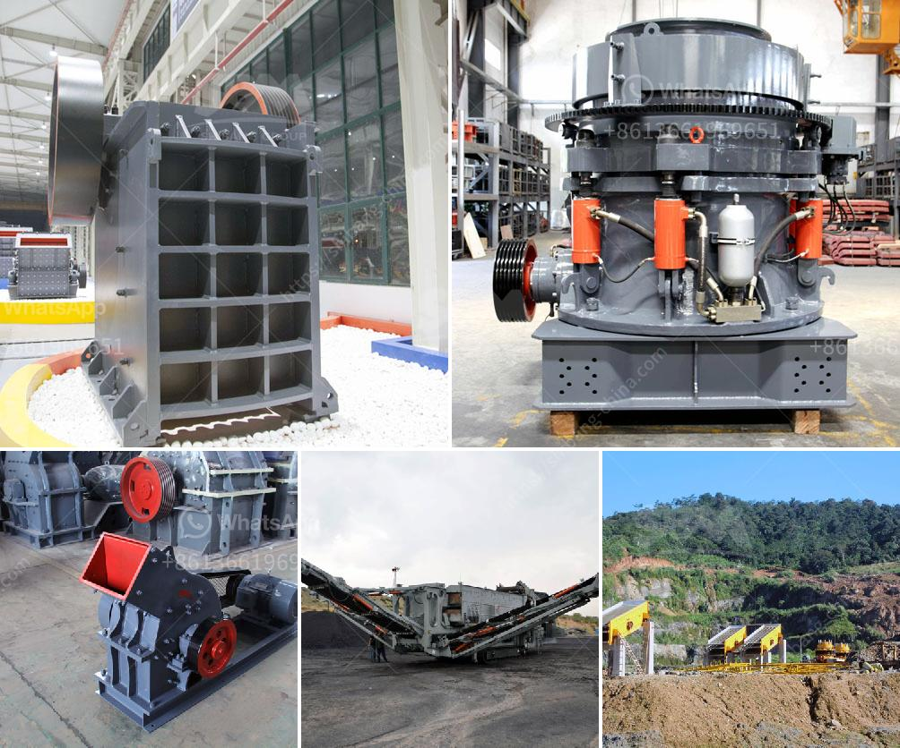

<h3>مصنع محطم للبيع في الإمارات</h3>
يُعدّ الإمارات العربية المتحدة واحدة من أهم الوجهات الاقتصادية في العالم، حيث تستقطب العديد من المستثمرين والراغبين في تطوير الأعمال التجارية. ومن بين القطاعات التي تشهد نمواً مستداماً في الإمارات، يتمتع قطاع صناعة تكسير الحجارة بانتشار واسع.

يعتبر مصنع التكسير من المشاريع الناجحة والمربحة في الإمارات، فهو يساهم في تلبية الطلب المتزايد على المواد الخرسانية والرمل والحصى في البناء والبنية التحتية. يقدم هذا المصنع فرصة استثمارية ممتازة للمستثمرين المحليين والأجانب على حد سواء.

يمتاز مصنع التكسير بتصميمه وتكنولوجياته المتقدمة، مما يسهل عمليات الإنتاج ويضمن جودة المنتجات النهائية. وبالإضافة إلى ذلك، يتمتع المصنع ببنية تحتية متكاملة وذلك لتوفير أعلى جودة لخدماته وتلبية متطلبات العملاء. كما يتم استخدام أحدث التقنيات البيئية وتطبيق معايير السلامة والأمان للعمال.

يُشترط في المصنع أن يتوافر به معدات تكسير متنوعة، مثل الكسارات الفكية والمخروطية والصدمية، وكذلك الغرابيل والمصانع المتنقلة. هذه المعدات تعمل على تكسير الصخور الضخمة إلى جزيئات صغيرة قابلة للاستخدام في صناعة الخرسانة والمواد الإنشائية الأخرى.

تستفيد الإمارات من موقعها الاستراتيجي وقنوات الشحن القوية، مما يسهل تصدير المنتجات المكسورة إلى الدول المجاورة وحول العالم. وبفضل الإقبال المتزايد على البنية التحتية على مستوى العالم، يمكن لمصنع التكسير الاستفادة من التوجه العالمي نحو الأعمال التجارية الرابحة.

ليس فقط يوفر مصنع التكسير فرصة استثمارية رائعة، بل يساهم أيضًا في تعزيز الاقتصاد المحلي عن طريق خلق فرص عمل للكثير من العمال المحليين. بالإضافة إلى ذلك، يسهم في تحسين الاستدامة البيئية من خلال إعادة استخدام المواد وتقليل النفايات.

باختصار، مصنع التكسير في الإمارات هو فرصة استثمارية مجزية للمستثمرين الذين يرغبون في دخول صناعة البناء النشطة والمربحة. إنها فرصة لا تُمكن تفويتها لتلبية الطلب المتزايد على المواد الإنشائية والبنية التحتية في الإمارات وخارجها. يجب على المستثمرين المهتمين اغتنام هذه الفرصة المتاحة والاستفادة من البيئة الاقتصادية الساحرة في الإمارات العربية المتحدة.
<h3>Contact us</h3><ul><li><strong>Whatsapp:&nbsp;<a href="https://wa.me/8613661969651">+8613661969651</a></strong></li><li><a href="https://swt.shibang-china.com/?git&amp;zhl&amp;مصنع محطم للبيع في الإمارات"><strong>Online Service(chat now)</strong></a></li></ul><h3>Related</h3><ul><li><a href='تكلفة آلات الحديد الاسفنجي 300 طن في اليوم.md'>تكلفة آلات الحديد الاسفنجي 300 طن في اليوم</a></li><li><a href='جهاز كسر الكوارتز الصغير.md'>جهاز كسر الكوارتز الصغير</a></li><li><a href='شراء وبيع حجر الكسارة في ماليزيا.md'>شراء وبيع حجر الكسارة في ماليزيا</a></li><li><a href='آلات مستخدمة في مصنع الفحم المسحوق.md'>آلات مستخدمة في مصنع الفحم المسحوق</a></li><li><a href='كسارة خرسانية صغيرة في المملكة المتحدة.md'>كسارة خرسانية صغيرة في المملكة المتحدة</a></li></ul>