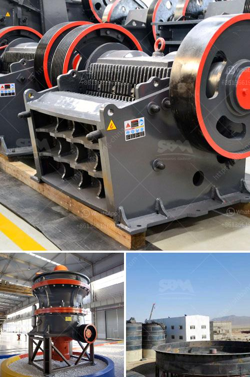

<h3>مصنع مسحوق البنتونيت في الإمارات</h3>
تعتبر الإمارات العربية المتحدة واحدة من الدول الرائدة في مجال الصناعة والتصنيع، حيث تستثمر الدولة بشكل كبير في الصناعات الجديدة ذات القيمة المضافة العالية. ومن بين هذه الصناعات تأتي صناعة مسحوق البنتونيت.

يعتبر مسحوق البنتونيت من المواد الطبيعية وهو نوع من الطين الناعم يتم استخراجه من تربة البنتونيت وتكون طبيعياً في الإمارات. يتم استخدامه في عدة صناعات ومجالات، بما في ذلك الحفر والبناء والتجميل والعناية بالجمال والرعاية الصحية.

يعتبر مسحوق البنتونيت من المواد العالية الجودة وذات القيمة المضافة العالية، نظراً لخصائصه المتميزة وتركيبته الطبيعية. فهو يحتوي على نسب عالية من الكالسيوم والمغنيسيوم والصوديوم والحديد والبوتاسيوم، فضلاً عن العديد من العناصر الأخرى التي تعطيه القوة والفاعلية للاستخدام في مجالات متعددة.

يتم استخدام مسحوق البنتونيت في صناعة الحفر، حيث يضاف إلى الطين لتعزيز قوة الحفر ومقاومة الضغط. كما يستخدم في صناعة البناء لتعزيز خواص العزل الحراري والعزل الصوتي. بالإضافة إلى ذلك، يستخدم مسحوق البنتونيت في صناعة مستحضرات التجميل والعناية بالبشرة، حيث يساعد على تنقية البشرة وتجديدها وترطيبها.

وفي الإمارات، يوجد العديد من المصانع التي تقوم بإنتاج مسحوق البنتونيت بجودة عالية. تعتمد عملية إنتاجها على استخراج التربة الطبيعية وتجهيزها وتحويلها إلى مسحوق ناعم قابل للاستخدام في العديد من الصناعات. وتستخدم تقنيات حديثة ومعدات متطورة في عمليات الطحن والتصفية والتجفيف لضمان الحصول على منتج نهائي ذو جودة عالية.

بفضل توفر الموارد الطبيعية في الإمارات والاستثمارات الحكومية في هذه الصناعة، يعتبر مصنع مسحوق البنتونيت في الإمارات ناجحاً. حيث يوفر المصنع فرص عمل للسكان المحليين ويعزز النمو الاقتصادي للدولة. كما أن صناعة مسحوق البنتونيت تساهم في تلبية احتياجات السوق المحلية والعالمية، وتعزز من قدرة الإمارات على التصدير وزيادة العائدات.

باختصار، صناعة مسحوق البنتونيت في الإمارات تمثل مثالاً نموذجياً للصناعة الحديثة وذات القيمة المضافة العالية. تعتمد على الموارد الطبيعية المتوفرة في الدولة وتستثمر في التقنيات المتطورة ومعدات الإنتاج لتوفير منتج ذو جودة عالية وفاعلية في الاستخدام. مع استمرار نمو الاقتصاد الوطني وعزم الدولة على تعزيز الاستدامة والتنوع الاقتصادي، فإن صناعة مسحوق البنتونيت في الإمارات تواصل تحقيق نجاحات جديدة وتعزز مكانة الدولة كمركز صناعي رائد عالمياً.
<h3>Contact us</h3><ul><li><strong>Whatsapp:&nbsp;<a href="https://wa.me/8613661969651">+8613661969651</a></strong></li><li><a href="https://swt.shibang-china.com/?git&amp;zhl&amp;مصنع مسحوق البنتونيت في الإمارات"><strong>Online Service(chat now)</strong></a></li></ul><h3>Related</h3><ul><li><a href='كسارة VSI لسحق الرمل.md'>كسارة VSI لسحق الرمل</a></li><li><a href='تصميم آلة سحق الجبس بتنسيق PDF.md'>تصميم آلة سحق الجبس بتنسيق PDF</a></li><li><a href='آلة كسارة حجر الجرانيت في تايلاند.md'>آلة كسارة حجر الجرانيت في تايلاند</a></li><li><a href='آخر آلة معالجة ذهب في إندونيسيا.md'>آخر آلة معالجة ذهب في إندونيسيا</a></li><li><a href='إجراءات تصحيحية لسيور النقل.md'>إجراءات تصحيحية لسيور النقل</a></li></ul>