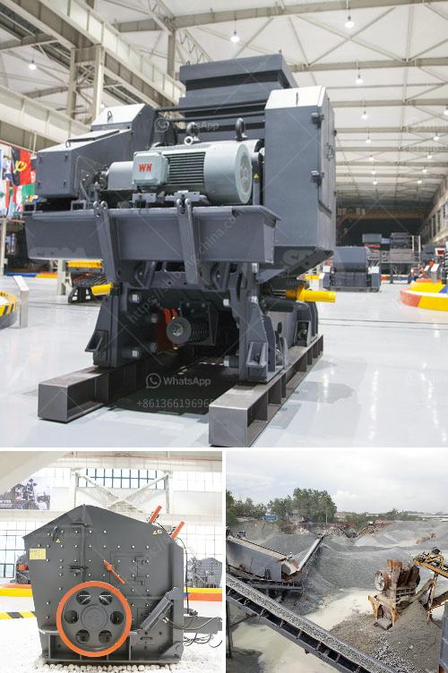

<h3>مصنع مسحوق التلك</h3>
تعد مساحيق التلك من المنتجات المستخدمة على نطاق واسع في مختلف الصناعات وفي منتجات الاستهلاك اليومية. ويأتي تلك المساحيق من تعدين ومعالجة خام التلك، وإنتاجها يتم عبر عملية صناعية تشمل عدة خطوات. يلعب المصنع المكلف بتحويل التلك الخام إلى مسحوق دورًا هامًا في هذه العملية.

تبدأ عملية تصنيع مسحوق التلك بمرحلة تعدين التلك. يتم استخراج الخام من مناجم التلك المنتشرة في مواقع مختلفة حول العالم. ثم يتم نقل الخام إلى المصنع حيث يتعرض لعملية تنقية لإزالة الشوائب والمواد الأخرى غير المرغوب فيها. يتم طحن الخام بعدها عادةً في طاحونة كروية للحصول على جسيمات صغيرة.

بعد ذلك، يتم تعديل الخام المطحون بإضافة مواد كيميائية تهدف إلى تحسين الخصائص الفيزيائية والكيميائية للمسحوق المنتج. على سبيل المثال، يتم إضافة مغنيسيا وسيليكا إلى التلك المطحون لزيادة قدرته على الامتصاص. يمكن أيضًا إضافة مواد تالق أو أصباغ للحصول على ألوان مختلفة أو استخدامه في منتجات التجميل.

بعد التعديل، يتم تجفيف الخليط بواسطة فرن حراري عالي الحرارة. يتم تحويل الرطوبة المتبقية في الخام إلى بخار الماء ويترك البودرة النهائية جافة. ثم يتبع ذلك مرحلة التعبئة والتغليف، حيث يتم تعبئة المسحوق في أكياس أو عبوات وتغليفه بشكل مناسب لحمايته وتخزينه ونقله.

تحتاج عملية صناعة مسحوق التلك إلى أنظمة دقيقة لمراقبة الجودة لضمان تحقيق أعلى مستويات الأداء والنقاء والسلامة. يتم انتقاء العينات بانتظام من الإنتاج لفحصها وفحصها في المختبر باستخدام تقنيات تحليلية متقدمة.

وبفضل العمل الجاد والمهارة المطلوبة في عملية تصنيع مسحوق التلك، فإن المصنع لديه القدرة على توفير مسحوق مثلى النقاء والجودة، وفقًا لمتطلبات واحتياجات العملاء المختلفة.

باختصار، يلعب المصنع المكلف بإنتاج مسحوق التلك دورًا هامًا في تعدين وتحويل هذه المادة الخام إلى منتج نهائي عالي الجودة. تكنولوجيا الإنتاج المتقدمة والمراقبة الجودة الدقيقة تجعل من الممكن الحصول على مسحوق التلك النقي والمنتجات ذات الصلة التي تلبي متطلبات السوق المتنوعة.
<h3>Contact us</h3><ul><li><strong>Whatsapp:&nbsp;<a href="https://wa.me/8613661969651">+8613661969651</a></strong></li><li><a href="https://swt.shibang-china.com/?git&amp;zhl&amp;مصنع مسحوق التلك"><strong>Online Service(chat now)</strong></a></li></ul><h3>Related</h3><ul><li><a href='سعر كسارة الفك.md'>سعر كسارة الفك</a></li><li><a href='تكلفة مطاحن الهامر للسعر.md'>تكلفة مطاحن الهامر للسعر</a></li><li><a href='خط إنتاج مصنع كسارة الحجر في الهند.md'>خط إنتاج مصنع كسارة الحجر في الهند</a></li><li><a href='مصنع كسارة للبيع في باكستان.md'>مصنع كسارة للبيع في باكستان</a></li><li><a href='مورد قطع غيار الكسارة كينيا.md'>مورد قطع غيار الكسارة كينيا</a></li></ul>