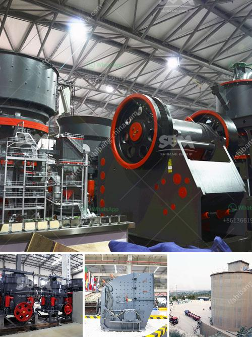

<h3>مصنع مسحوق الجبس في الهند</h3>
يعتبر مصنع مسحوق الجبس في الهند أحد أهم المصانع في المجال، حيث يقوم بإنتاج مسحوق الجبس الطبيعي المستخدم في العديد من الصناعات. توجد العديد من المصانع في الهند التي تعمل على إنتاج مسحوق الجبس، وذلك بسبب توفر المواد الخام والتكاليف المنخفضة.

يقوم المصنع بإجراء عدة خطوات لإنتاج مسحوق الجبس. يبدأ العمل بنقل الجبس الخام من المحجر إلى المصنع حيث يتم تكسيره بواسطة المطرقة لتحويله إلى حجم صغير. بعد ذلك، يتم نقل الجبس المكسور إلى المطاحن لطحنه إلى مسحوق ناعم.

تعتبر عملية الطحن من أهم الخطوات في عملية إنتاج مسحوق الجبس، حيث تتم باستخدام المطاحن الدوارة المتقدمة التي تعمل على طحن الجبس بطريقة دقيقة للغاية. تحتوي هذه المطاحن على أسطوانة دوارة ومجموعة من الأسطوانات الثابتة، وتعمل على سحق الجبس بين هذه الأسطوانات للحصول على مسحوق ناعم وموحد.

بعد طحن الجبس، يتم نقل المسحوق إلى مجفف حيث يتم تجفيفه بواسطة تيارات الهواء الساخنة. يتم تطبيق درجات الحرارة والضغط المناسبة لإزالة أي رطوبة متبقية في المسحوق، مما يؤدي إلى الحصول على مسحوق الجبس النهائي.

تعتبر الهند من أكبر المنتجين لمسحوق الجبس في العالم، حيث تشهد زيادة في الطلب على هذا المنتج من قبل الصناعات المختلفة مثل صناعة الأسمنت والورق وصناعة البلاستر. يتم استخدام مسحوق الجبس في هذه الصناعات لمزجه مع المواد الأخرى لإنتاج منتجات عالية الجودة.

يتميز مسحوق الجبس المنتج في الهند بجودته العالية وخلوه من الشوائب، مما يجعله يحظى بشهرة كبيرة في السوق العالمية. يتم تصدير هذا المنتج إلى العديد من البلدان في العالم، مما يدعم الاقتصاد الهندي ويساهم في زيادة عائدات الصادرات.

باختصار، يعتبر مصنع مسحوق الجبس في الهند من المصانع المتقدمة في هذا المجال، حيث يقوم بإنتاج مسحوق الجبس الناعم الذي يستخدم في العديد من الصناعات. يتميز هذا المسحوق بجودته العالية وسهولة توافر المواد الخام، مما يجعله يلعب دورًا هامًا في تطور الصناعة في الهند.
<h3>Contact us</h3><ul><li><strong>Whatsapp:&nbsp;<a href="https://wa.me/8613661969651">+8613661969651</a></strong></li><li><a href="https://swt.shibang-china.com/?git&amp;zhl&amp;مصنع مسحوق الجبس في الهند"><strong>Online Service(chat now)</strong></a></li></ul><h3>Related</h3><ul><li><a href='بيع محطة تكسير الحجارة.md'>بيع محطة تكسير الحجارة</a></li><li><a href='مصنع لطحن الأسمنت في الهند.md'>مصنع لطحن الأسمنت في الهند</a></li><li><a href='معدات معالجة الذهب في جنوب أفريقيا.md'>معدات معالجة الذهب في جنوب أفريقيا</a></li><li><a href='كسارة الفك PE 150x250.md'>كسارة الفك PE 150x250</a></li><li><a href='كسارة الفك ميم FR.md'>كسارة الفك ميم FR</a></li></ul>