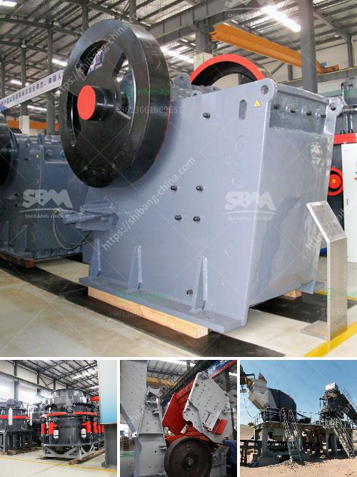

<h3>مصنع مسحوق لوح الجبس في إثيوبيا</h3>
تعد صناعة مسحوق لوح الجبس من الصناعات الهامة والاستراتيجية في إثيوبيا، حيث يشهد هذا القطاع نموًا ملحوظًا في السنوات الأخيرة. يأتي هذا النمو نتيجة للطلب المتزايد على لوح الجبس في السوق المحلية والعالمية، وأيضًا بسبب التطور التكنولوجي والابتكار في صناعة المواد الصحية والعمران.

تتميز إثيوبيا بالموارد الطبيعية الوفيرة وخاصة الجبس، حيث يصنف كأحد أكبر منتجي المواد الخام للجبس في العالم. تضم إثيوبيا العديد من المحاجر والمناطق الصناعية التي تنتج الجبس بكميات كبيرة، لذا فإن إقامة مصنع مسحوق لوح الجبس في إثيوبيا يعتبر فكرة مثالية للإستثمار.

يعد مسحوق لوح الجبس مادة أساسية في عمليات البناء والتشييد، حيث يستخدم في إنتاج الجدران الداخلية والأسقف والتقسيمات، كما يستخدم في التزيين الداخلي والعزل الحراري والصوتي. يتميز لوح الجبس بمرونته وقوته، مما يجعله خيارًا مثاليًا للبناء السريع والمستدام.

توفر إثيوبيا العمالة الرخيصة والمؤهلة والطاقة الكهربائية المستدامة، مما يجعلها وجهة مثالية لإقامة مصنع مسحوق لوح الجبس. بالإضافة إلى ذلك، تشجع الحكومة الإثيوبية على الاستثمار في قطاع البناء، حيث تقدم تسهيلات ودعمًا للمستثمرين المحليين والأجانب.

يوفر مصنع مسحوق لوح الجبس في إثيوبيا فرص العمل للشباب ويساهم في تحسين الاقتصاد المحلي وتنميته. كما يقلل من التبعية على الاستيراد ويدعم الاستدامة البيئية، حيث يقلل من استهلاك الطاقة والموارد الطبيعية.

في الختام، يعد إقامة مصنع مسحوق لوح الجبس في إثيوبيا خطوة استراتيجية ومجدية، تلبي الطلب المتزايد على لوح الجبس في السوق العالمية وتسهم في تنمية الاقتصاد المحلي وتحسين فرص العمل. تحظى هذه الصناعة بإمكانيات هائلة في إثيوبيا وتعد استثمارًا مثمرًا يشجع على التنمية الاقتصادية في البلاد.
<h3>Contact us</h3><ul><li><strong>Whatsapp:&nbsp;<a href="https://wa.me/8613661969651">+8613661969651</a></strong></li><li><a href="https://swt.shibang-china.com/?git&amp;zhl&amp;مصنع مسحوق لوح الجبس في إثيوبيا"><strong>Online Service(chat now)</strong></a></li></ul><h3>Related</h3><ul><li><a href='كسارة الخرسانة للبيع في نيو جيرسي.md'>كسارة الخرسانة للبيع في نيو جيرسي</a></li><li><a href='كسارات الحجر في بيلين.md'>كسارات الحجر في بيلين</a></li><li><a href='دراسة جدوى لإنشاء محجر.md'>دراسة جدوى لإنشاء محجر</a></li><li><a href='مطحنة الكرة لطحن الفلسبار.md'>مطحنة الكرة لطحن الفلسبار</a></li><li><a href='تكلفة معدات سحق الجرانيت.md'>تكلفة معدات سحق الجرانيت</a></li></ul>